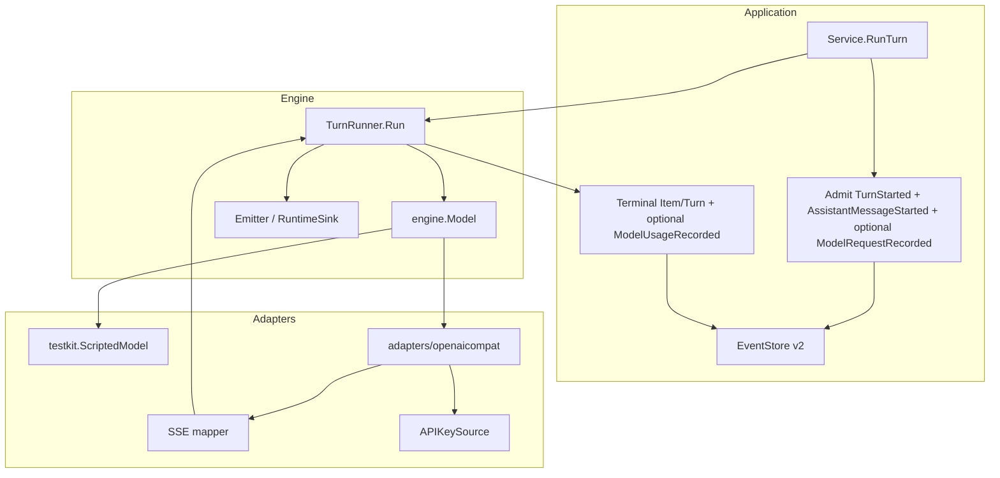
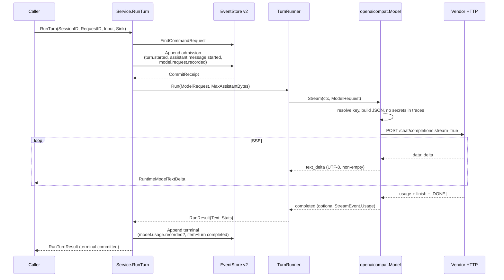

# Provider Contract and First Real Provider Adapter

- **Author:** TBD
- **Date:** 2026-08-15
- **Status:** Accepted
- **Stability:** `experimental` / `internal`
- **Maturity:** pre-v0; not a general availability release
- **Repository:** `open-code-harness` (`github.com/SongYii/open-code-harness`)
- **Depends on:** EventStore v2 Slice 1 (merged PR #6), Engine vertical slice, Domain events
- **Normative language:** English
- **Reading copy:** [Provider 合同与第一个真实 Adapter](2026-08-15-provider-adapter-design.zh-CN.md)
- **Out of scope next:** Tool Runtime, Policy Engine, MCP, approvals, SQLite, JSONL audit, Runtime Host, ACP, TUI

This document designs the Provider contract and the first real HTTP adapter. It is an internal Go design, not a stable public protocol. Pre-v0 changes still require the design, implementation, tests, and architecture docs to move together.

---

## Overview

Open Code Harness can already run one bounded assistant Turn through a provider-neutral Engine port. `engine.Model` / `engine.ModelStream` emit `text_delta*` then `completed`. `testkit.ScriptedModel` is a formal adapter on that port. `application.Service.RunTurn` is the only command authority: it admits a Turn, calls `engine.TurnRunner`, and persists terminal facts through EventStore v2 (`ReadStream`, `Append`+receipt, `ResolveAppend`, `FindCommandRequest`). There is no real HTTP provider, no tools, no policy, no ACP, and no TUI.

This milestone adds a replaceable Provider Adapter that implements the same `engine.Model` port, plus the capability, streaming, error, cancellation, observability, and reconstructability contracts needed for a first industrial HTTP model. The first production adapter is an OpenAI-compatible Chat Completions SSE client. DeepSeek, Kimi, MiniMax, and other compatible endpoints share that adapter and differ only by capability profile and composition-time identity. Application and Engine remain free of `if provider == "deepseek"` branches, HTTP, API keys, and vendor SDKs.

The Engine stream grammar stays `text_delta* → completed`. `StreamEvent` may carry `Usage` on `completed` only. `RunResult.Stats` carries attempt stats on every exit so Application can persist usage, finish reason, vendor request id, and latency. Vendor SSE is mapped onto `text_delta` / `completed`; stats are not stream events. Request envelopes and token usage become versioned, log-only domain facts so anything that reaches the model is reconstructable from the Session stream. EventStore v2’s interface is unchanged.

---

## Background & Motivation

### Current implemented state

Verified in `/Users/songyi/.grok/worktrees/code-open-code-harness/grok` on the EventStore v2 line:

| Layer | What exists | What does not |
| --- | --- | --- |
| Domain | Compact `Session` write state; Session/Turn/assistant Item commands and events; fail-closed codec | `ModelAttempt`, tools, request envelope, usage |
| Engine | `Model`, `ModelStream`, `TurnRunner`, `Emitter`, 1 MiB assistant UTF-8 bound | HTTP, capability profile, usage on `RunResult` |
| Application | `Service.RunTurn` as sole command authority; EventStore v2 admission and unknown-outcome resolution | Provider identity, retry, request-header persistence |
| Persistence | Memory EventStore only | SQLite, JSONL |
| Adapters | `testkit.ScriptedModel`, `adapters/memory` | Any real provider |
| Architecture gate | `dependencies_test.go` forbids domain/engine provider imports and application `net/http` | Adapter ownership for HTTP packages |

`engine.ModelRequest` is still only `{SessionID, TurnID, ItemID, Input}`. The stream contract in `internal/harness/engine/model.go` is:

```go
// Streams emit zero or more non-empty UTF-8 text deltas followed by one completed event.
type StreamEvent struct {
    Type StreamEventType
    Text string
}
```

`TurnRunner.Run` fail-closes on any other `StreamEvent.Type`, empty/invalid UTF-8 deltas, completed-with-text, or `io.EOF` before `completed`. Production code has no `if scripted` branches; the AST gate in `internal/harness/architecture/dependencies_test.go` rejects them.

`application.ReconstructRequestResult` currently requires exactly two or four relevant records forming adjacent lifecycle pairs:

```text
admission:  turn.started + assistant.message.started
terminal:   assistant.message.{completed|failed|interrupted} + turn.{completed|failed|interrupted}
```

That reconstruction rule is Application-owned. It must evolve if this milestone appends log-only facts under the same `CommandID`. EventStore v2 itself does not need a new method.

### Pain points this milestone removes

1. The only `engine.Model` implementation is a test double. The port has never been proven against a real wire protocol.
2. Model-visible content is reconstructable today only as `TurnStarted.Input`. Model id, adapter family, endpoint identity, and capability settings never become facts.
3. Provider failures would currently collapse to `model_startup` / `model_stream`. Auth, quota, rate-limit, and transient classes have no stable codes.
4. There is no place to put HTTP, API keys, SSE parsing, or vendor quirks without contaminating Domain or Engine.

### Why Provider now

The 2026-08-15 DeepSeek Harness gate (`docs/research/architecture-gates/2026-08-15-deepseek-harness-and-roadmap.md`) already decided: after EventStore v2 Slice 1, return to product capabilities (Provider, then Tool/Policy). Completing persistence slices 2–6 first would produce a strong event store with no real agent loop.

---

## Goals & Non-Goals

### Goals

1. Keep `engine.Model` as the Engine consumption port. Domain, Engine, and Application stay free of HTTP, API keys, and vendor SDKs.
2. Ship one Provider Adapter that implements `engine.Model` on the same path as `ScriptedModel`.
3. Express model differences as a capability profile plus composition-time identity. Never `if provider == "deepseek"` in Application or Engine.
4. Map vendor SSE/chunks onto existing `text_delta` / `completed`. Define ignore-versus-fail-closed rules for unknown vendor fields.
5. Normalize errors into existing Engine/Application categories, with more specific durable codes for auth/quota/rate-limit/transient/permanent. Provider classifies retryability; Application decides. Application does not silently retry model side effects.
6. Honor `context` cancellation. Keep the existing 1 MiB assistant UTF-8 bound.
7. Record token usage, latency, and provider/model identity as structured metadata. No high-cardinality raw prompts in metrics. No secrets in events or error text.
8. Persist a DSH-style request envelope so the exact model-visible request is a function of the log.
9. First real adapter: OpenAI-compatible HTTP Chat Completions streaming, shared by DeepSeek/Kimi/MiniMax-compatible endpoints.
10. API key from env/config only. Never logged.
11. Deterministic tests need no network and no live keys. `go test` default path stays keyless.
12. Failure, cancel, concurrency, and resource bounds are specified before the happy path.

### Non-goals

- Tool Runtime, Policy Engine, MCP, approvals. Tool-call and reasoning stream event names are reserved in this document only; Engine does not grow those constants in this slice.
- SQLite, JSONL audit, Runtime Host, ACP, TUI.
- Multi-provider routing, cost optimization, prompt-cache layout, DeepSeek-specific heuristics (tool-call repair, flash/pro routing, cache-prefix gymnastics).
- Changing the EventStore v2 interface. A new versioned domain event type is allowed; a new Store method is not.
- Vendor SDKs, OAuth, browser login, model discovery, live catalog refresh.
- Silent Application retry of a model attempt.
- Persisting reasoning items, images, or structured-output requests.
- Changing the Engine stream grammar to a multi-block protocol.

---

## Key Decisions

| ID | Decision | Rationale |
| --- | --- | --- |
| P-01 | `engine.Model` remains the only Engine consumption port. The HTTP adapter implements it directly. | Same path as `ScriptedModel`. Production stays free of `if scripted` / `if openai` branches. Matches charter §6.3 and the Engine slice. |
| P-02 | First adapter is OpenAI-compatible Chat Completions SSE (`POST /chat/completions`, `stream: true`), not a vendor-native SDK and not OpenAI Responses. | DeepSeek, Kimi, MiniMax, and most local/gateway endpoints share this wire. One adapter + profiles maximizes model-neutrality. Codex’s current Responses-only default is OpenAI-product-specific; our first consumers are chat/completions endpoints. |
| P-03 | Capability Profile is data. Vendor differences enter via profile + wire hints + identity, never name branches in Application/Engine. | Adopted from charter §6.3, Kimi `ModelCapability`, DSH `resolveModelInfo`, and the Reasonix-as-community-only rule. |
| P-04 | Engine stream grammar stays `text_delta* → completed`. `StreamEvent` may carry `Usage` on `completed` only. `RunResult.Stats` carries usage/finish/request-id/latency on every exit. Tool/reasoning names stay design-reserved; Engine does not add those constants. | Avoids breaking `TurnRunner` and `modeltest`. Tool/reasoning belong to later milestones. `modeltest` treats nil `Usage` as the scripted default. |
| P-05 | Unknown vendor JSON fields are ignored. Protocol violations, empty completions, and out-of-profile tool calls fail closed. Reasoning fields never enter assistant text. | DSH fail-closed on required unknown *session* types; SSE extras are not our schema. Mixing `reasoning_content` into `text` would corrupt the durable assistant fact. |
| P-06 | Provider classifies retryability; Application never retries a model attempt. One `RunTurn` is one model attempt. | Adopted from DSH “one adapter call is one provider attempt.” Matches EventStore v2 “no second model call” for one Request ID. |
| P-07 | Persist `model.request.recorded` (required when identity is configured) and optional `model.usage.recorded` as log-only domain events under `schemaVersion: 1`. EventStore v2 interface unchanged. | DSH `request/header` lesson: model-visible means logged. Compact `Session` stays write-side compact; Apply is version-only. |
| P-08 | `application.Config.RequestIdentity` is optional. ScriptedModel tests keep the current 2-event admission. HTTP composition must set identity. | Avoids rewriting every Engine scenario test while making reconstructability mandatory on the real path. |
| P-09 | Auth is an injected `APIKeySource` (env or static test key). Keys never appear in events, logs, metrics, or `Error()` text. | Charter security baseline. DSH/Pi/Codex all keep credentials out of the session log. |
| P-10 | Deterministic tests use a scripted `http.RoundTripper` and recorded SSE fixtures. No vendor SDK. `go.mod` stays stdlib-only. | Industrial quality without live keys. Matches existing `modeltest` / EventStore conformance discipline. |
| P-11 | Package: `internal/harness/adapters/openaicompat`. Architecture owner `openaicompat` (or `httpadapter`) may import `net/http` and `os`. It must not import `os/exec`, `application`, `testkit`, or any other `adapters/*`. | `EnvAPIKey` needs `os.Getenv`. Memory/application still forbid `os` and `net/http`. |
| P-12 | Classified provider codes live on `engine.ProviderFailure`. `durableFailure` unwraps `primary.Cause` with `errors.As`; when present it persists `ProviderFailure.Code` and the matching safe display sentence. Application never imports `openaicompat`. | `engine.Error.Code` stays the coarse Engine code (`model_startup` / `model_stream` / …). Without an Engine-owned unwrap type, every HTTP 401 would still persist as `model_startup`. |
| P-13 | `engine.RunResult` is the only pipe for usage, finish reason, vendor request id, and latency into Application facts. Adapter logs are not facts. `TurnRunner` copies last-observed attempt stats on success **and** fail/cancel. | `ModelUsageRecorded` cannot be populated from token counters alone, and today’s `TurnRunner.fail` returns `RunResult{}`. |
| P-14 | This milestone’s model-visible messages are exactly `[{role:user,text:Input}]`. `Decide` rejects any other `Request.Messages` shape or a `text` that is not byte-equal to `Input`. Compact `Session` has no transcript and is not used to rebuild history. Context Engine later extends `Messages` (and the logged envelope) first. | Honest about current write-side state. Prevents hidden system prompts and split-brain `turn.started.input` vs envelope. |
| P-15 | `engine.Model` does not gain `Identity()`. Only `*openaicompat.Model` has `Identity()`. HTTP composition must copy that value into `Config.RequestIdentity`. Omitting it is a composition bug, not a type error. Tests use `MustComposeHTTP`. | Optional identity keeps ScriptedModel tests unchanged. A port method would force every adapter, including ScriptedModel, to invent an identity. |
| P-16 | Default stream idle timeout is **60 seconds**. Composition may raise `IdleTimeout` per endpoint. | Locked. An unbounded wait is worse than a classified transient. Thinking-heavy endpoints opt in by composition, not by raising the default. |
| P-17 | A change of model, adapter family, profile, or endpoint requires a **new Request ID**. `DigestRunTurnRequestV1` stays Session ID + Input; identity is not folded into the digest. | Locked. One Request ID is one attempt (EventStore v2). A different route is a different attempt, not a silent reuse. |
| P-18 | Send `stream_options.include_usage` only when `Hints.IncludeUsage` is true. No URL auto-detect and no adapter retry if the server 400s. Composition flips the hint. | Locked. Auto-detect and retry would be a second model side effect and a hidden vendor branch. |
| P-19 | `User-Agent` is the literal `open-code-harness` with **no version** until a release tag exists. Adding a version later is not a schema change. | Locked. Attribution without inventing a version number. |

---

## Primary-source comparison (Adopt / Boundary)

Re-verified 2026-08-15 from then-public official sources. DeepSeek-Reasonix remains community context only and is not a primary source.

| Source | Observed contract (official) | Adopt | Boundary |
| --- | --- | --- | --- |
| **DeepSeek Harness** [`docs/architecture.md`](https://github.com/deepseek-ai/deepseek-harness/blob/master/docs/architecture.md), [`docs/subsystems/llm-streaming.md`](https://github.com/deepseek-ai/deepseek-harness/blob/master/docs/subsystems/llm-streaming.md), [`docs/subsystems/session.md`](https://github.com/deepseek-ai/deepseek-harness/blob/master/docs/subsystems/session.md) | Model-visible means logged. `request/header` (`EpochHeader`: call config, system prompt, tool schemas) is a log-only snapshot appended before dispatch. `LlmAdapter.stream()` is the seam; adapters register by route, not by name in the loop. `StreamChunk` is a closed union; usage before finish; one adapter call is one attempt; adapters disable library retries; `LlmFailure` carries `code`, optional `status`, `providerRetryAfterMs`, `requestId`; policy decides retry. Idle timeout default 5 min. Empty completion is an error. Capability seams are definition / provider / consumer. | Reconstructable request envelope. Adapter seam behind a consumer-owned port. Classify retryability without retrying in the adapter. Usage as a durable fact. Fail closed on our own unknown event types. Capability as a seam, not a vendor `if`. | Do not adopt Cordis / everything-is-a-plugin as the kernel. Do not copy `SessionEventMap`, `EpochHeader`, `StreamChunk`, or `ctx.llm` names. Do not make async memory-flush the commit authority. Do not put DeepSeek-only routing in the loop. Do not implement their `llm/stream` waterfall. TypeScript core is rejected. |
| **Pi** [`packages/ai/README.md`](https://github.com/badlogic/pi-mono/blob/main/packages/ai/README.md), `packages/ai/src/api/openai-completions.ts` | Provider owns catalog + auth + stream. Most third-party vendors share the `openai-completions` **API implementation**; a provider is a composition of identity, auth, models, and one API. Unified events: `text_delta`, thinking, toolcall, `done`/`error`. `fauxProvider` is the test double on the same port. Huge `OpenAICompletionsCompat` matrix (developer role, `max_tokens` vs `max_completion_tokens`, `stream_options.include_usage`, DeepSeek `reasoning_content` replay, thinking formats). Abort is a first-class stop reason. | Shared chat/completions wire for many vendors. Scripted/faux adapter on the same port. Injected auth. Explicit cancel. Keep a *small* wire-hint surface (`include_usage`, omit unused fields). | Do not import Pi’s compat matrix, cost accounting, OAuth, catalog, or SDK-backed API implementations. Do not emit thinking/tool events this milestone. Do not continue-after-abort by persisting partial assistant text (our failed/interrupted items store no partial text). |
| **Kimi Code** [`AGENTS.md`](https://github.com/MoonshotAI/kimi-code/blob/main/AGENTS.md), `packages/agent-core-v2/src/kosong/contract/{provider,capability,errors}.ts` | `kosong` is the LLM wire layer, separate from agent-core. `ChatProvider` is immutable; per-turn intent lives in `GenerateOptions`. `ModelCapability` declares image/video/audio/thinking/tool_use/context limits; `UNKNOWN_CAPABILITY` is explicit (`max_context_tokens: 0`). Error taxonomy is born-coded (`provider.auth_error`, `provider.rate_limit`, `context.overflow`, …). Abort is classified first and never becomes a retryable provider error. `isRetryableGenerateError` is advisory for callers. Quota exhausted is not retryable even on HTTP 429. | Separate wire contract from the loop. Capability object with explicit unknown. Status-based classification. Cancel wins over retryable mapping. Quota ≠ rate-limit. | Do not copy `kosong` type names or the DI × Scope engine. Do not implement video/audio. Do not put retry loops in Application. Do not use message-regex as the *primary* classifier (status first; body only against the closed quota and overflow token lists in Errors). |
| **Grok Build** `crates/codegen/xai-grok-shell/src/agent/model_providers.rs`, `xai-grok-sampling-types/src/provider_error.rs` | `[model_providers.<id>]` is composition: `base_url`, `env_key`, headers, query, auth helper, `context_window`. Models inherit provider defaults; a missing provider does not leak session tokens onto a third-party base URL. Unknown config keys warn and are ignored. Error bodies are parsed tolerantly; secrets are not the concern of the parser, but display text is truncated. | Composition-root provider table (endpoint + env key + headers + context window). Unknown *config* keys are ignored with a warning. Never send harness session credentials to a foreign base URL. | Do not adopt their lenient “skip malformed provider and continue” as our adapter constructor policy — our constructor fail-closes on invalid config. Do not copy xAI sampling types. No ACP/TUI model-switch UI in this milestone. |
| **OpenAI Codex** [`codex-rs/model-provider-info`](https://github.com/openai/codex/blob/main/codex-rs/model-provider-info/src/lib.rs), app-server README (prior gate) | `ModelProviderInfo` is endpoint + `env_key` + headers + wire API + retry/idle bounds. Default stream idle timeout 300 s. Built-in vs user-defined providers. Current code **removed** `wire_api = "chat"` in favor of Responses. Bounded retries are a *provider-info* concern; 429 is not retried by their default `RetryConfig`. Explicit item lifecycle `started → delta* → completed`. | Provider info as composition data. Idle timeout and header maps. Env-sourced keys. Lifecycle already matches our Engine. Treat 429 as classified, not auto-retried. | Do not switch our first adapter to Responses. Do not copy Codex retry-inside-the-client as Application behavior. Do not use app-server protocol objects as domain events. |
| **Maka** [`ARCHITECTURE.md`](https://github.com/maka-agent/maka-agent/blob/main/ARCHITECTURE.md), [`docs/architecture/runtime-core-architecture-draft.md`](https://github.com/maka-agent/maka-agent/blob/main/docs/architecture/runtime-core-architecture-draft.md) | One execution authority. `ModelAdapter` isolates construction, chunk normalization, usage, and error classification. Facts vs projections. A late provider event must not overwrite an established abort. Maka **does not** persist a byte-level HTTP request; it records identities/hashes and says bit-exact replay would need more. | Adapter isolates wire. Cancel/abort wins over a late `completed`. Usage normalized at the adapter. Single execution authority remains Application. | Do not adopt AI-SDK `streamText` as our kernel. Do not defer request-envelope reconstructability the way Maka currently does — DSH’s stronger log rule is the one we adopt. Do not implement Runtime Host. |

### Already decided for DeepSeek Harness (reaffirmed)

**Adopt:** model-visible means logged; request envelope reconstructable from the log; capability seams (definition / provider / consumer); no vendor-name branches in the loop.

**Reject:** Cordis / everything-is-a-plugin as engine kernel; TypeScript core; DeepSeek-only routing in the loop; async memory-first flush as commit authority.

---

## Proposed Design

### Placement and dependency direction

```text
headless caller / future composition root
                    |
                    v
internal/harness/application  -----> internal/harness/engine
  command + durability               Model port, profile types,
                                     TurnRunner, Emitter
                    |
                    v
            internal/harness/domain
             lifecycle + log-only facts

internal/harness/adapters/openaicompat ----implements----> engine.Model
internal/harness/testkit.ScriptedModel ----implements----> engine.Model
internal/harness/adapters/memory      ----implements----> application.EventStore
```

Rules (enforced by extending `internal/harness/architecture/dependencies_test.go`):

- `domain` and `engine` still cannot import any path segment `provider` / `providers`, and cannot import `net/http`.
- `application` still cannot import `adapters/*`, `testkit`, or `net/http`.
- `adapters/openaicompat` may import `engine`, `domain`, `net/http`, and `os`. It must not import `os/exec`, `application`, `testkit`, or any other `adapters/*`. The gate table in `TestForbiddenImport` must include these two allowed exceptions; a copy of the memory-owner rules plus only `net/http` cannot compile `EnvAPIKey`.
- Production code still cannot mention `ScriptedModel`.
- `go.mod` stays module-stdlib. No OpenAI/Anthropic/DeepSeek SDK.

### Architecture



`TurnRunner` does not know which adapter it holds. `Service` does not know HTTP. The adapter does not decide domain transitions.

### Sequence: successful HTTP turn



Cancellation uses the existing winner table in EventStore v2. The adapter’s only extra duty is to abort the HTTP request when `ctx` is canceled and to return promptly from `Next` / `Close`.

### Capability Profile

New Engine types in `internal/harness/engine/profile.go` (no HTTP, no vendor names required to function):

```go
package engine

type CapabilityTriState string

const (
    CapabilityUnsupported CapabilityTriState = "unsupported"
    CapabilitySupported   CapabilityTriState = "supported"
    CapabilityRequired    CapabilityTriState = "required"
)

// CapabilityProfile is the provider-neutral declaration of what one
// configured model route accepts. Zero tokens mean unknown, not zero.
type CapabilityProfile struct {
    NativeTools         CapabilityTriState
    Images              CapabilityTriState
    StructuredOutput    CapabilityTriState
    ReasoningFields     CapabilityTriState
    PromptCache         CapabilityTriState
    ContextWindowTokens uint32
    MaxOutputTokens     uint32
}

// RequestIdentity is composition-time identity copied into Application
// so the request envelope can be logged without importing an adapter.
// Wire hints that change the JSON body are part of identity, not
// adapter-private state.
type RequestIdentity struct {
    AdapterFamily  string // "openai_compat"
    ModelID        string
    EndpointID     string // host[:port][/path-prefix]; no userinfo, no query
    Profile        CapabilityProfile
    IncludeUsage   bool   // sent as stream_options.include_usage
    MaxTokensField string // "", "max_tokens", or "max_completion_tokens"
}
```

Validation:

- `AdapterFamily` is a non-empty lower-snake token (`^[a-z][a-z0-9_]{0,63}$`).
- `ModelID` is non-empty valid UTF-8, trimmed, length ≤ 256. It is an endpoint model string, not a vendor enum.
- `EndpointID` is derived from `BaseURL` by stripping userinfo, query, fragment, and a trailing slash. It never contains credentials.
- Tri-states must be one of the three constants. Unknown/empty at construction is invalid (fail closed), except token fields may be 0.
- `IncludeUsage` is a bool (false means the field is omitted from the JSON body).
- `MaxTokensField` is `""`, `"max_tokens"`, or `"max_completion_tokens"`. Any other value is invalid.

`openaicompat.Model.Identity()` copies `Config.Hints` into these two fields. Application maps one envelope without importing the adapter:

- `Messages` is exactly `[{Role: "user", Text: request.Input}]`.
- Identity/hint fields copy from `Config.RequestIdentity`.
- Compact `Session` is not consulted for history; it has none.

This milestone’s first-adapter behavior:

| Profile field | First-adapter action |
| --- | --- |
| `NativeTools=unsupported` | Do not send `tools`. If the vendor returns `tool_calls` / `finish_reason=tool_calls`, fail closed (`capability_mismatch`). |
| `NativeTools=supported\|required` | Still do not send tools (Tool Runtime is a later milestone). `required` is rejected at composition: the first adapter cannot satisfy it. |
| `Images` | Do not send image parts. Incoming image content is a protocol violation. |
| `StructuredOutput` | Do not send `response_format`. |
| `ReasoningFields=*` | Never copy `reasoning_content` / `reasoning` into `text_delta`. Ignore those fields. Do not persist a reasoning item. |
| `PromptCache` | Do not send cache-control or `prompt_cache_key`. Record the capability only. |
| `ContextWindowTokens` | Logged. Not enforced this milestone (no Context Engine). |
| `MaxOutputTokens>0` | May set `max_tokens` / `max_completion_tokens` per wire hint. `0` omits the field. |

Named presets live in the adapter package, not in Engine or Application:

```go
// internal/harness/adapters/openaicompat/profile.go
func ProfileTextOnly(contextWindow, maxOutput uint32) engine.CapabilityProfile
```

Vendor-named helpers such as `ProfileDeepSeekChat` / `ProfileKimiChat` are optional adapter-local literals for humans composing a binary. They must not be imported from `application` tests or Engine. The first Application HTTP scenario uses `ProfileTextOnly` plus explicit `RequestIdentity` field literals so a vendor name never leaks across the Application boundary. The loop never switches on preset names.

### Wire hints (adapter-local, tiny)

Pi’s `OpenAICompletionsCompat` is rejected as a first-adapter surface. The adapter keeps a closed, default-safe hint struct:

```go
type WireHints struct {
    // When true, send stream_options.include_usage = true.
    IncludeUsage bool
    // "" omits both fields. Otherwise "max_tokens" or "max_completion_tokens".
    MaxTokensField string
}
```

Defaults: `IncludeUsage=true`, `MaxTokensField=""` (omit). No URL-based auto-detection of vendor quirks (P-18). Send `stream_options.include_usage` only when `Hints.IncludeUsage` is true. If an endpoint 400s on that field, the adapter does **not** retry without it; composition sets `IncludeUsage=false` and the caller uses a new Request ID (P-17). `Identity()` copies both hint fields onto `engine.RequestIdentity` so Application can persist them without importing the adapter. We do not silently probe.

### Engine stream contract (versioned, compatible)

`engine.Model` and `ModelStream` method signatures do not change. The grammar stays `text_delta* → completed`. This slice still changes the contract additively: `StreamEvent` may carry `Usage` on `completed` only, and `RunResult` carries attempt stats on every return (success, fail, cancel). `modeltest` DeepEqual of scripted `completed` events treats a nil `Usage` as the default; scripted steps do not set `Usage`.

```go
type TokenUsage struct {
    InputTokens       uint64
    OutputTokens      uint64
    CachedInputTokens uint64 // 0 if the vendor did not report cache reads
}

type AttemptStats struct {
    Usage             *TokenUsage // nil if the vendor sent no usage object
    FinishReason      string      // "stop" | "length" | "unknown" after successful completed; "" on every fail/cancel
    ProviderRequestID string      // vendor x-request-id / x-ds-request-id; empty if absent
    LatencyMs         uint64      // adapter HTTP span; 0 if Stream never sent
}

type StreamEvent struct {
    Type  StreamEventType
    Text  string
    Usage *TokenUsage // nil except optionally on completed
}

type RunResult struct {
    Text  string
    Stats AttemptStats
}
```

`TurnRunner` rules:

- `text_delta`: unchanged (`Text` non-empty valid UTF-8, `Usage == nil`).
- `completed`: `Text` must be empty. `Usage` may be nil or a copy of observed accounting. Runner copies `Usage` onto `RunResult.Stats.Usage`.
- Any other `Type` remains `CodeInvalidStream`.
- `Usage` on a delta is `CodeInvalidStream`.
- Finish reason, vendor request id, and latency are **not** stream events. The adapter reports them through an Engine-owned optional inspector on the stream it returned:

```go
// Optional. Implemented by openaicompat streams. ScriptedModel does not.
type AttemptObserver interface {
    Snapshot() AttemptStats
}
```

`TurnRunner` type-asserts the live `ModelStream` once on every exit (success, fail, cancel). **Order is mandatory:** Snapshot first, then `cancel()`, then `Close`. Today’s `fail` cancels first and would drop stats if the adapter zeroed them on context cancel. If the stream does not implement `AttemptObserver`, stats stay zero. If it does, runner copies `Snapshot()` onto `RunResult.Stats` even when returning `*engine.Error`. `fail` and canceled-`succeed` return `RunResult{Stats: snapshot}` with empty `Text`.

`Close` errors are still joined onto `engine.Error.Cause` (`errors.Join(primary.Cause, closeCause)`). Join must not replace a `ProviderFailure` already on `Cause`; `errors.As` continues to find it. Snapshot must already have run before Close.

Latency clock (normative): the adapter starts a monotonic clock immediately before `http.Client.Do` and snapshots elapsed milliseconds in `AttemptStats.LatencyMs` on every `Snapshot()`. Application does not start a second clock. Zero means the HTTP request was never sent (startup config/key failure). `Snapshot()` must not clear `LatencyMs` / last usage when the context is already canceled.

`engine.Model` does **not** grow `Identity()` or `Snapshot()`. Only the concrete HTTP stream implements `AttemptObserver`.

#### `Next` error remapping (PR 2 must change `TurnRunner`)

Today `TurnRunner.Run` (`internal/harness/engine/runner.go`) treats every `Next` error as `CodeModelStream`, except `isEOF` → `CodeInvalidStream` with a **nil** Cause. That drops a classified `CodeInvalidStream` (empty completion, `tool_calls`, bad SSE) and turns a wrapped unexpected-EOF into `invalid_stream` with no `ProviderFailure`.

Normative `Next` handling after this slice (cancel still wins first):

1. If `ctx.Err() != nil` → `CodeCanceled` (existing).
2. If `errors.As(err, &engineErr)` and `engineErr` is a non-nil `*engine.Error` with a valid code → keep that `Code` and `Cause`. Do **not** run `isEOF` on this tree.
3. Else if `isEOF(err)` → `CodeInvalidStream` with nil Cause (stream ended without `completed`; ScriptedModel / exhausted-script path).
4. Else → `CodeModelStream` with `errorCause(err, CodeModelStream)` (existing).

Adapter contract: `Next` returns `*engine.Error{Code: CodeInvalidStream|CodeModelStream|CodeCanceled, Cause: &engine.ProviderFailure{...}}`. When the HTTP connection drops, wrap a transient `ProviderFailure` (`provider_transient`) **without** putting `io.EOF` in the unwrap chain (`errors.Is(err, io.EOF)` must be false). `io.EOF` remains only the “stream ended without completed” signal for unclassified adapters.

PR 2 tests: `Next` returning `CodeInvalidStream` + `empty_response` / `capability_mismatch` surfaces as `CodeInvalidStream` from `Run`; unexpected-EOF classified as `provider_transient` is **not** remapped by `isEOF`.

Reserved names for a later Tool Runtime / reasoning slice (`tool_call_delta`, `tool_call`, `reasoning_delta`) are documented here only. This slice does **not** add Engine constants for them. `TurnRunner` already fail-closes on any unknown `Type`. HTTP tests that need to prove rejection emit `engine.StreamEventType("tool_call_delta")` as an unknown type.

`modeltest` continues to be the `engine.Model` contract suite for scripted adapters. HTTP tests do not pretend to be `modeltest.Factory` (that factory configures scripted steps). They prove the same grammar through a scripted transport.

### First adapter: `internal/harness/adapters/openaicompat`

```go
package openaicompat

type APIKeySource interface {
    // APIKey returns the bearer token. Implementations must not log it.
    APIKey() (string, error)
}

type EnvAPIKey struct{ Name string }      // os.Getenv; empty/missing is auth failure
type StaticAPIKey struct{ Value string }  // tests only; still never logged

type Config struct {
    BaseURL    string // required
    ModelID    string // required
    APIKey     APIKeySource
    Profile    engine.CapabilityProfile
    Hints      WireHints
    UserAgent  string        // default "open-code-harness"; no version until a release tag (P-19)
    HTTPClient *http.Client  // optional; see HTTP client policy
    IdleTimeout           time.Duration // default 60s (P-16); composition may raise per endpoint
    ResponseHeaderTimeout time.Duration // default 30s
    MaxRequestBytes       int           // default 1 MiB
    MaxSSELineBytes       int           // default 256 KiB
    // AllowInsecureLoopback permits http:// only when the host is
    // loopback (127.0.0.1, ::1, localhost). Default false. Tests set
    // this; New never special-cases "being a test."
    AllowInsecureLoopback bool
}

func New(cfg Config) (*Model, error)
func (m *Model) Identity() engine.RequestIdentity
func (m *Model) Stream(context.Context, engine.ModelRequest) (engine.ModelStream, error)
```

`New` fail-closes on invalid config (empty BaseURL/ModelID, bad profile, non-positive bounds, nil APIKey source, userinfo in BaseURL, `http://` unless `AllowInsecureLoopback` and host is loopback). It does not perform network I/O. `http://169.254.169.254` and any non-loopback `http://` are rejected even if the flag is set.

`Stream` is safe for concurrent calls. Each call owns one HTTP request and one `ModelStream`. `Next` and `Close` are single-consumer and never concurrent with each other, matching `engine.ModelStream`.

#### Request mapping

This milestone’s exact JSON body:

```json
{
  "model": "<ModelID>",
  "stream": true,
  "messages": [
    {"role": "user", "content": "<ModelRequest.Input>"}
  ],
  "stream_options": {"include_usage": true}
}
```

`stream_options` is omitted when `Hints.IncludeUsage` is false. A 400 on `include_usage` is a classified permanent/startup failure, not an adapter retry (P-18). `max_tokens` / `max_completion_tokens` are omitted unless both `Profile.MaxOutputTokens > 0` and `Hints.MaxTokensField` is set.

Headers:

- `Authorization: Bearer <key>` — required. `APIKey()` returning empty or an error is `provider_auth` at `Stream`. This milestone has no keyless sentinel and no remote keyless mode.
- `Content-Type: application/json`
- `Accept: text/event-stream`
- `User-Agent: open-code-harness` — exact default, no version suffix until a release tag exists (P-19). `Config.UserAgent` may override only for tests; production composition uses the default.
- `Connection: keep-alive` is left to `http.Client`

The adapter must not add a hidden system prompt. Model-visible messages this milestone are exactly `[{role:user,content:Input}]`. If a later milestone adds system/tool content, it must appear in `model.request.recorded` first.

#### SSE mapping

Parse standard SSE: lines, `data:` payloads, blank-line dispatch, ignore `event:`, `id:`, `retry:`, comments (`:`).

| Vendor payload | Adapter action |
| --- | --- |
| `data: [DONE]` | End of stream. If `completed` was not yet emitted, synthesize `completed` with any observed usage. If no `completed` and no text, fail as empty completion. |
| `choices[0].delta.content` non-empty string | `text_delta` |
| empty / missing `content` | Ignore (role-only or keep-alive chunk) |
| `delta.content` or `message.content` is an array of parts, object, or number | Fail closed. Engine `CodeInvalidStream`, durable `invalid_stream`. |
| `delta.reasoning_content` / `delta.reasoning` / `delta.reasoning_details` | Ignore. Never concatenate into assistant text. |
| `usage` object | Remember the last object. Map fields (see usage mapping below) onto `completed.Usage` / `AttemptStats.Usage`. |
| non-object `usage` (array, string, number) | Fail closed. Engine `CodeInvalidStream`, durable `invalid_stream`. |
| `finish_reason=stop` | Mark finish; emit `completed`. `AttemptStats.FinishReason="stop"` **only on this successful completed path**. |
| `finish_reason=length` | `completed` with the text already accepted. `AttemptStats.FinishReason="length"`. This is **not** `engine.CodeOutputLimit`. |
| `finish_reason` absent after a successful stream | `AttemptStats.FinishReason="unknown"` |
| `finish_reason=content_filter` | Fail closed. Engine `CodeModelStream`, class `permanent`, durable `provider_permanent`. **Do not** copy `content_filter` onto `AttemptStats.FinishReason` (leave `""`). |
| `finish_reason=tool_calls` or `delta.tool_calls` | Fail closed. Engine `CodeInvalidStream`, durable `capability_mismatch`. **Do not** copy `tool_calls` onto `AttemptStats.FinishReason` (leave `""`). |
| extra JSON keys (`id`, `object`, `created`, `model`, `system_fingerprint`, …) | Ignore |
| non-JSON `data:` that is not `[DONE]` | Fail closed. Engine `CodeInvalidStream`, durable `invalid_stream`. |
| HTTP 200 whose `Content-Type` is not `text/event-stream` | Fail closed. Engine `CodeModelStartup`, durable `provider_permanent`. Parse with `mime.ParseMediaType`. Compare the type case-insensitively (`TEXT/EVENT-STREAM;charset=UTF-8` is a stream). Ignore parameters once the type matches. Missing/unparsable `Content-Type` is not a stream. Includes JSON bodies with a full `choices[0].message` from gateways that ignore `stream:true`. |
| HTTP 201 / 204 / any other 2xx | Fail closed. Engine `CodeModelStartup`, durable `provider_permanent`. |
| HTTP non-2xx before stream | Classify from status + bounded error body (see classifier). Engine `CodeModelStartup`. |
| truncated JSON / line > `MaxSSELineBytes` | Fail closed. Engine `CodeInvalidStream`, durable `invalid_stream`. |
| idle > `IdleTimeout` while `Next` is blocked | Fail. Engine `CodeModelStream`, class `transient`, durable `provider_transient`. |
| `ctx` canceled | Engine `CodeCanceled`; cancel the HTTP request. `AttemptStats.FinishReason=""`. |

Multiple `choices` is fail-closed. Engine `CodeInvalidStream`, durable `invalid_stream`. We request one completion.

**`AttemptStats.FinishReason` closed set:** after a successful `completed` event it is exactly `stop`, `length`, or `unknown`. On every fail or cancel path it is `""`. Vendor strings such as `content_filter` and `tool_calls` are classification inputs only; they never enter `AttemptStats` or `ModelUsageRecorded.finishReason`. Latency-only usage on a fail path is legal (`finishReason=""`, `latencyMs>0`).

PR 2/3 test: `finish_reason=content_filter` persists `AssistantMessageFailed.Code == "provider_permanent"` **and** a `model.usage.recorded` with `finishReason=""` when `LatencyMs > 0`.

#### Usage JSON mapping

Remember the last `usage` object. Non-object `usage` is `invalid_stream` (above). Field mapping is closed and ordered:

| `TokenUsage` field | Prefer first present JSON number |
| --- | --- |
| `InputTokens` | `prompt_tokens`, then `input_tokens` |
| `OutputTokens` | `completion_tokens`, then `output_tokens` |
| `CachedInputTokens` | `prompt_tokens_details.cached_tokens`, then `prompt_cache_hit_tokens` |

`encoding/json` decodes numbers as `float64`. Accept a value iff it is finite, `>= 0`, and equals its integer truncation (`10.0` is 10; `10.5`, `NaN`, `-1`, and non-numbers are `invalid_stream`). Missing fields stay `0`. Ignore `total_tokens` except as an optional sanity check: if all three mapped counters are present and `total_tokens` is an accepted number and `total_tokens != InputTokens+OutputTokens`, still accept the mapped counters (do not fail the stream). Extra usage keys (`completion_tokens_details`, `prompt_cache_miss_tokens`, …) are ignored.

Vendor request id: copy the first non-empty of response headers `x-request-id`, `x-ds-request-id`, `openai-request-id` into `AttemptStats.ProviderRequestID` (trimmed, max 128 bytes). Never copy `Authorization` or cookie headers.

#### HTTP client policy

- Redirects: 0. A 3xx is observed as the final response and classified as `CodeModelStartup` + `provider_permanent` (see status table). It is not treated as 4xx or 5xx.
- Injected `*http.Client`: clone the struct and, if its `Transport` is `*http.Transport`, `Clone()` that transport. Never mutate `http.DefaultClient` or `http.DefaultTransport`. If `HTTPClient` is nil, build a private `http.Transport` and a private `http.Client`. Set `CheckRedirect` to **always** return `http.ErrUseLastResponse` on the clone so `Do` yields the 3xx response and the 300–399 classifier row applies. Do not refuse inside `CheckRedirect` (a redirect error has no status and would be misclassified as transient). Set `ResponseHeaderTimeout` on the cloned transport.
- Context: the `Stream` context is the request context. `Close` and cancel must (1) cancel a derived context so a blocked `Next` unblocks, and (2) `Close` the response body (drain is not required; `Close` is). Leaving the body open leaks the connection pool.
- Body: `bytes.NewReader` of a bounded buffer; no streaming encode that could exceed `MaxRequestBytes` unnoticed — marshal, check length, then send.
- Response: `http.MaxBytesReader` is not sufficient for SSE; enforce per-line and idle bounds instead.

### Errors

The adapter returns `*engine.Error` whose `Code` stays in `{CodeModelStartup, CodeModelStream, CodeCanceled, CodeInvalidRequest, CodeInvalidStream}`. Classification lives on an Engine-owned cause so Application can unwrap it without importing `openaicompat`:

```go
package engine

type FailureClass string

const (
    FailureClassAuth      FailureClass = "auth"
    FailureClassQuota     FailureClass = "quota"
    FailureClassRateLimit FailureClass = "rate_limit"
    FailureClassTransient FailureClass = "transient"
    FailureClassPermanent FailureClass = "permanent"
    FailureClassCanceled  FailureClass = "canceled"
)

// ProviderFailure is the classified cause of a model Error.
// Code is the durable Application code persisted on AssistantMessageFailed.
type ProviderFailure struct {
    Class       FailureClass
    Retryable   bool          // advisory only; Application does not retry
    RetryAfter  time.Duration // 0 if unknown or unparsable
    Code        string        // provider_auth, provider_quota, …
    HTTPStatus  int           // 0 if no response
    RequestID   string
    SafeMessage string
}

func (e *ProviderFailure) Error() string // never includes Authorization, keys, or raw bodies
```

`openaicompat` constructs `engine.Error{Code: CodeModelStartup|CodeModelStream|…, Cause: &engine.ProviderFailure{...}}`. It does not define its own classified type.

#### Normative extraction (PR 2)

`application.mapRunError` stays category-stable:

- `CodeCanceled` → `CategoryCanceled`
- `CodeOutputLimit` → `CategoryOutputLimit`
- `CodeDelivery` → `CategoryDelivery`
- model codes (`CodeModelStartup`, `CodeModelStream`, `CodeInvalidStream`) → `CategoryModel`

`durableFailure(primary *Error) (code, message string)` is the only place that unwraps classification:

```go
var failure *engine.ProviderFailure
if errors.As(primary.Cause, &failure) && failure != nil && allowedFailureCode(failure.Code) {
    return failure.Code, displaySentence(failure.Code)
}
// else today's Engine-code mapping:
// model_startup / model_stream / output_limit / invalid_stream / model_failure
```

`allowedFailureCode` accepts:

```text
provider_auth, provider_quota, provider_rate_limit,
provider_transient, provider_permanent, capability_mismatch,
context_overflow, empty_response,
model_startup, model_stream, output_limit, invalid_stream, model_failure
```

Display sentences (never the vendor body):

| Durable code | Message |
| --- | --- |
| `provider_auth` | `provider rejected credentials` |
| `provider_quota` | `provider quota exhausted` |
| `provider_rate_limit` | `provider rate limited` |
| `provider_transient` | `provider temporarily unavailable` |
| `provider_permanent` | `provider rejected the request` |
| `capability_mismatch` | `provider returned an unsupported capability` |
| `context_overflow` | `provider context window exceeded` |
| `empty_response` | `provider returned an empty completion` |
| existing Engine codes | existing sentences |

PR 2 ships a test: `CodeModelStartup` wrapping `ProviderFailure{Code: "provider_auth"}` persists `AssistantMessageFailed.Code == "provider_auth"` and is accepted by `allowedFailureCode`. ScriptedModel errors without a `ProviderFailure` still persist `model_startup` / `model_stream`.

#### Closed classifier (adapter)

Order is mandatory. Inspect at most the first 4 KiB of the error body.

1. **Cancel.** If `ctx.Err() != nil` or the error is `context.Canceled` / `context.DeadlineExceeded` from the caller context: `CodeCanceled`. Never remap cancel to transient.
2. **Status class** (no body):

| HTTP status | Class | Retryable | Engine code | Durable code |
| ---: | --- | --- | --- | --- |
| 300–399 | permanent | false | `CodeModelStartup` | `provider_permanent` |
| 401, 403 | auth | false | `CodeModelStartup` | `provider_auth` |
| 429 | rate_limit | true | `CodeModelStartup` | `provider_rate_limit` |
| 408, 409, 500, 502, 503, 504, 529 | transient | true | `CodeModelStartup` | `provider_transient` |
| 400, 404, 413, 422 | permanent | false | `CodeModelStartup` | `provider_permanent` |
| other 4xx | permanent | false | `CodeModelStartup` | `provider_permanent` |
| other 5xx | transient | true | `CodeModelStartup` | `provider_transient` |

This table is the **pre-stream** status class (`Stream()` / first response line). Do **not** classify 3xx via the 4xx/5xx fallbacks. Redirects are disabled, so a 3xx is observed as the final response.

Request JSON over `MaxRequestBytes` (before `Do`): class permanent, `Retryable=false`, Engine `CodeModelStartup`, durable `provider_permanent`.

Dial/TLS/idle-timeout/unexpected-EOF with no status: transient / `provider_transient`. Unexpected-EOF **during** `Next` uses Engine `CodeModelStream` (via `*engine.Error`, no `io.EOF` in the unwrap chain). Missing/empty API key before the request: auth / `provider_auth`.

Mid-stream status (idle, classified `Next` failures) uses the Engine codes already pinned in the SSE table; those paths do not re-enter this 3xx/4xx/5xx startup table.

3. **Bounded body inspect**, only to *override* the status default:

Quota override (applies only to HTTP 429). Case-insensitive substring **or** JSON `error.code` / `error.type` exact match after lowercasing:

```text
substrings: insufficient_quota, quota_exceeded, quota exhausted,
            billing_not_active, you exceeded your current quota,
            exceed your quota
codes:      insufficient_quota, quota_exceeded, billing_not_active
```

Match → `provider_quota`, class quota, `Retryable=false`. No match → keep `provider_rate_limit`.

Context-overflow override (applies only to HTTP 400, 413, 422):

```text
substrings: context_length_exceeded, context length, maximum context,
            max context length, context window, too many tokens,
            prompt is too long, token limit
codes:      context_length_exceeded, max_tokens, context_window_exceeded
```

Match → `context_overflow`, class permanent, `Retryable=false`. No match → keep `provider_permanent`.

Capability-mismatch and empty-completion are **not** body searches: they are protocol observations (`tool_calls` / zero text after `stop`). Empty completion: class permanent, `Retryable=false`, durable `empty_response`, Engine `invalid_stream`.

`Retry-After`: parse as integer delta-seconds, or else as HTTP-date (`time.RFC1123`). On failure or negative: `RetryAfter=0`. Cap at 1 hour.

`Retryable` is advisory metadata only. `Service.RunTurn` does not loop. A future Policy/Context milestone may start a **new** `RunTurn` with a new Request ID after inspecting the durable failure code.

`SafeMessage` is at most 256 runes, stripped of `Bearer …`, `sk-…`, query `key=`, and `Authorization` values. HTML bodies use a short `http_<status>` fallback. `ProviderFailure.Error()` and `engine.Error.Error()` never render the raw cause.

### Cancellation and bounds

Existing Engine/Application rules remain authoritative:

- `TurnRunner` cancels the stream context on every fail path and always `Close`s a non-nil stream.
- Application’s cancel winner table is unchanged (`running` may append `caller_canceled`; in-flight terminal intent beats a late cancel).
- Assistant UTF-8 output: 1 MiB, evaluated before accepting a delta (`application.DefaultMaxAssistantBytes`).

Adapter-specific bounds:

| Resource | Default | On exceed |
| --- | ---: | --- |
| Request JSON | 1 MiB | `CodeModelStartup` + `provider_permanent` |
| SSE line | 256 KiB | `CodeInvalidStream` + `invalid_stream` |
| Idle between readable SSE bytes while `Next` blocked | 60 s | `CodeModelStream` + `provider_transient` |
| Response headers | 30 s | `CodeModelStartup` + `provider_transient` |
| Redirects (observed 3xx) | 0 | `CodeModelStartup` + `provider_permanent` |
| Assistant text | 1 MiB (runner) | `output_limit` |
| Error body retained for classification | 4 KiB | truncate, then classify |
| `SafeMessage` | 256 runes | truncate |

Default idle timeout is **60 seconds** (P-16). That is stricter than DSH/Codex (5 min) and is the locked default, not a placeholder. Thinking-heavy endpoints that emit no tokens for longer than 60 s must raise `IdleTimeout` at composition; the adapter does not auto-extend. The configured value is process/identity logging only (not the reconstruction envelope; it is not model-visible content).

### Request envelope and usage as durable facts

#### Why domain events, not a Store API change

EventStore v2 already stores opaque `domain.Event` values. Reconstructability is a Domain/Application concern. Adding methods to `EventStore` would violate the “do not change v2 except for a strictly required versioned event” rule.

#### New log-only events (`schemaVersion: 1`)

The Engine slice already allows new pre-v0 types under schema version 1 when existing bytes and replay meaning stay compatible. Existing fixtures continue to decode byte-for-byte.

```go
const (
    EventModelRequestRecorded = "model.request.recorded"
    EventModelUsageRecorded   = "model.usage.recorded"
)

type ModelPromptMessage struct {
    Role string `json:"role"` // "system" | "user" | "assistant"
    Text string `json:"text"`
}

type ModelRequestRecorded struct {
    TurnID              TurnID               `json:"turnID"`
    ItemID              ItemID               `json:"itemID"`
    AdapterFamily       string               `json:"adapterFamily"`
    ModelID             string               `json:"modelID"`
    EndpointID          string               `json:"endpointID"`
    NativeTools         string               `json:"nativeTools"`
    Images              string               `json:"images"`
    StructuredOutput    string               `json:"structuredOutput"`
    ReasoningFields     string               `json:"reasoningFields"`
    PromptCache         string               `json:"promptCache"`
    ContextWindowTokens uint32               `json:"contextWindowTokens"`
    MaxOutputTokens     uint32               `json:"maxOutputTokens"`
    IncludeUsage        bool                 `json:"includeUsage"`
    MaxTokensField      string               `json:"maxTokensField"`
    Messages            []ModelPromptMessage `json:"messages"`
}

type ModelUsageRecorded struct {
    TurnID            TurnID `json:"turnID"`
    ItemID            ItemID `json:"itemID"`
    InputTokens       uint64 `json:"inputTokens"`
    OutputTokens      uint64 `json:"outputTokens"`
    CachedInputTokens uint64 `json:"cachedInputTokens"`
    LatencyMs         uint64 `json:"latencyMs"`
    FinishReason      string `json:"finishReason"` // stop|length|unknown|"" 
    ProviderRequestID string `json:"providerRequestID"`
}
```

Codec: strict objects, `DisallowUnknownFields`, required keys listed exactly. Every listed key must be present. Empty strings and zeros are legal where documented. `Messages` must be non-empty, each `role` in `{system,user,assistant}`, `text` valid UTF-8. No `Authorization`, no raw URL with userinfo, no API key fields exist on the types.

Required keys for `model.request.recorded`:

```text
turnID, itemID, adapterFamily, modelID, endpointID,
nativeTools, images, structuredOutput, reasoningFields, promptCache,
contextWindowTokens, maxOutputTokens, includeUsage, maxTokensField, messages
```

Each `messages[]` element requires exactly `role`, `text`.

Required keys for `model.usage.recorded`:

```text
turnID, itemID, inputTokens, outputTokens, cachedInputTokens,
latencyMs, finishReason, providerRequestID
```

`finishReason` is one of `stop`, `length`, `unknown`, or `""`. `providerRequestID` and `finishReason` may be `""`. Token fields and `latencyMs` may be `0`.

`Apply` treats both as **version-only** facts:

- Session must be active.
- IDs must match the active Turn/Item (request: while running; usage: while the item is still running, so usage is appended *before* the terminal item event).
- Compact `Session` fields other than `Version` do not change.
- `OccurredAt` must not be before the active item’s `StartedAt`. Equal timestamps are legal: `BuildAppendIntent` stamps one `OccurredAt` for every event in a batch.
- Unknown future types remain fail-closed.

`CloneEvent` and `HistoricalApply` (`internal/harness/domain/record.go`, `historical_oracle_test.go`) must recognize both new types. Historical apply is version-only: bump `Version`, do not add historical items or change turn/item status.

`HistoricalDecide` is the fail-closed twin of `Decide` (`historical_oracle_test.go`). Compact-equivalence runs `freshCommandsForPrefix` through both. Today `historical_decideStartAssistantTurn` always returns two events via `startAssistantTurnEvents` and unknown commands hit `command type cannot be decided`. PR 1 must:

- update `historical_decideStartAssistantTurn` to honor `command.Request` with the **same** validation and 2-or-3-event list as `Decide` (including the Messages-equals-Input rule below);
- add `historical_decideRecordModelUsage` as a version-only command (same eligibility as `Decide`: active matching Turn/Item);
- extend `HistoricalDecide`’s switch to dispatch `RecordModelUsage`.

Existing fixture prefixes stay green because they use `Request == nil` and never issue `RecordModelUsage`. Any new oracle case with a non-nil request or a usage command will disagree unless both oracles grow together.

#### Admission: one composite Decide

Do not invent preview `RecordedEvent`s and do not add `Project`. `StartAssistantTurn` grows an optional envelope. One `Decide` against the idle session emits two or three events:

```go
type StartAssistantTurn struct {
    SessionID SessionID
    TurnID    TurnID
    ItemID    ItemID
    Input     string
    Request   *ModelRequestSpec // nil → two events (scripted path)
}

type ModelRequestSpec struct {
    AdapterFamily       string
    ModelID             string
    EndpointID          string
    NativeTools         string
    Images              string
    StructuredOutput    string
    ReasoningFields     string
    PromptCache         string
    ContextWindowTokens uint32
    MaxOutputTokens     uint32
    IncludeUsage        bool
    MaxTokensField      string
    Messages            []ModelPromptMessage
}

type RecordModelUsage struct {
    SessionID SessionID
    ModelUsageRecorded
}
```

When `Request != nil`, `Decide(StartAssistantTurn)` validates the spec (same rules as the event codec) **and** requires `Messages` to be exactly one `{role:user, text}` whose `text` equals `command.Input` (byte-for-byte). Any other shape — zero messages, extra rows, `system`/`assistant` roles, or text that differs from `Input` — is `CodeInvalidCommand`. This slice has no system or history rows; Context Engine later extends both `Input` mapping and this check together.

It then returns:

```text
turn.started
assistant.message.started
model.request.recorded
```

When `Request == nil`, today’s two-event batch is unchanged. Application copies `Config.RequestIdentity` plus `[{role:user,text:Input}]` into `ModelRequestSpec`. It never rebuilds messages from compact `Session`. `HistoricalDecide` applies the same Messages-equals-Input rule.

#### Terminal: two Decides against the same running state

`RecordModelUsage` is valid against the current running assistant item (version-only). `CompleteAssistantTurn` / `FailAssistantTurn` / `InterruptAssistantTurn` are also valid against that same state. Application therefore:

1. Optionally `Decide(runningState, RecordModelUsage{...})` when `runResult.Stats` has any observed fact (`Usage != nil`, or `FinishReason != ""`, or `ProviderRequestID != ""`, or `LatencyMs > 0`).
2. `Decide(runningState, Complete|Fail|Interrupt...)` against the **same** `runningState` (not the post-usage projection).
3. Concatenate `[usageEvents..., terminalEvents...]` into one `BuildAppendIntent`.

No preview `Apply` is required. Do not say “the same way” as admission: admission is one composite command; terminal is two independent Decides on one state.

When `RequestIdentity == nil` (ScriptedModel tests, current fixtures): admission stays two events. This is an **explicit exclusion** of reconstructable model identity on the scripted path. HTTP composition must set identity via `MustComposeHTTP` (P-15).

`BuildAppendIntent` already allows up to 64 events. 3 is fine.

#### Reconstruction update (required)

`ReconstructRequestResult` today hard-fails unless relevant records are exactly 2 or 4 adjacent pairs. Admission and terminal of one `RunTurn` already share one `CommandID` (`runTurnOwned`), so a same-CommandID `model.request.recorded` would break every HTTP turn.

Normative function:

1. Collect records whose `CommandID` equals the command-request record. `referencesRequestIdentity` does not need new cases: CommandID always matches for events Application appended in this `RunTurn`. State that assumption in the test comment.
2. Split those records, in stream order, into:
   - **lifecycle**: the eight existing Session/Turn/Item types that `referencesRequestIdentity` already lists;
   - **request**: `model.request.recorded`;
   - **usage**: `model.usage.recorded`;
   - **other**: anything else with that CommandID → **corrupt**.
3. Lifecycle + companions must match one of these exact shapes, with no other interleaving:

```text
running scripted:   {turn.started, assistant.message.started}
running HTTP:       {turn.started, assistant.message.started, model.request.recorded}
terminal scripted:  {turn.started, assistant.message.started,
                     itemTerminal, turnTerminal}
terminal HTTP, no usage:
                    {turn.started, assistant.message.started, model.request.recorded,
                     itemTerminal, turnTerminal}
terminal HTTP, usage:
                    {turn.started, assistant.message.started, model.request.recorded,
                     model.usage.recorded, itemTerminal, turnTerminal}
```

4. Fail closed (corrupt) on: two request facts; two usage facts; usage after the terminal pair; usage on a still-running request (no terminal pair); request not immediately after the admission pair; a same-CommandID event that is neither lifecycle nor the two new types; log-only whose `turnID`/`itemID` do not equal the command-request record.
5. `RunTurnResult.Records` is the CommandID-matching slice in stream order (companions included).
6. `resolveTerminalUnknown` and `durableRequestTerminalError` find the item terminal **by type** (`AssistantMessageCompleted|Failed|Interrupted`), not `Events[0]`, `Events[len-2]`, or `Records[len-2]`. Usage may occupy index 0 of a 3-event terminal intent. Existing `turn_success_test.go` / `turn_failure_test.go` that assume `Events[0]` is the item terminal must be updated in PR 2 when identity+usage is on; scripted tests with `RequestIdentity == nil` keep the old two-plus-two shape.

Required reconstruction tests: 2-event scripted running; 3-event HTTP running; 4-event scripted terminal; 5-event HTTP success without usage; 6-event HTTP success with usage; at least one corrupt misplacement (usage after terminal, extra request, unknown same-CommandID type, mismatched turn/item ids).

Historical fixtures without the new types remain valid.

#### What is reconstructable after this slice

Given the Session stream of an HTTP turn:

- User text: `turn.started.input` and `model.request.recorded.messages`.
- Model route: `adapterFamily`, `modelID`, `endpointID`.
- Capabilities and wire hints actually used.
- Assistant text: `assistant.message.completed.text`.
- Usage and latency: `model.usage.recorded` when the vendor sent usage.

Not reconstructable (explicit exclusions):

- Raw HTTP headers (they contain `Authorization`).
- Raw SSE bytes.
- Reasoning tokens.
- Tool schemas (none exist).
- System prompt (none exists; when Context Engine adds one, it must extend `Messages` and this event).

This matches DSH’s “pure function of the log” for the content that actually reaches the model, without copying their type names.

### Observability

Structured fields on adapter logs / future OTel spans (content attributes off by default):

```text
adapter_family, model_id, endpoint_id,
session_id, turn_id, item_id, command_id,
http_status, provider_request_id,
latency_ms, input_tokens, output_tokens, cached_input_tokens,
error_class, error_code, retryable
```

Never as metric labels: raw prompts, message text, API keys, `Authorization`, full URLs with query.

Metrics (low cardinality — **do not** label by `model_id`; it is unbounded free text). Keep `model_id` on structured logs only:

- `provider_stream_started_total{adapter_family}`
- `provider_stream_completed_total{adapter_family,finish_reason}`
- `provider_stream_failed_total{adapter_family,error_class}`
- `provider_stream_latency_ms` histogram labeled `{adapter_family}`
- `provider_tokens{adapter_family,io}` counter

If a metrics library is not yet in-tree, emit nothing rather than inventing a second log protocol. The durable usage fact is the completion evidence for accounting. A process-local hook may be added later; it is not required to land HTTP.

---

## API / Interface Changes

### Unchanged (must not break)

- `engine.Model.Stream(ctx, ModelRequest) (ModelStream, error)`
- `engine.ModelStream.Next` / `Close`
- `engine.ModelRequest` fields
- EventStore v2 four methods and request/result types
- `Service.RunTurn` caller signature (`SessionID`, `RequestID`, `Input`, `Sink`)
- Compact `Session` write fields

### Additive Engine

```go
type TokenUsage struct { InputTokens, OutputTokens, CachedInputTokens uint64 }
type AttemptStats struct {
    Usage *TokenUsage
    FinishReason, ProviderRequestID string
    LatencyMs uint64
}
// StreamEvent.Usage *TokenUsage  // completed only
// RunResult.Stats   AttemptStats // copied on success, fail, and cancel
type AttemptObserver interface { Snapshot() AttemptStats }
type ProviderFailure struct { /* classified cause; see Errors */ }
type CapabilityProfile struct { /* see above */ }
type RequestIdentity struct {
    AdapterFamily, ModelID, EndpointID string
    Profile CapabilityProfile
    IncludeUsage bool
    MaxTokensField string
}
```

### Additive Domain

`model.request.recorded`, `model.usage.recorded`; `StartAssistantTurn.Request *ModelRequestSpec` (Messages must equal `[{user, Input}]`); `RecordModelUsage`; codec key lists; `Apply` / `CloneEvent` / `HistoricalApply` / `HistoricalDecide` version-only recognition.

### Additive Application

```go
type Config struct {
    // existing fields...
    RequestIdentity *engine.RequestIdentity // nil = scripted path exclusion
}

func durableFailure(...) // errors.As(primary.Cause, *engine.ProviderFailure)
func ReconstructRequestResult(...) // exact 2/3/4/5/6-event shapes; else corrupt
```

`NewService` stays valid with `RequestIdentity == nil`.

### New adapter API (internal, experimental)

```go
package openaicompat

func New(Config) (*Model, error)
func (m *Model) Identity() engine.RequestIdentity
func (m *Model) Stream(context.Context, engine.ModelRequest) (engine.ModelStream, error)
```

Composition (future `cmd` / tests):

```go
model, err := openaicompat.New(cfg)
runner, err := engine.NewTurnRunner(model)
appCfg := application.DefaultConfig()
id := model.Identity() // concrete adapter method, not engine.Model
appCfg.RequestIdentity = &id
service, err := application.NewService(store, ids, clock, runner, authority, appCfg)
```

Test helper (adapter test package or application HTTP scenario file; not a production `engine.Model` method):

```go
func MustComposeHTTP(t *testing.T, cfg openaicompat.Config) (*application.Service, *openaicompat.Model)
```

It sets `AllowInsecureLoopback` only for loopback fixture servers, copies `Identity()` into `Config.RequestIdentity`, and fails the test if identity is zero. Application tests that need a profile use `openaicompat.ProfileTextOnly` or inline `engine.CapabilityProfile` literals — not vendor-named helpers.

---

## Data Model Changes

### Compact write state

No new `Session` / `Turn` / `Item` fields. Log-only events advance `Version` only. Historical Turn/Item uniqueness is unchanged. `HistoricalApply` must recognize the new types as version-only or compact-equivalence tests fail.

### Migration

- Existing streams replay as today.
- New types appear only on new HTTP admissions.
- Memory store needs no schema migration.
- SQLite is not in scope; when it arrives it stores the same recorded-event bytes.

### Digest impact

`DigestAppendRequest` already hashes event type + canonical payload. Admission with a third event produces a different append digest (correct). `DigestRunTurnRequestV1` remains Session ID + Input only: request idempotency does not include model identity, and this slice does **not** extend the digest. A change of model, adapter family, profile, or endpoint is a different attempt and **requires a new Request ID** (P-17). Reusing a Request ID after such a change is a caller/composition bug. Application does not compare identity inside `FindCommandRequest` this milestone.

---

## Alternatives Considered

### Alternative A — Vendor-native first adapter (DeepSeek or OpenAI SDK)

**Pros:** Faster happy path against one vendor; vendor reasoning/cache fields mapped faithfully.

**Cons:** Encodes one vendor in the first real path; forces a second adapter immediately for Kimi/MiniMax; pulls an SDK into `go.mod`; encourages name branches. Conflicts with charter model-neutrality.

**Rejected.**

### Alternative B — OpenAI Responses API first (Codex current default)

**Pros:** Matches current Codex wire; richer native items.

**Cons:** DeepSeek/Kimi/MiniMax-compatible endpoints speak Chat Completions, not Responses. Codex explicitly removed `wire_api=chat` for *their* product, not as a universal law. We would fail the “maximize model-neutrality” goal.

**Rejected for the first adapter.** A later `adapters/openaireponses` can implement the same `engine.Model` port.

### Alternative C — Defer request/usage events; reconstruct from `TurnStarted.Input` only

**Pros:** Zero reconstruction churn; smaller PR.

**Cons:** Violates the DSH lesson this gate is required to adopt. Model id and endpoint never become facts. Maka’s weaker “hash some inputs” posture is explicitly not what we chose.

**Rejected.** Optional identity on Service keeps scripted tests small without dropping the real-path fact.

### Alternative D — Widen `engine.Model` to a multi-block stream now

**Pros:** Native room for tools/reasoning/usage chunks (DSH `StreamChunk`, Pi events).

**Cons:** Rewrites `TurnRunner`, `modeltest`, and every fixture before tools exist. The Engine slice called this a model-only runner on purpose.

**Rejected.** Document reserved names only; do not add Engine constants.

### Alternative E — Adapter retries (Codex `request_max_retries`, DSH `dsh-llm-retry`)

**Pros:** Hides flakes.

**Cons:** A retried HTTP call is a second model side effect under one admitted Turn. EventStore v2 promised one model call per Request ID. DSH itself says adapters disable library retries and that recovery opens another numbered attempt.

**Rejected.** Classify only.

---

## Security & Privacy Considerations

| Threat | Severity | Mitigation |
| --- | --- | --- |
| API key written to Session events or logs | High | Types have no secret fields. Redaction tests fail the build if `Authorization`, `Bearer `, or `sk-` appear in `Error()`, classified messages, or marshaled events. |
| Key sent to a foreign base URL | High | `EndpointID` and `BaseURL` are composition-owned. No implicit inheritance from a harness session token (Grok Build lesson). Constructor rejects unexpected userinfo in URL. |
| SSRF via `BaseURL` | Medium | Composition supplies BaseURL. Adapter does not follow redirects. `http://` requires `AllowInsecureLoopback` **and** a loopback host. This milestone has no user-controlled runtime BaseURL API. |
| Prompt / workspace text in metrics | Medium | Metric labels are `adapter_family` / `error_class` / `finish_reason` only. `model_id` stays on structured logs. Content attributes off. |
| Mutating process-global HTTP state | Medium | Clone injected clients/transports; never touch `http.DefaultClient` / `http.DefaultTransport`. |
| Connection-pool leak on cancel | Medium | `Close` and cancel always `Close` the response body. |
| Vendor HTML error body logged wholesale | Low | 4 KiB classify cap; markup → `http_<status>`. |
| Key in test fixtures | Medium | Fixtures use `test-key` / `StaticAPIKey`. Live tests (if any) are `//go:build liveprovider` and never run in default `go test`. |
| Redirect to a host that logs `Authorization` | Medium | Redirects disabled. |

Auth source: `EnvAPIKey{Name}` reads `os.Getenv` at `Stream` time (not `New` time) so key rotation works without reconstructing the adapter. Missing key is `provider_auth`, not a panic.

---

## Observability

See the structured fields and metrics in Proposed Design. Alerting (when a host exists):

- Spike in `provider_stream_failed_total{error_class=auth}` → credential/config page.
- Sustained `rate_limit` or `quota` → operator, not automatic retry.
- `transient` + rising latency → vendor/network.
- Zero `completed` with non-zero `started` beyond idle+header timeouts → adapter stuck; cancel path regression.

No alerting design is implemented this milestone (no Runtime Host).

---

## Rollout Plan

There is no production binary or feature-flag service yet. Rollout is composition and tests.

1. Land domain log-only events + reconstruction shapes (PR 1). Existing ScriptedModel `RunTurn` tests stay green with `RequestIdentity == nil`.
2. Land Engine `AttemptStats` / `ProviderFailure` / profile types and Application unwrap + terminal-by-type (PR 2). `modeltest` still passes (nil `Usage`).
3. Land `openaicompat` with scripted transport (PR 3). Default `go test` is keyless.
4. Wire one Application scenario that constructs the HTTP adapter + identity via `MustComposeHTTP` and runs a fixture turn (PR 4).
5. Optional later: `//go:build liveprovider` smoke against a recorded endpoint.

**Rollback:** stop constructing `openaicompat.New`. Domain events remain readable no-ops for compact state. No EventStore migration to undo.

**Feature flags:** none. Identity nil vs non-nil is the only behavioral switch, and it is explicit configuration.

---

## Failure semantics (normative)

1. Invalid adapter config fails at `New`, before any Session mutation.
2. Missing key fails at `Stream` as `model_startup` / `provider_auth`. Application terminalizes the already-admitted Turn as failed. No retry.
3. HTTP/SSE failures after admission terminalize as failed with a classified durable code.
4. Caller cancel after admission terminalizes as interrupted `caller_canceled`. Adapter must not emit `completed` after cancel.
5. A late vendor `completed` after `Close`/cancel is discarded. Abort wins (Maka / existing Engine).
6. Output over 1 MiB is `output_limit`; no partial text is persisted.
7. Empty completion is a failed Turn, not a successful empty assistant message.
8. Unknown admission/terminal append outcomes stay on the EventStore v2 path. The adapter is not invoked a second time.
9. `RequestIdentity == nil` is allowed only as the scripted/test exclusion. HTTP composition that omits it ships without reconstructable model identity — treated as a composition bug, not a runtime fallback.

---

## Testing and evaluation

### Suites

| Suite | Proves |
| --- | --- |
| Existing `engine/modeltest` + `testkit.ScriptedModel` | Engine port unchanged |
| Domain codec/apply/decide tests for the two new events | Fail-closed JSON, version-only Apply, fixture compatibility |
| `ReconstructRequestResult` table | 2/3/4/5/6-event legal shapes; duplicate/misplaced/unknown same-CommandID companions corrupt |
| `adapters/openaicompat` scripted `RoundTripper` | Mapping, cancel, idle, auth, 401/429 quota vs rate-limit, 500, empty, tool_calls, `content_filter` usage `finishReason=""`, reasoning isolation, usage JSON field mapping, non-SSE 200, 201/204, non-string content, line overflow, bad JSON, redirect, secret redaction, body close |
| Recorded SSE fixtures under `testdata/sse/` | Golden streams for DeepSeek-shaped and generic chat/completions chunks |
| Application scenario with HTTP adapter + memory store | One real-path `RunTurn` through EventStore v2 without network |
| Architecture AST gate | HTTP import boundary, no ScriptedModel branches, no provider segment in domain/engine |
| `go test ./... -count=1` and `go test -race ./... -count=1` | Default path keyless |

### Evidence required for completion

- Commands run and their exit codes.
- List of new event types and proof existing JSONL fixtures still match byte-for-byte.
- Proof that a fixture containing `Authorization: Bearer sk-secret` in a vendor error does not appear in `Error()` text, events, or testdata assertions except as the input being redacted.
- Proof Application does not call `Stream` twice for one Request ID (existing registry tests still pass; add one HTTP-adapter case).
- Explicit exclusion list in an evidence ledger (`docs/architecture/provider-adapter-evidence.md`) when implementation lands.

### What default CI must not do

- Open a real network socket to a vendor.
- Require `OPENAI_API_KEY` / `DEEPSEEK_API_KEY` / `MOONSHOT_API_KEY`.
- Import a vendor SDK.

---

## Explicit exclusions

- Tools, policy, MCP, approvals, tool-call stream emission. Engine does not add `tool_call*` / `reasoning_delta` constants.
- Reasoning item persistence; `reasoning_content` is dropped, not stored.
- Images, audio, video, structured output requests.
- Prompt cache layout, `prompt_cache_key`, vendor cache heuristics.
- Multi-provider routing, fallback, cost optimization.
- Application-level retry or stream reconnect.
- SQLite, JSONL, Runtime Host, ACP, TUI.
- EventStore v2 interface changes.
- OAuth, device login, model discovery.
- Vendor SDKs.
- Hidden system prompts.
- Partial assistant text on failure/interrupt (unchanged domain rule).
- Reconstructable identity on the ScriptedModel path when `RequestIdentity` is nil.

---

## Open Questions

None remaining. Previously open items, resolved 2026-08-15:

1. **Idle timeout default — Resolved (P-16):** **60 seconds.** Composition may raise `IdleTimeout` per endpoint for thinking-heavy models. Not a live-smoke follow-up.
2. **Live model switch under the same Request ID — Resolved (P-17):** **require a new Request ID.** A model/adapter/profile/endpoint change is a different attempt. Matches EventStore v2 one-attempt-per-Request-ID. Digest stays Session ID + Input.
3. **`include_usage` — Resolved (P-18):** **explicit wire hint only.** Send `stream_options.include_usage` only when `Hints.IncludeUsage` is true. No auto-detect and no adapter retry on HTTP 400.
4. **User-Agent — Resolved (P-19):** **`open-code-harness` without a version** until a release tag exists. A later version suffix is not a schema change.

Failed-attempt accounting is also closed: if `AttemptStats` is non-zero, Application prepends `model.usage.recorded` on success **and** fail/interrupt. Cancel still records stats when the adapter observed any.

---

## References

- Charter: `docs/superpowers/specs/2026-08-11-open-code-harness-architecture-design.md` §6.3 Model Runtime
- Engine slice: `docs/superpowers/specs/2026-08-12-engine-vertical-slice-design.md`
- Implemented Engine contract: `docs/architecture/engine-vertical-slice.md`
- EventStore v2: `docs/architecture/eventstore-v2.md`, `docs/superpowers/specs/2026-08-13-eventstore-v2-contract-design.md`
- Sequencing gate: `docs/research/architecture-gates/2026-08-15-deepseek-harness-and-roadmap.md`
- Code: `internal/harness/engine/model.go`, `runner.go`, `runtime.go`, `errors.go`, `modeltest/suite.go`
- Code: `internal/harness/application/turn.go`, `service.go`, `store.go`, `request_result.go`, `errors.go`
- Code: `internal/harness/testkit/scripted_model.go`
- Code: `internal/harness/architecture/dependencies_test.go`
- Code: `internal/harness/domain/events.go`, `apply.go`, `codec.go`, `decide.go`, `record.go`, `historical_oracle_test.go`
- DeepSeek Harness: https://github.com/deepseek-ai/deepseek-harness (`docs/architecture.md`, `docs/subsystems/llm-streaming.md`, `docs/subsystems/session.md`)
- Pi: https://github.com/badlogic/pi-mono (`packages/ai`)
- Kimi Code: https://github.com/MoonshotAI/kimi-code (`packages/agent-core-v2/src/kosong/contract`)
- Grok Build: https://github.com/xai-org/grok-build (`xai-grok-shell` model_providers, `xai-grok-sampling-types` provider_error)
- OpenAI Codex: https://github.com/openai/codex (`codex-rs/model-provider-info`)
- Maka: https://github.com/maka-agent/maka-agent (`ARCHITECTURE.md`, runtime-core draft)

---

## PR Plan

Incremental, independently reviewable, each mergeable without a live key.

### PR 1 — Log-only model request and usage events

- **Title:** `domain: add model.request.recorded and model.usage.recorded facts`
- **Files:** `internal/harness/domain/events.go`, `commands.go`, `decide.go`, `apply.go`, `codec.go`, `record.go` (`CloneEvent`), `historical_oracle_test.go` (`HistoricalApply`, `HistoricalDecide`, `historical_decideStartAssistantTurn`, `historical_decideRecordModelUsage`), compact-equivalence tests, codec/decide/apply tests; `internal/harness/application/request_result.go` and reconstruction tests only
- **Depends on:** none (main already has EventStore v2)
- **Description:** Add schemaVersion-1 log-only events. Extend `StartAssistantTurn` with optional `*ModelRequestSpec` so one `Decide` emits 2 or 3 events (no preview Apply). When `Request != nil`, require exactly one `user` message whose `text` equals `Input`. Add `RecordModelUsage`. `Apply` / `CloneEvent` / `HistoricalApply` are version-only. `HistoricalDecide` must emit the same 2-or-3-event admission and accept `RecordModelUsage`; compact-equivalence compares both oracles. Reconstruction implements the exact 2/3/4/5/6-event shapes and fail-closes on extra/misplaced/unknown same-CommandID companions. Existing fixtures stay byte-identical. Do **not** change `resolveTerminalUnknown`, `durableFailure`, or `allowedFailureCode` here — scripted terminals remain 2+2. No HTTP. `RequestIdentity` not wired yet.

### PR 2 — Engine profile, attempt stats, ProviderFailure, and Application wiring

- **Title:** `engine: add capability profile, attempt stats, and provider failure`
- **Files:** `internal/harness/engine/profile.go`, `model.go`, `errors.go`, `runner.go`, `runner_test.go`, `modeltest/suite.go` (nil `Usage` remains the scripted default); `internal/harness/application/service.go`, `turn.go` (`durableFailure` unwrap, `allowedFailureCode`, `resolveTerminalUnknown` / `durableRequestTerminalError` find terminals **by type**, identity → `StartAssistantTurn.Request`, usage prepend from `RunResult.Stats`), `turn_success_test.go`, `turn_failure_test.go` (stop assuming `Events[0]` is the item terminal when identity/usage is on)
- **Depends on:** PR 1
- **Description:** Compatible `StreamEvent.Usage` on `completed`; `RunResult.Stats` + `AttemptObserver`. Snapshot **before** cancel then Close. `fail` / canceled-`succeed` return `RunResult{Stats: snapshot}` with empty `Text`. `FinishReason` is `stop|length|unknown` only after successful `completed`; `""` on fail/cancel. **Change `Next` remapping:** if `errors.As` finds `*engine.Error` with a valid code, keep `Code` and `Cause`; do not run `isEOF` on that tree; unclassified `io.EOF` stays `CodeInvalidStream`. Adapter tests (PR 3) must not put `io.EOF` in the unwrap chain for connection drops. `engine.ProviderFailure` is the classified cause. `durableFailure` does `errors.As(primary.Cause, &failure)` and persists `failure.Code`. Tests: `CodeModelStartup` wrapping `provider_auth` persists `provider_auth`; `content_filter` persists `provider_permanent` plus usage with `finishReason=""`; `Run` preserves `CodeInvalidStream` from `Next` for empty completion / `tool_calls`; classified unexpected-EOF is `CodeModelStream` + `provider_transient`, not `isEOF`. `Config.RequestIdentity` optional; scripted tests unchanged. Do not merge until the classified-code path (P-12), usage-metadata path (P-13), and Next-remap tests exist. Still no HTTP.

### PR 3 — OpenAI-compatible adapter and architecture gate

- **Title:** `adapters/openaicompat: first HTTP Model adapter with scripted transport`
- **Files:** `internal/harness/adapters/openaicompat/*`, `testdata/sse/*`, `internal/harness/architecture/dependencies_test.go`
- **Depends on:** PR 2
- **Description:** `New` + `Stream` implementing `engine.Model` and `AttemptObserver`. `Identity()` populates profile **and** wire hints. Closed classifier (cancel → status → 4 KiB body tokens). Closed usage JSON mapping (`prompt_tokens`/`completion_tokens` then `input_tokens`/`output_tokens`; cached from `prompt_tokens_details.cached_tokens` then `prompt_cache_hit_tokens`). SSE mapper, redaction, bounds, cancel, body `Close`, cloned transports, `AllowInsecureLoopback`. Default idle 60 s (P-16); `User-Agent: open-code-harness` with no version (P-19); `include_usage` only when the hint is set, no auto-retry on 400 (P-18). Fail closed on non-SSE 200 (`CodeModelStartup`+`provider_permanent`), non-200 2xx (same), non-string `content` (`CodeInvalidStream`). Never copy `content_filter`/`tool_calls` onto `FinishReason`. No keyless sentinel. Scripted `RoundTripper` and recorded fixtures. AST owner `openaicompat` may import `net/http` and `os`; must not import `os/exec`, Application, testkit, or other `adapters/*`. `go test` keyless.

### PR 4 — Application scenario on the real adapter path

- **Title:** `application: RunTurn through openaicompat fixtures`
- **Files:** `internal/harness/application` scenario test (or adapter integration test) using `MustComposeHTTP` + `ProfileTextOnly` / inline profile literals; memory store + fixture transport
- **Depends on:** PR 3
- **Description:** One success, one 401 (durable `provider_auth`), one 429 quota vs rate-limit, one cancel, one empty completion, one reasoning-isolation, one secret-redaction turn through `Service.RunTurn`. Proves admission includes `model.request.recorded` with `includeUsage`/`maxTokensField`, terminal includes usage/finish/latency/request-id when observed, and `FindCommandRequest` still prevents a second `Stream`. Updates implemented-architecture notes if the repo’s doc convention requires it in the same slice.

### PR 5 — Docs ledger (implementation-time)

- **Title:** `docs: implemented provider adapter contract and evidence`
- **Files:** `docs/architecture/provider-adapter.md`, `docs/architecture/provider-adapter-evidence.md` (and zh-CN reading copies if the repo’s bilingual convention is followed at implementation time)
- **Depends on:** PR 4
- **Description:** Record behavior enforced by tests, same style as `docs/architecture/engine-vertical-slice.md` and `eventstore-v2.md`. Not required to write this design; required when the code lands.
