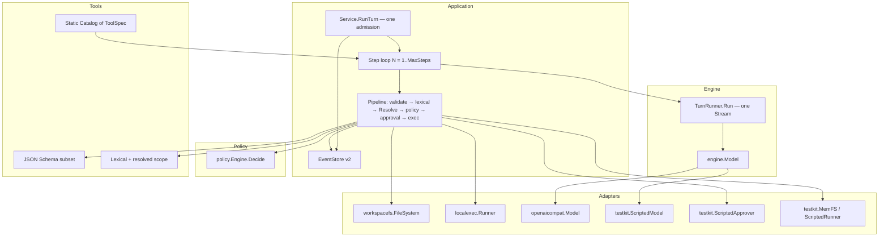
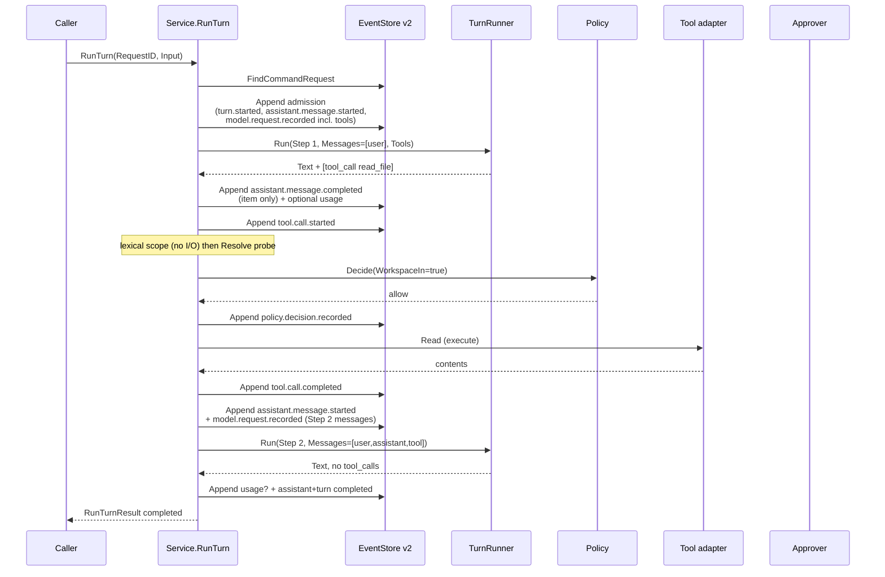

# Tool Runtime, Policy Engine, and Minimal Workspace Tools

- **Author:** TBD
- **Date:** 2026-08-16
- **Status:** Draft
- **Stability:** `experimental` / `internal`
- **Maturity:** pre-v0; not a general availability release
- **Repository:** `open-code-harness` (`github.com/SongYii/open-code-harness`)
- **Depends on:** Domain events / Session-Turn state machine; Engine vertical slice; EventStore v2 Slice 1; Provider contract + `adapters/openaicompat` (PRs #7, #12, #13)
- **Normative language:** English
- **Reading copy:** [Tool Runtime、Policy 与最小工作区工具](2026-08-16-tool-runtime-policy-design.zh-CN.md)
- **Charter authority:** [Open Code Harness architecture design](docs/superpowers/specs/2026-08-11-open-code-harness-architecture-design.md) §6.4
- **Out of scope next:** SQLite, JSONL audit, Runtime Host / crash continuation, ACP, TUI, full MCP client, OS Seatbelt/Landlock/bwrap backends, plugin registry, parallel tool batches, Context Engine

This document designs the Tool Runtime, an independent Policy Engine, and the smallest builtin workspace tool set that turns one admitted Turn into a bounded Step loop (`model → tool* → model`) without making the kernel a plugin host. It is an internal Go design, not a stable public protocol. Pre-v0 changes still require the design, implementation, tests, and architecture docs to move together.

---

## Overview

Open Code Harness can already admit one assistant Turn, run one provider-neutral model attempt, and persist a terminal Item/Turn pair through EventStore v2. The Engine stream grammar is still `text_delta* → completed`. `engine.Model` has no tool-call events. `NativeTools=required` is rejected at `openaicompat.New`. Vendor `tool_calls` fail closed as `capability_mismatch`. Compact `domain.Session` has no transcript. One `RunTurn` is one model attempt; Application does not retry. EventStore v2 remains four methods.

That is a Minimal Executable Turn Runner, not a code agent. A useful coding turn must read and write the workspace and run a bounded command, then send those results back to the model. This milestone adds that loop as an **Application-owned Step machine** over the existing Engine runner.

The design adopts charter §6.4 as the only execution pipeline. Scope is two stages (lexical, then a Resolve **probe**); execute I/O is last:

```text
schema validation
  → lexical scope check          # no I/O
  → Resolve probe                # I/O; not execute
  → policy decision              # WorkspaceIn = resolved bit
  → optional approval
  → sandboxed execution          # Read / Write / Run only after allow|granted
  → output normalization
  → audit event
```

Builtin tools (and later MCP tools) convert to one internal `domain.ToolSpec`. Policy is a pure function of `(spec, args, scope, mode)` and does not live in tool bodies. Default policy is least privilege: workspace-scoped reads allow; writes, `exec`, paths outside the workspace, and network deny or require approval. `tool.call.started` is committed **before** any side effect. One Request ID still admits exactly once and never silently starts a second *model* call; additional model attempts are explicit, numbered Steps whose request envelopes are logged before `Stream`.

---

## Background & Motivation

### Current implemented state (verified 2026-08-16 on this worktree)

| Layer | What exists | What blocks a tool loop |
| --- | --- | --- |
| Domain | Compact `Session` (identity, workspace, status, version, ≤1 active Turn, ≤1 active Item); assistant Item only; `model.request.recorded` / `model.usage.recorded` version-only | No `ItemKind` for tools; `validateSession` requires `ItemKindAssistantMessage`; `CompleteAssistantTurn` always terminates the Turn; `ModelPromptMessage` is `{role,text}` with roles `system\|user\|assistant` only; `Decide(StartAssistantTurn)` requires `Messages == [{user, Input}]`; codec `validateStrictJSONObject` is an **exact** key set (not `omitempty`) |
| Engine | `TurnRunner` consumes `text_delta* → completed`; `CapabilityProfile.NativeTools`; `AttemptStats` | No `tool_call` stream event; `ModelRequest` is `{SessionID,TurnID,ItemID,Input}`; `validPayload` rejects unknown runtime types |
| Application | `Service.RunTurn` is sole command authority; EventStore v2 admission + unknown-outcome resolution; `execution_registry` phases `admission_*` / `running` / `terminal_*` only; one `runner.Run` per admission | After `Run`, always `CompleteAssistantTurn` / fail / interrupt; `validExecutionTransition` does **not** allow `terminal_in_flight → running`; `retainUnknown` accepts only admission/terminal unknown; `ReconstructRequestResult` accepts only the 2/3/4/5/6-event shapes and the admission `ItemID`; `DigestRunTurnRequestV1` is Session+Input |
| Persistence | EventStore v2: `ReadStream`, `Append`, `ResolveAppend`, `FindCommandRequest` | Must not grow a fifth method |
| Provider | `adapters/openaicompat` Chat Completions SSE; `ProfileTextOnly`; `finish_reason=tool_calls` → `capability_mismatch` | Does not send `tools`; does not assemble `delta.tool_calls` |
| Architecture | `dependencies_test.go` owners: domain, engine, application, memory, openaicompat | No owner for policy, tools, workspace fs, or exec |
| Tests | `modeltest`, `eventstoretest`, `enginescenariotest`; keyless HTTP fixtures | No tool/policy/path-escape suite |

`application.Service.RunTurn` (`internal/harness/application/turn.go`) admits, calls `engine.TurnRunner.Run` once, and terminalizes. `CheckStartAssistantTurnEligibility` rejects any running Turn or Item. Compact Apply of `assistant.message.completed` clears the active Item **and** `CompleteAssistantTurn` also emits `turn.completed`, so there is no legal “assistant finished, Turn still running, tools next” state.

### Pain points this milestone removes

1. A Turn cannot observe or change a workspace. The product cannot yet be a code agent.
2. Vendor tool-calling endpoints are unusable: the only legal profile is text-only, and `tool_calls` are a protocol violation.
3. There is no single, testable permission decision. Any future tool would invent its own checks.
4. There is no reconstructable contract for “this Request ID already admitted a Turn that is mid-tool or mid-step.” EventStore v2 already forbids a second *admission*; the Step loop must not become a second silent *model* call.

### Why this now

The 2026-08-15 DeepSeek Harness gate already sequenced Provider, then Tool/Policy, before SQLite / ACP / TUI. Completing persistence slices 2–6 first would produce a strong event store with no agent loop. Provider is on `origin/main`. This is the next product capability.

---

## Goals & Non-Goals

### Goals

1. Turn a single admitted `RunTurn` into a bounded Step loop: one model attempt, then zero or more tools, then another model attempt, until the model returns no tools or a bound fires.
2. Keep Application as the sole command authority. Engine remains a bounded **one-attempt** runner. Domain remains pure (no `os`, `os/exec`, `net`, `net/http`, filesystem).
3. Convert every builtin tool to one `domain.ToolSpec`. Leave the same type MCP-shaped so a later MCP adapter can project into it. Do not implement an MCP client.
4. Implement charter §6.4 as an explicit Application pipeline, not a listener waterfall and not checks inside tool bodies.
5. Policy Engine is an independent package: deterministic, side-effect-free, table-tested. Default least privilege for write, exec, out-of-workspace paths, and network.
6. Log `tool.call.started` and **commit** it before any execute or approval wait. Model-visible content is logged. Step k≥2 `model.request.recorded.Messages` is the **new suffix** (that Step’s assistant + tool results), not a re-copy of the whole Turn. The live owner reconstructs the Stream projection by walking committed events of this CommandID.
7. Preserve EventStore v2’s four methods. Prefer new schemaVersion-1 domain events.
8. One Request ID still admits once. A second *invocation* never starts a model call. Additional model attempts happen only inside the live owner’s explicit Step loop after durable tool terminals.
9. Ship the smallest useful builtin set: `read_file`, `write_file`, `list_dir`, `exec`.
10. Failure, cancel, bound exhaustion, policy deny, and approval deny are specified and tested before the happy path.
11. Default `go test` stays keyless and uses `t.TempDir()` / in-memory filesystem / scripted exec. Production adapters must not touch a real user workspace in tests.
12. `go.mod` stays stdlib-only. Replaceable adapters behind consumer-owned ports; no plugin registry, no dynamic loading, no unloadable Domain/Application/Store.

### Non-goals

- SQLite, JSONL replica, Runtime Host, process-crash continuation of a running Step loop, ACP, TUI.
- Full MCP client, MCP transport, or remote tool hosts.
- Plugin kernel, Cordis, `next()` policy waterfalls, hook buses, self-modifying runtime.
- OS confinement backends (macOS Seatbelt, Linux bwrap/Landlock, Windows ACL). The **port** is defined; the first `exec` adapter is a bounded `os/exec` with workspace cwd and env scrubbing, and reports `enforcement=partial`.
- Parallel tool batches, background exec, PTY, LSP, web fetch, apply-patch, grep/search as first-class tools, todo lists, Skills, subagents.
- Application retry of a model attempt. Provider `Retryable` remains advisory.
- Expanding compact `Session` into a transcript. Context Engine is a later milestone; this slice projects **this Turn’s** model-visible messages from events the live owner already committed (and from `ReadStream` only when reconstructing a *terminal* result).
- Changing `DigestRunTurnRequestV1` to include tools, policy, or identity.
- Vendor SDKs, OAuth, or a fifth EventStore method.

---

## Key Decisions

| ID | Decision | Rationale |
| --- | --- | --- |
| T-01 | Application owns the Step loop. `engine.TurnRunner` stays one `Stream` / one attempt. | Matches EventStore v2 (“Application does not retry”), charter §6.2, and “Engine is a bounded runner.” Putting the loop in Engine would force Engine to import policy, tools, and Store. |
| T-02 | Step = one model attempt + the tool executions it produced. Turn = one or more Steps, capped. | Adopted from official DeepSeek Harness. Does not overload the current Item/Turn machine: assistant Items and tool Items are distinct; the Turn stays `running` across Steps. |
| T-03 | One Request ID admits once. Only the live execution-lease owner may call `Model.Stream` again, and only after every tool of the previous Step has a durable terminal and a new `model.request.recorded` is committed. A second invocation never calls the model. | Satisfies “must not silently start a second model call for the same admission” while still allowing a reconstructable loop. Crash mid-loop remains `reconciliation_required` (existing running-boundary). |
| T-04 | EventStore v2 interface is unchanged. New versioned domain events carry tool, policy, and approval facts. | A fifth Store method is not required: tools are not a second admission. Reconstruction walks the existing CommandID lineage. |
| T-05 | `tool.call.started` is appended and committed before schema-failure reporting to the model, approval wait, or execute. Invalid args still produce a started + failed pair. | DSH: log `tool/call` before execute. Side effects must not exist without a durable intent. |
| T-06 | Policy is `policy.Engine.Decide(Input) Decision` — a pure function. Not a `next()` waterfall, not a hook bus, not code inside `read_file` / `exec`. | Charter §6.4; DSH waterfall explicitly rejected. Independent tests; tools cannot self-authorize. |
| T-07 | Default policy: `read_file` / `list_dir` allow inside workspace; `write_file` and `exec` require approval; any path outside workspace or any network intent denies. Missing Approver ⇒ deny. `ModeAllowWrites` ships in `policy` (table-complete) but is **not** the production default. Production composition is `ModeDefault`. Tests and headless CI may pass `ModeAllowWrites` explicitly. | Least privilege by default. Headless automation that must write without an Approver opts in; it does not get a silent yolo mode. |
| T-08 | First builtins: `read_file`, `write_file`, `list_dir`, `exec`. `list_dir` accepts optional `depth` (1 = this folder only, 2 = one extra level; omitted ≡ 1; max 2; entry cap 256). No grep, patch, web, or todo. | Smallest set that can inspect a tree, change a file, and run `go test`. `depth` 1 matches ordinary “list this folder” / `ls` semantics. |
| T-09 | Tools execute **sequentially** in model order. `isConcurrencySafe` / parallel batches are deferred. | Compact Session allows one active Item. Parallel would require a different write-side invariant and a later design. |
| T-10 | Engine stream grammar is `text_delta* tool_call* completed`. The `completed` **event** has empty `Text` and nil `ToolCall`. `RunResult` **may** contain both concatenated text and `ToolCalls`. Uniqueness is on **call ids**, not names. No `tool_call_delta` this slice. Adapter buffers vendor chunks and emits Engine events in grammar order. | Chat Completions routinely mix prose and tools. Rejecting “text and tools in one attempt” would make the loop unusable. Two `read_file` calls in one Step are legal. |
| T-11 | Non-empty catalog requires `RequestIdentity != nil` and `NativeTools ∈ {supported, required}`. `required` + empty catalog is a composition error. `unsupported` + non-empty catalog is a `NewService` error. Engine does **not** consult a profile; it accepts `Tools` as data. Empty catalog ⇒ `Messages==nil`, `Tools==nil`, one `Run`, existing `CompleteAssistantTurn`. | `TurnRunner` has no profile field. Composition is the only place that can know `unsupported`. Existing scripted DeepEqual tests stay Input-only. |
| T-12 | Replaceable executors behind consumer-owned ports (`tools.FileSystem`, `tools.CommandRunner`, `tools.Approver`). Static catalog at composition. No plugin registry. | Locked user preference: DSH “everything is a plugin” is adopted only as replaceable adapters behind ports. Domain/Application/Store are not unloadable. |
| T-13 | Compact `Session` stays transcript-free. The live owner holds an in-memory message projection rebuilt from events **this invocation committed**. Reconstruction of a terminal Request ID walks the stream. Mid-loop crash does not auto-continue. | Honest about write-side state. Avoids a second mutable transcript. Matches DSH “model-visible means logged” without copying their in-memory Session object. |
| T-14 | First `exec` sandbox is `enforcement=partial`: workspace cwd, scrubbed env, timeout, output cap, process-group kill, no extra files. OS confinement is a later adapter on the same `CommandRunner` port. | Industrial enough to bound damage; honest that curl-from-exec is not kernel-blocked. Policy still denies network *tools*; exec remains approval-gated. |
| T-15 | Approval is **not** a write-side Item kind. Durable `approval.requested` / `approval.resolved` events apply version-only on the running tool Item. The human/UI is an injected `Approver` port. Default implementation denies. ACP/TUI later implement the same port. | Preserves compact “≤1 active Item.” Specifies denial and timeout before the happy path without building a client. |
| T-16 | `DigestRunTurnRequestV1` remains Session ID + exact UTF-8 input. Tool catalog, policy mode, and model identity are not folded in. Changing those requires a new Request ID (composition rule, same as P-17). | One Request ID is one user intent. Silent catalog swaps would be a second attempt. |
| T-17 | Same `CommandID` is correlation lineage for the whole Turn (admission, every Step, every tool, terminal). New `ItemID`s per assistant Step and per tool call. | Matches today’s “one Command ID across two appends.” Reconstruction stays “all records with this CommandID.” |
| T-18 | JSON Schema validation is a **closed subset** implemented in stdlib (`encoding/json` + typed walk). No schema library. | `go.mod` stays module-stdlib. Unsupported keywords fail closed. |
| T-19 | Mid-loop appends use new lease phases `step_append_in_flight` / `step_append_unknown` that may return to `running`. Unknown ⇒ `ResolveAppend` on the retained exact intent; never execute unless `tool.call.started` is committed; never re-execute after a committed or unknown tool terminal; budget exhausted ⇒ `append_outcome_unknown`, zero `Stream`, zero execute. | Today `retainUnknown` and `validExecutionTransition` only cover admission and one turn-terminal. Reusing `terminal_in_flight` cannot legally return to `running`. |
| T-20 | Model-visible tool result / `read_file` / `exec` output cap is **64 KiB**. Step k≥2 logs a **suffix** envelope, not the accumulated transcript. Serialized Stream projection is capped at **4 MiB**. Tool-enabled HTTP composition requires `MaxRequestBytes ≥ projectionCap + wireSlack` = **5 MiB** (`wireSlack` = 1 MiB for `model`/`stream`/`tools` JSON wrapping). Oversize projection ⇒ Application `envelope_limit` before `Stream`. | A naïve 8×8×256 KiB (or 1 MiB `read_file`) envelope exceeds the 8 MiB event payload and the adapter’s 1 MiB default body. Equality of projection cap and HTTP floor would reject a legal 4 MiB projection inside the adapter. |

---

## Primary-source comparison (Adopt / Boundary)

Re-verified 2026-08-16 from then-public official sources via `gh api`. DeepSeek-Reasonix remains community context only and is not a primary source.

| Source | Observed contract (official, 2026-08-16) | Adopt | Boundary |
| --- | --- | --- | --- |
| **DeepSeek Harness** [`docs/tool-execution-pipeline.md`](https://github.com/deepseek-ai/deepseek-harness/blob/master/docs/tool-execution-pipeline.md), [`docs/subsystems/tools.md`](https://github.com/deepseek-ai/deepseek-harness/blob/master/docs/subsystems/tools.md), [`docs/subsystems/sandbox.md`](https://github.com/deepseek-ai/deepseek-harness/blob/master/docs/subsystems/sandbox.md), [`docs/subsystems/approval.md`](https://github.com/deepseek-ai/deepseek-harness/blob/master/docs/subsystems/approval.md) | `tool/call` is a session event **before** execute. Pipeline: `tools/pre-execute` waterfall → monotonic guards → `ctx.approval` (absent/unanswerable = deny) → `tools/execute` around-dispatch → body → `tools/post-execute` → `finalizeContent` → `tools/result`. Registry snapshots canonical JSON; model-facing `ToolSchema` strips `execute`/`timeoutMs`. SandboxMode is file-effect only (`read-only` / `workspace-write` / `danger-full-access`); network is outside that vocabulary. Silent unconfined passthrough is illegal. A step is one model request plus its tools; a turn is zero or more steps. | Log call before execute. Explicit ordered pipeline. Fail-closed unknown required types. Approval missing ⇒ deny. Model-visible result is one frozen outcome. Sandbox as a **port** with reported `full\|partial` enforcement. Step/Turn layering. | Do **not** implement Cordis waterfalls, `next()` listeners, hook-owned policy, Code Mode `run_code` transport, or their event type names (`tool/call`, `ctx.tools`). Do not make async flush the commit authority. TypeScript/plugin kernel rejected. |
| **Pi** [`packages/agent/README.md`](https://github.com/badlogic/pi-mono/blob/main/packages/agent/README.md), `packages/agent/src/agent-loop.ts` | `turn_start` = one LLM call + its tool executions. `beforeToolCall` after `tool_execution_start` and parsed args; can block. Parallel default, sequential if any tool opts out. `fauxProvider` on the same port. `terminate: true` can skip the follow-up LLM call. In-memory `AgentMessage[]` is the working context. | Step = model + tools. Scripted model on the same port. Sequential this slice (Pi’s safer mode). Cancel as a first-class stop. Injected tool set. | Do not treat an in-memory message list as durable authority. Do not adopt parallel-first, hook `beforeToolCall` as policy, or `terminate` hints as domain facts. Do not copy Pi type names. |
| **Kimi Code** [`AGENTS.md`](https://github.com/MoonshotAI/kimi-code/blob/main/AGENTS.md), `packages/agent-core-v2/src/tool/toolContract.ts`, `workspaceToolPolicy.ts` | `ExecutableTool.resolveExecution(input) → execute(ctx)`. `ToolAccesses` declare file read/write/search so the scheduler can overlap non-conflicting calls. `approvalRule` is part of the resolved execution. Workspace tool policy is a **veto** that outranks agent/profile allow lists. `ToolSource = builtin \| user \| mcp`. Loop-control fields (`stopTurn`) are stripped before persistence. | One execution contract for builtin and (later) MCP. Resource-access declaration **type** (even if unused for scheduling). Workspace/policy veto independent of the tool body. Strip loop hints from durable facts. | Do not adopt DI × Scope, `IWorkspaceToolPolicy` service names, or parallel scheduling this slice. Do not persist `stopTurn`. |
| **Grok Build** user-guide [`18-sandbox.md`](https://github.com/xai-org/grok-build/blob/main/crates/codegen/xai-grok-pager/docs/user-guide/18-sandbox.md), [`22-permissions-and-safety.md`](https://github.com/xai-org/grok-build/blob/main/crates/codegen/xai-grok-pager/docs/user-guide/22-permissions-and-safety.md) | Authorization order: PreToolUse hooks → deny/ask/allow rules (deny wins) → remembered grants → built-in read-only auto-approve → permission mode. Read-only tools (`read_file`, `list_dir`, …) do not prompt. Sandbox profiles `off/workspace/read-only/strict`; default **off**. Fail-closed on unenforceable deny globs. `always-approve` still honors deny. | Deny wins. Read tools default-allow inside workspace. Separate **policy decision** from **sandbox enforcement**. Fail closed if we claim a bound we cannot enforce. | Do not default sandbox to off for *policy*. Do not implement hook buses, remembered grants, yolo/`always-approve` as a first-class mode, or kernel Seatbelt/bwrap this slice. Do not copy Grok tool names as our schema identity beyond the ordinary `read_file`/`list_dir` vocabulary. |
| **OpenAI Codex** issues/docs on execpolicy + sandbox; prior gates on item lifecycle | Sandbox placement and approval policy are separate. An exclusion rule must not grant permission. Explicit item lifecycle `started → delta* → completed`. Bounded queues. Thread-store authority. | Keep policy ≠ sandbox. Tool Item lifecycle matches assistant Items. Store remains the fact authority. | Do not implement `execpolicy` DSL, PTY unified exec, or Codex app-server objects as domain events. Do not copy `sandbox-exec` profiles. |
| **Maka** [`ARCHITECTURE.md`](https://github.com/maka-agent/maka-agent/blob/main/ARCHITECTURE.md) | One execution authority (Runtime Host). Runtime Event Log is canonical for model messages, tool calls, results, termination. Context pruning changes projections, not history. Tool Runtime sits under the runner, not under clients. | Single execution authority = Application. Facts vs projections. Clients (later ACP/TUI) must not execute tools. | Do not implement Runtime Host, Agent Graph, or eval kernel. Do not defer request-envelope logging. |

### Already decided for DeepSeek Harness (reaffirmed)

**Adopt:** `tool/call` logged before execute; explicit pipeline; Step = one model request plus its tools; Turn = zero or more Steps; fail-closed unknown required types; model-visible means logged.

**Reject:** Cordis / everything-is-a-plugin as kernel; TypeScript core; Policy as a `next()` listener waterfall; async flush as commit authority.

**Refinement (user-locked):** replaceable adapters behind consumer-owned ports. No plugin registry. Domain, Application, and Store are not unloadable plugins.

---

## Proposed Design

### Placement and dependency direction

```text
headless caller / future composition root
                    |
                    v
internal/harness/application  -----> internal/harness/engine
  command + Step loop +                Model port, TurnRunner,
  pipeline orchestration               tool_call stream events
                    |
        +-----------+-----------+
        v                       v
internal/harness/policy    internal/harness/tools
  Decide() only              ToolSpec catalog, schema
                             subset, scope check, ports
        |
        v
internal/harness/domain
  lifecycle + log-only facts

internal/harness/adapters/workspacefs  ----implements----> tools.FileSystem
internal/harness/adapters/localexec    ----implements----> tools.CommandRunner
internal/harness/adapters/openaicompat ----implements----> engine.Model
internal/harness/testkit               ----implements----> all ports (scripted)
internal/harness/adapters/memory       ----implements----> application.EventStore
```

Rules (extend `internal/harness/architecture/dependencies_test.go`):

| Owner | New root | May import | Must not import |
| --- | --- | --- | --- |
| `ownerPolicy` | `internal/harness/policy` | `domain`, stdlib (`encoding/json`, `strings`, …) | `application`, `engine`, `tools`, `adapters`, `os`, `os/exec`, `net`, `net/http` |
| `ownerTools` | `internal/harness/tools` | `domain`, stdlib (`path/filepath` lexical only) | `policy`, `application`, `adapters`, `os`, `os/exec`, `net`, `net/http` |
| `ownerWorkspaceFS` | `internal/harness/adapters/workspacefs` | `tools`, `domain`, `os`, `path/filepath` | `application`, `testkit`, `os/exec`, `net/http`, other `adapters/*` |
| `ownerLocalExec` | `internal/harness/adapters/localexec` | `tools`, `domain`, `os`, `os/exec` | `application`, `testkit`, `net/http`, other `adapters/*` |
| `ownerApplication` | (existing) | **also** `policy`, `tools` | still no `adapters/*`, `os`, `os/exec`, `net/http` |
| `ownerOpenAICompat` | (existing) | engine, domain, `net/http`, `os` | still no `os/exec`; may not import `tools` (receives `[]domain.ToolSchema` on `ModelRequest`) |
| `ownerDomain` / `ownerEngine` | (existing) | unchanged | still no `os` / `net` / `provider` path segments |

`path/filepath` in `tools` is allowed only for lexical `Clean` / `IsAbs` / `ToSlash`. Any `EvalSymlinks`, `Stat`, `Open`, or `LookPath` lives in an adapter.

### Architecture



### Failure, cancel, bounds, and denial (normative — before the happy path)

Specify these first. Tests in PR 1–5 must pin them before a green two-step fixture is treated as done.

#### A. Admission and second model call

| Situation | Durable effect | Model `Stream` | Code |
| --- | --- | --- | --- |
| `FindCommandRequest` not_found | One admission CAS | At most one, after commit | existing |
| found terminal | Reconstruct; return | **Zero** | existing |
| found running, local owner | Wait | **Zero** (waiter) | existing |
| found running, no local owner | None | **Zero** | `reconciliation_required` |
| identity mismatch | None | **Zero** | `command_identity_mismatch` |
| Live owner, Step *k* tools not all terminal | None | **Zero** additional | internal invariant |
| Live owner, Step *k* tools all terminal, `k < MaxSteps`, model returned tools | Commit `assistant.message.started` + `model.request.recorded` for Step *k+1* | Exactly one new `Stream` | — |
| Live owner, `k == MaxSteps` and model still returned tools | Fail Turn with `step_limit` | **Zero** additional | `step_limit` |
| New invocation with same Request ID after process death mid-loop | None this slice | **Zero** | `reconciliation_required` |

The live owner’s Nth `Stream` is **not** a second admission. It is an explicit Step whose request envelope is already a committed fact. A *different goroutine or process* holding the same Request ID never reaches `Stream`.

#### A2. Mid-loop appends, `execution_registry`, and unknown outcome (normative)

Today (`internal/harness/application/execution_registry.go`) the live owner moves `admission_in_flight → running → terminal_append_in_flight`. `retainUnknown` accepts only `admission_unknown` and `terminal_unknown`. `validExecutionTransition` does **not** allow `terminal_append_in_flight → running`. A tool Turn performs many non-terminal appends after admission. Reusing the terminal phase cannot legally return to the loop.

**Locked phases** (additions in **bold**):

```text
admission_in_flight
  → running
  → step_append_in_flight      # new; any mid-loop Append
       → running               # committed; continue the loop
       → step_append_unknown   # new; lost ack
            → running          # ResolveAppend committed | one exact retry not_found then committed
  → terminal_append_in_flight  # Turn-terminal pair only (existing)
```

`retainUnknown` must accept `step_append_unknown` in addition to the two existing unknown phases. Today `retainUnknown` sets `ownerActive=false`; only `resumeAfterResolvedAdmission` restores `running` + `retained=false` + `ownerActive=true`. Mid-loop resolution copies that contract:

```go
// execution_registry.go — same guards as resumeAfterResolvedAdmission,
// except the required phase is step_append_unknown.
func (lease *executionLease) resumeAfterResolvedStepAppend() error
```

After `ResolveAppend` committed or after one exact `Append` retry of a `not_found` step intent: call `resumeAfterResolvedStepAppend` then continue the loop. Do **not** go `step_append_unknown → terminal_append_in_flight`. A mid-loop batch is never a Turn terminal (see composites below). Cancel after a resolved step-append uses `running → cancel_won → terminal_append_in_flight` like today.

`validExecutionTransition` must allow:

| From | To |
| --- | --- |
| `running` | `step_append_in_flight`, `terminal_append_in_flight`, `cancel_won` |
| `step_append_in_flight` | `running`, `step_append_unknown`, `cancel_won` |
| `step_append_unknown` | `running` (via `resumeAfterResolvedStepAppend` only), `step_append_in_flight` (exact retry of the retained intent only), `cancel_won` |

An unresolved `step_append_unknown` counts as a retained unknown for the Session (same `unresolved` / `errSessionUnresolved` rule as today). A different new admission on that Session is rejected until the unknown is resolved or the process dies (then `reconciliation_required`).

**Per-append contract** (every mid-loop batch uses `ResolveAppend` on the retained exact `AppendIntent`; existing `AppendResolutionTimeout` / `AppendResolutionMaxOperations`):

| Append batch | After `not_found` | After `committed` | After unknown exhausted | Side effect |
| --- | --- | --- | --- | --- |
| item-only `assistant.message.completed` (+ optional usage) | one exact `Append` | continue; projection from committed events | `append_outcome_unknown`; **zero** `Stream`; **zero** execute | none |
| `tool.call.started` | one exact `Append` | pipeline may proceed | `append_outcome_unknown`; **zero** execute | **never** `Resolve`/`Read`/`Write`/`Run` unless this batch is a committed fact |
| `policy.decision.recorded` | one exact `Append` | call `Decide` was already pure; continue | `append_outcome_unknown`; **zero** execute | none |
| `approval.requested` | one exact `Append` | wait on Approver | `append_outcome_unknown`; do not wait; **zero** execute | none |
| `approval.resolved` | one exact `Append` | execute only if `granted` **and** `tool.call.started` is committed | `append_outcome_unknown`; **zero** execute | none |
| `tool.call.completed` / `tool.call.failed` (Turn **continues**) | one exact `Append` | continue to next tool / next Step | `append_outcome_unknown`; **do not re-invoke** execute; **zero** `Stream` | execute already happened or did not; never retry execute |
| Step k≥2 `assistant.message.started` + `model.request.recorded` | one exact `Append` | exactly one `Stream` | `append_outcome_unknown`; **zero** `Stream` | none |
| `InterruptToolTurn` / `FailToolTurn` (tool terminal **+** turn terminal; optional `approval.resolved`) | existing **terminal**-unknown path | done | existing `append_outcome_unknown`; **zero** `Stream`; **zero** execute | none |
| Turn-terminal pair with no active Item (existing `CompleteTurn` / `FailTurn` / `InterruptTurn`) | existing terminal-unknown path | done | existing | none |

**Execute / Stream interlocks (must-pass tests in PR 5b):**

1. Never call `FileSystem.Read` / `Write` / `List` or `CommandRunner.Run` unless `tool.call.started` for that `ItemID` is a **committed** fact (committed receipt or `ResolveAppend` = committed).
2. `FileSystem.Resolve` is a scope **probe**, not execute. It may run only after lexical scope passed and `tool.call.started` is committed, and only before `Decide`. It must not create, write, or start a process.
3. Never re-invoke execute after a committed **or unknown** tool terminal (`completed` / `failed` / `interrupted`).
4. Never `Stream` while any append of this Request ID is unresolved, or after `append_outcome_unknown`.
5. Memory-store pre-commit faults already exist; inject them on `tool.call.started`, tool terminal, and Step k≥2 start.

#### B. Cancel

| Phase | Durable boundary | Model / tool | Outcome |
| --- | --- | --- | --- |
| Preflight / pre-admission | none | nothing | `canceled`, no records (existing) |
| After admission, during Step model | one `InterruptAssistantTurn` (existing composite) | cancel stream ctx | `caller_canceled` |
| After `tool.call.started`, before execute | one `InterruptToolTurn` | no execute | `caller_canceled` |
| During execute | cancel `CommandRunner`/`FileSystem` ctx; then one `InterruptToolTurn` | kill process group | `caller_canceled` |
| During approval wait | one `InterruptToolTurn` with `Approval` set (emits `approval.resolved` + tool interrupt + turn interrupt) | no execute | `caller_canceled` |
| Terminal append in flight | existing EventStore winner table | no new Stream | existing |
| Late cancel vs retained completed/failed | retained winner | no new Stream | existing |

Cancel never leaves a started tool Item without a terminal event. Cleanup uses the existing `context.WithoutCancel` + `TerminalCommitTimeout` path.

**Locked (Domain law):** `decideInterruptTurn` / `decideFailTurn` / `decideCompleteTurn` reject a running Item (`CodeItemAlreadyRunning`). Application **must not** `Decide(InterruptTurn)` / `Decide(FailTurn)` while `ActiveItem != nil`. PR 1 adds composites that mirror `InterruptAssistantTurn`:

```go
// Require running Turn + ActiveItem.Kind == tool_call matching ItemID.
// One Decide, one event batch, one terminal_append_in_flight commit.
type InterruptToolTurn struct {
    SessionID  SessionID
    TurnID     TurnID
    ItemID     ItemID
    Code       string // caller_canceled | runtime_delivery_failed | request_abandoned
    Message    string
    ApprovalID ApprovalID // zero ⇒ no approval.resolved in the batch
}
type FailToolTurn struct {
    SessionID SessionID
    TurnID    TurnID
    ItemID    ItemID
    Code      string
    Message   string
}
```

`InterruptToolTurn` emits, in order: optional `approval.resolved{decision=canceled}` (only if `ApprovalID` is set and `approval.requested` for that ID already applied on this item) → `tool.call.interrupted` → `turn.interrupted`. `FailToolTurn` emits `tool.call.failed` → `turn.failed`. Ban concatenating separately Decided tool-terminal and turn-terminal lists against the same pre-tool-terminal state. Ban two-commit “InterruptToolCall then InterruptTurn” as the cancel path (that would be a second lease protocol for the same user cancel).

PR 5b test: cancel during execute produces one legal Domain batch from `InterruptToolTurn` and never calls `Decide(InterruptTurn)` on a state that still has `ActiveItem`.

#### C. Policy and approval denial

| Decision | Execute? | Model-visible tool result | Turn |
| --- | --- | --- | --- |
| `allow` | yes | execution output | continues |
| `deny` | **no** | `tool.call.failed` code `policy_denied`, safe message | **continues** (model sees the denial; may stop or try something else) |
| `require_approval` + grant | yes | execution output | continues |
| `require_approval` + deny | **no** | `tool.call.failed` code `approval_denied` | continues |
| `require_approval` + timeout | **no** | `tool.call.failed` code `approval_timeout` | continues |
| `require_approval` + no Approver wired | **no** (treated as deny) | `approval_denied` | continues |
| Unknown tool name | **no** | `tool.call.failed` code `unknown_tool` | continues if the model emitted it; Engine already accepted the `tool_call` |
| Schema invalid | **no** | `invalid_args` | continues |
| Path out of workspace (lexical) | **no** | `scope_denied` | continues; **no** `Resolve`, **no** `Decide` |
| Symlink / realpath escape (`Resolve` fails or `WorkspaceIn=false`) | **no** | `scope_denied` | continues; `Decide` **is** invoked with `WorkspaceIn=false` (must deny); **no** `Read`/`Write`/`Run` |

Denial is a **tool-level** failure, not a Turn failure, unless a bound says otherwise. That matches DSH (denials become binding tool results) and keeps the model in the loop. A future policy mode `fail_turn_on_deny` is out of scope.

**Model-visible tool `Text` (locked; no path, args, or env):**

| Code | `role=tool` `Text` (UTF-8) | Event field | `truncated` |
| --- | --- | --- | --- |
| (success) | exact normalized output, possibly plus `\n[truncated]` | `ToolCallCompleted.Content` | `true` iff marker appended |
| `policy_denied` | `policy denied this tool` | `ToolCallFailed.Message` | false |
| `approval_denied` | `approval denied this tool` | `ToolCallFailed.Message` | false |
| `approval_timeout` | `approval timed out` | `ToolCallFailed.Message` | false |
| `scope_denied` | `path is outside the workspace` | `ToolCallFailed.Message` | false |
| `unknown_tool` | `unknown tool` | `ToolCallFailed.Message` | false |
| `invalid_args` | `invalid tool arguments` | `ToolCallFailed.Message` | false |
| `output_limit` | `tool output exceeded the size limit` | `ToolCallFailed.Message` | false |
| `exec_timeout` | `command timed out` | `ToolCallFailed.Message` | false |
| `envelope_limit` | (Turn failure; no tool message) | Turn `step_limit`-class code `envelope_limit` | n/a |

The truncation marker is the exact six characters `\n` + `[truncated]`. Tests compare these strings, not just codes.

#### D. Execution and bound failures

| Bound | Limit | On exceed |
| ---: | ---: | --- |
| Steps per Turn | `MaxSteps = 8` | `turn.failed` / `step_limit`; no further Stream |
| Tool calls per Step | `MaxToolCallsPerStep = 8` | `n > 8` ⇒ `invalid_stream` on the model attempt; Turn fails; **zero** `tool.call.started`. No prefix execute. No `tool_call_limit`. |
| Tool argument JSON | 32 KiB UTF-8 | `invalid_args`; no execute |
| Tool result payload (`MaxToolResultBytes`) | **64 KiB** UTF-8 | success: keep prefix + `\n[truncated]`, `truncated=true`. Failures use the frozen sentence, never a prefix of secrets. Canonical IDs/codes are never truncated. |
| `read_file` bytes | **64 KiB** | larger file ⇒ success with prefix + `\n[truncated]` (`truncated=true`), not `output_limit` |
| `write_file` bytes | 32 KiB (`content` `maxLength`; matches argument JSON bound) | `invalid_args` |
| `list_dir` entries | 256 across the whole walk; `depth` omitted or `1` = named directory only; `depth` `2` = children + one extra level | return `truncated=true` + first 256 paths in lexical order |
| `exec` wall time | 30 s default, max 120 s | kill process group; `exec_timeout` |
| `exec` combined stdout+stderr | **64 KiB** | kill; success with prefix + `\n[truncated]` if the process exited; `output_limit` if killed for size mid-run |
| Approval wait | 30 s default | `approval_timeout` (deny) |
| Assistant UTF-8 (existing) | 1 MiB | existing `output_limit` on the model attempt |
| Logged envelope per `model.request.recorded` | `maxLoggedEnvelopeBytes` (below) | reject append if over 8 MiB (must not happen if composition honors the formula) |
| Stream projection | **4 MiB** serialized messages+tools JSON | `envelope_limit`; **zero** `Stream` |
| Events per append (existing) | 64 | pipeline uses small batches (1–4 events) |
| Event payload (existing) | 8 MiB | reject, never truncate facts |

**Envelope math (locked):**

```text
maxLoggedEnvelopeBytes =
    MaxAssistantBytes                         # 1 MiB
  + MaxToolCallsPerStep * MaxToolResultBytes  # 8 × 64 KiB = 512 KiB
  + tools schema + identity overhead          # ≤ 64 KiB
  ≈ 1.6 MiB
```

`maxLoggedEnvelopeBytes` must be `< 8 MiB` (event payload). Tool-enabled HTTP composition requires `MaxRequestBytes ≥ 5 MiB` so a just-under-4-MiB projection plus `model`/`stream`/`tools` wrapping still fits. Application checks the serialized projection **before** `Stream` and fails `envelope_limit` at 4 MiB; the adapter must not be the first to reject a legal projection.

Step 1 logs `[{user, Input}]`. Step k≥2 logs only the **suffix** (that Step’s assistant message + its tool results), not the accumulated Turn. The live owner builds the Stream `Messages` by walking committed events of this CommandID (user from `turn.started` / first envelope, then each suffix in order). A single max-size suffix therefore fits in one event; a max-length Turn may still hit the 4 MiB projection cap and fail `envelope_limit` before Stream — that is this slice’s substitute for a Context Engine.

PR 5b must include: persist a last `model.request.recorded` at `maxLoggedEnvelopeBytes`; fail `envelope_limit` when the reconstructed projection would exceed 4 MiB. PR 7 must pin: a just-under-cap projection is accepted by `Stream` when `MaxRequestBytes = 5 MiB`.

**Tool-call batch rule (locked):** if `len(tool_calls) == 0`, the Turn completes. If `1 ≤ n ≤ 8`, execute all sequentially. If `n > 8`, the model attempt is `invalid_stream` and the Turn fails. We do not execute a prefix of an oversized batch.

#### E. Provider / capability

| Situation | Engine / adapter | Application |
| --- | --- | --- |
| `NativeTools=unsupported` and vendor sends `tool_calls` | existing `capability_mismatch` | fail Turn (existing) |
| `NativeTools=supported\|required` and vendor sends assembled calls | `tool_call` events then `completed` with `FinishReason=tool_calls` | enter tool pipeline |
| `required` but catalog empty | `NewService` composition error | no RunTurn |
| `unsupported` + non-empty catalog | `NewService` composition error | no RunTurn; Engine is never asked |
| Empty completion with no tools (existing) | `empty_response` | fail Turn |
| `finish_reason=stop` and also tool_calls | `invalid_stream` | fail Turn |
| Duplicate `tool_call.id` in one Step | `invalid_stream` | fail Turn |
| Unknown stream type | existing `invalid_stream` | fail Turn |

### Step and Item lifecycle

```text
Turn:  absent --turn.started--> running --turn.completed|failed|interrupted--> terminal
```

```text
Step k (k ≥ 1):
  assistant.message.started
  model.request.recorded          # required when RequestIdentity != nil OR k ≥ 2
  [model.usage.recorded]
  assistant.message.completed     # text + toolCalls[]  (item only; Turn stays running)
       or assistant.message.failed|interrupted  (+ turn terminal)
```

```text
Each tool in Step k (sequential; Turn continues):
  tool.call.started               # BEFORE pipeline side effects
  policy.decision.recorded        # log-only, version-only
  [approval.requested]
  [approval.resolved]             # granted | denied | timeout — not cancel
  tool.call.completed | failed    # deny/timeout/schema/scope are failed, Turn continues

Turn-ending cancel while that tool Item is active (one composite, not a per-tool terminal):
  InterruptToolTurn → [approval.resolved{canceled}] + tool.call.interrupted + turn.interrupted
```

```text
Item kinds (write-side):
  assistant_message  (existing)
  tool_call          (new)
```

There is **no** `ItemKindApproval`. Approval events are version-only on the running tool Item.

Compact Apply:

- `assistant.message.completed` with `ToolCalls != nil` **clears the assistant Item** and **leaves the Turn running** (today `applyTerminalItem` already clears the Item; today `CompleteAssistantTurn` also emits `turn.completed` — that composite is **only** used when `ToolCalls` is empty).
- `tool.call.started` sets `ActiveItem` to a `tool_call` Item. Requires running Turn and no active Item. Memory `buildBatch` (and the EventStore identity index) must treat `tool.call.started` like `assistant.message.started` for historical ItemID uniqueness.
- Tool terminals use `applyTerminalItem`.
- `approval.requested` and `approval.resolved` are version-only on the running tool Item (`applyVersionOnlyRunningItem`).
- `policy.decision.recorded` is version-only on the running tool Item.
- After the last tool terminal, compact state is: running Turn, no active Item. That is the legal pre-state for `StartAssistantMessage` (already implemented in `decideStartAssistantMessage`).
- `validateSession` (used by `CheckStartAssistantTurnEligibility`) must accept `item.Kind == assistant_message | tool_call`. A crash-left running tool Item makes a **different** Request ID fail with `item_already_running` / `turn_already_running`, not “session structure is invalid.” Same Request ID remains `reconciliation_required`.

New / split commands:

| Command | Events | When |
| --- | --- | --- |
| `CompleteAssistantMessage` (new) | `assistant.message.completed` only | model returned tools, or Application will start another Step |
| `CompleteAssistantTurn` (existing) | item completed + turn completed | model returned no tools (final Step) |
| `StartToolCall` | `tool.call.started` | after previous Item cleared |
| `RecordPolicyDecision` | `policy.decision.recorded` | after `Decide`, before execute |
| `RequestApproval` | `approval.requested` | policy effect `require_approval` |
| `ResolveApproval` | `approval.resolved` | Approver returned or timeout |
| `CompleteToolCall` / `FailToolCall` | matching tool terminal **only** | execute success / policy or approval deny (Turn **continues**) |
| `InterruptToolTurn` (new composite) | [`approval.resolved`] + `tool.call.interrupted` + `turn.interrupted` | cancel while a tool Item is active |
| `FailToolTurn` (new composite) | `tool.call.failed` + `turn.failed` | Turn-failing error while a tool Item is active (not used for table-C denials) |
| `StartAssistantMessage` (existing) | `assistant.message.started` | Step k≥2 |
| `RecordModelRequest` (new) | `model.request.recorded` | Step k≥2 (and allowed on Step 1 instead of bundling if we choose; Step 1 keeps today’s optional bundle on `StartAssistantTurn`) |
| `CompleteTurn` / `FailTurn` / `InterruptTurn` (existing) | turn terminal | **no** active Item (`CodeItemAlreadyRunning` otherwise) |

`FailAssistantTurn` / `InterruptAssistantTurn` remain the composites when the **assistant** Item is running (model attempt). `FailToolCall` / `CompleteToolCall` never terminate the Turn. There is no standalone `InterruptToolCall` command: user cancel always ends the Turn, so the only interrupt path is `InterruptToolTurn`.

### Sequence: successful two-Step turn



Write with approval (deny path is the same until `Approver`):

```mermaid
sequenceDiagram
    participant S as Service
    participant ES as EventStore
    participant P as Policy
    participant A as Approver
    participant T as write_file

    S->>ES: tool.call.started
    Note over S: lexical + Resolve before Decide
    S->>P: Decide(write_file, WorkspaceIn=true)
    P-->>S: require_approval
    S->>ES: policy.decision.recorded + approval.requested
    S->>A: Decide(ctx, request)
    alt granted
        A-->>S: allow
        S->>ES: approval.resolved granted
        S->>T: Write
        S->>ES: tool.call.completed
    else denied or timeout
        A-->>S: deny
        S->>ES: ResolveApproval + FailToolCall
        Note over S: Turn continues; next model sees the failed tool
    else ctx cancel
        A-->>S: canceled
        S->>ES: InterruptToolTurn<br/>(approval.resolved canceled +<br/>tool.call.interrupted + turn.interrupted)
        Note over S: Turn ends; no further Stream
    end
```

### Live-owner Step loop (Application)

Pseudocode for `runTurnOwned` after successful admission. Existing one-attempt path is the `MaxSteps==1 && catalog empty` specialization; when the catalog is empty **and** the first `Run` returns no tool calls, behavior is byte-compatible with today.

```go
// After admission + first StartAssistantTurn batch.
// Empty catalog: Messages==nil, Tools==nil, one Run, CompleteAssistantTurn (today).
// Tool catalog: Messages/Tools populated; each commitStepAppend uses
// step_append_in_flight and ResolveAppend per table A2.
for step := 1; step <= cfg.MaxSteps; step++ {
    msgs, tools := (*[]domain.ModelPromptMessage)(nil), []domain.ToolSchema(nil)
    if catalogEnabled {
        if err := ensureProjectionUnderCap(); err != nil {
            return failTurn(envelope_limit) // no Stream
        }
        msgs, tools = projection.Messages(), catalog.Schemas()
    }
    run, err := runner.Run(ctx, engine.RunRequest{
        ModelRequest: engine.ModelRequest{
            SessionID: id.Session, TurnID: id.Turn, ItemID: assistantItem,
            Input:    request.Input,
            Messages: msgs,
            Tools:    tools,
        },
        MaxAssistantBytes: cfg.MaxAssistantBytes,
    }, emitter)
    if err != nil {
        return terminalizeExecutionFailure(...) // existing
    }
    if len(run.ToolCalls) == 0 {
        return completeAssistantTurn(...) // existing composite
    }
    if len(run.ToolCalls) > cfg.MaxToolCallsPerStep {
        return failTurn(invalid_stream) // no tool started
    }
    if err := commitStepAppend(completeAssistantMessage(run.Text, run.ToolCalls)); err != nil {
        return err
    }
    for _, call := range run.ToolCalls {
        if err := executeOneTool(ctx, call); err != nil {
            return err // only cancel / persistence / internal / append_outcome_unknown
        }
        projection.AppendTool(call, lastToolResult) // lastToolResult from committed events
    }
    if step == cfg.MaxSteps {
        return failTurn(step_limit) // tools already durable; no extra Stream
    }
    assistantItem = newItemID()
    // suffix = last assistant + its tool results only
    if err := commitStepAppend(startAssistantStep(assistantItem, projection.Suffix())); err != nil {
        return err
    }
}
```

`executeOneTool` **always** returns a durable tool terminal except on cancel/persistence/internal/unknown-append. Policy deny is not an Application error. It must not call execute unless `tool.call.started` committed (table A2).

`projection` is an in-memory `[]domain.ModelPromptMessage` owned by the invocation. It is rebuilt only from events **this invocation committed**. It is not compact Session state. After `ResolveAppend`, the owner updates it from the committed records, never from an uncommitted intent.

### Reconstructability

Today `ReconstructRequestResult` (`internal/harness/application/request_result.go`) accepts only 2/3/4/5/6 same-`CommandID` records. `validateRequestCompanions` rejects a **second** `model.request.recorded` and requires every companion `ItemID == CommandAdmission.ItemID`. `requestTerminal` only accepts the **admission** assistant item. `itemTerminalEvent` / `itemTerminalFromProposed` return the **first** assistant terminal. Memory `buildBatch` reserves item IDs only from `AssistantMessageStarted`. A two-Step turn will `store_corrupt` or mis-classify unless those helpers change.

**Locked: Apply-equivalent walk** on the same-CommandID subsequence. `ReconstructRequestResult` still does not call `Apply` (it has no compact Session), but every transition the walk accepts must be one compact `Apply` would accept from the same prefix. Illegal order ⇒ `store_corrupt`. This is a small state machine, not a type bag.

```text
States: admit_turn → open_assistant → idle_in_turn → open_tool → terminal

admit_turn:
  turn.started → open_assistant   # next must be assistant.message.started (admission ItemID)

open_assistant (ActiveItem = that assistant):
  model.request.recorded          # version-only; same ItemID; at most one per item
  model.usage.recorded            # version-only; same ItemID; at most one; after request if both exist
  assistant.message.completed     # ToolCalls empty → idle_in_turn
                                  #   (caller must then emit turn.completed, or the walk is running-if-no-turn-terminal)
                                  # ToolCalls non-empty → idle_in_turn (tools follow)
  assistant.message.failed        # must be followed by turn.failed → terminal
  assistant.message.interrupted   # must be followed by turn.interrupted → terminal

idle_in_turn (running Turn, no ActiveItem):
  tool.call.started               # new ItemID → open_tool
  assistant.message.started       # Step k≥2, new ItemID → open_assistant
  turn.completed | failed | interrupted → terminal
  # reject: tool.call.started before any item-only assistant.completed with ToolCalls
  #         in this Step (the last assistant complete must have had ToolCalls)

open_tool (ActiveItem = that tool):
  policy.decision.recorded        # version-only; same ItemID; at most one
  approval.requested              # version-only; same ItemID; at most one; requires policy
  approval.resolved               # version-only; same ItemID; at most one; requires requested
  tool.call.completed | failed    # → idle_in_turn (Turn continues)
  tool.call.interrupted           # must be followed by turn.interrupted → terminal
                                  # (InterruptToolTurn batch; may be preceded by approval.resolved)

terminal:
  no further same-CommandID events
```

Rules:

- Ignore admission `ItemID` except as the stable `RunTurnResult.ItemID`.
- Allow many `model.request.recorded` / `model.usage.recorded`; each must match the **currently open assistant** ItemID.
- `approval.resolved` without `approval.requested`, `tool.call.started` before an item-only assistant complete, two starts without a terminal, or a turn terminal while an Item is open ⇒ `store_corrupt`.
- Unknown same-CommandID type ⇒ `store_corrupt`.
- `Text` = last `assistant.message.completed` with **empty** `ToolCalls`; otherwise empty.
- Running = state is `open_assistant`, `open_tool`, or `idle_in_turn` (no turn terminal yet).
- Cancel during tool: `tool.call.interrupted` + `turn.interrupted` (no assistant terminal required). `durableRequestTerminalError` / `itemTerminalEvent` classify by the **turn** event.
- `step_limit` / `envelope_limit`: last assistant may still have had `ToolCalls`; Turn is `failed` from `idle_in_turn`. Do not treat the first tool-bearing `assistant.message.completed` as the Turn terminal.
- Old 2/3/4/5/6 shapes remain valid special cases of this machine.
- Memory `buildBatch` and `eventstoretest` must extract ItemIDs from `tool.call.started` as well as `assistant.message.started`.

PR 5a implements this machine and fixtures **before** the loop is wired. Pin: existing one-attempt shapes; one two-Step success; one mid-tool cancel (`InterruptToolTurn` batch); one **negative** (`tool.call.started` with no prior item-only complete) ⇒ `store_corrupt`.

No fifth Store method: `FindCommandRequest` still returns the admission record; Application reads the pinned stream (`ReadWholeStreamPinned`) and runs the walk.

### Model-visible messages (this Turn only)

`domain.ModelPromptMessage` grows optional fields. Step 1 admission still requires `[{role:user, text:Input}]` byte-equal to `TurnStarted.Input` (existing `validateStartAssistantTurnRequest`).

```go
const PromptRoleTool = "tool"

type ModelPromptMessage struct {
    Role       string          `json:"role"`
    Text       string          `json:"text"`
    ToolCalls  []ToolCallOffer `json:"toolCalls,omitempty"` // assistant only
    ToolCallID string          `json:"toolCallID,omitempty"` // tool only
    Name       string          `json:"name,omitempty"`       // tool only
}

type ToolCallOffer struct {
    ID        string `json:"id"`
    Name      string `json:"name"`
    Arguments string `json:"arguments"` // exact JSON text the model emitted
}
```

Codec: `validateStrictJSONObject` today requires an **exact** key set (`len(seen) != len(requiredKeys)` is a missing key; any other key is unknown). `encoding/json` `omitempty` is **not** sufficient and must not be cited as the compatibility story.

PR 1 must add an allowed-vs-required split (or a dedicated optional-key helper) used by:

| Payload | Required keys | Optional keys |
| --- | --- | --- |
| `assistant.message.completed` | `turnID`, `itemID`, `text` | `toolCalls` |
| `model.request.recorded` | existing closed list (`turnID`…`messages`) | `tools` |
| each `messages[]` object | `role`, `text` | `toolCalls`, `toolCallID`, `name` |

Pin: old fixtures without `toolCalls`/`tools` still decode; new fixtures with only the documented extra keys decode; any other extra key still fails. `DisallowUnknownFields` remains on the decode path **after** the allow-list check.

Step 1 envelope (when identity is set) stays `[{role:user, text:<Input>}]`.

Step k≥2 logged suffix (only the new messages):

```text
{role:assistant, text:<step k-1 text>, toolCalls:[{id,name,arguments}]}
{role:tool, toolCallID, name, text:<frozen result from the table in C>}
...
```

The Stream projection is reconstructed as `[user Input] + suffix_1 + … + suffix_{k-1}`. Application, not Domain, builds it. Domain only checks well-formedness (roles, UTF-8, tool role has id+name, assistant toolCalls ids unique). Compact Session is not consulted.

**Locked composition:** a non-empty catalog requires `RequestIdentity != nil` **and** `NativeTools ∈ {supported, required}`. Scripted tool-loop tests set a synthetic identity (`AdapterFamily=scripted`, `EndpointID=test`, `ModelID=scripted`). Existing no-tool scripted tests stay identity-nil and pass `Messages==nil`, `Tools==nil`.

---

## API / Interface Changes

### Domain

New event type constants (schemaVersion 1):

```go
EventAssistantMessageCompleted // payload gains optional ToolCalls
EventToolCallStarted   = "tool.call.started"
EventToolCallCompleted = "tool.call.completed"
EventToolCallFailed    = "tool.call.failed"
EventToolCallInterrupted = "tool.call.interrupted"
EventPolicyDecisionRecorded = "policy.decision.recorded"
EventApprovalRequested = "approval.requested"
EventApprovalResolved  = "approval.resolved"

ItemKindToolCall ItemKind = "tool_call"

FinishReasonToolCalls = "tool_calls"

PromptRoleTool = "tool"

CommandCompleteAssistantMessage = "assistant.message.complete"
CommandStartToolCall            = "tool.call.start"
CommandCompleteToolCall         = "tool.call.complete"
CommandFailToolCall             = "tool.call.fail"
CommandInterruptToolTurn        = "tool.turn.interrupt"
CommandFailToolTurn             = "tool.turn.fail"
CommandRecordPolicyDecision     = "policy.decision.record"
CommandRequestApproval          = "approval.request"
CommandResolveApproval          = "approval.resolve"
CommandRecordModelRequest       = "model.request.record"
```

```go
type ToolCallStarted struct {
    TurnID     TurnID `json:"turnID"`
    ItemID     ItemID `json:"itemID"`
    CallID     string `json:"callID"`     // model-facing id
    Name       string `json:"name"`
    Arguments  string `json:"arguments"`  // exact JSON text
    StepIndex  uint32 `json:"stepIndex"`  // 1-based
}

type ToolCallCompleted struct {
    TurnID    TurnID `json:"turnID"`
    ItemID    ItemID `json:"itemID"`
    CallID    string `json:"callID"`
    Content   string `json:"content"`
    Truncated bool   `json:"truncated"`
}

type ToolCallFailed struct {
    TurnID  TurnID `json:"turnID"`
    ItemID  ItemID `json:"itemID"`
    CallID  string `json:"callID"`
    Code    string `json:"code"`
    Message string `json:"message"`
}

type ToolCallInterrupted struct {
    TurnID  TurnID `json:"turnID"`
    ItemID  ItemID `json:"itemID"`
    CallID  string `json:"callID"`
    Code    string `json:"code"`    // caller_canceled | runtime_delivery_failed | request_abandoned
    Message string `json:"message"`
}

type PolicyDecisionRecorded struct {
    TurnID   TurnID `json:"turnID"`
    ItemID   ItemID `json:"itemID"`
    CallID   string `json:"callID"`
    Name     string `json:"name"`
    Effect   string `json:"effect"`   // allow | deny | require_approval
    RuleID   string `json:"ruleID"`
    Reason   string `json:"reason"`   // stable code, not prose from the model
}

type ApprovalRequested struct {
    TurnID      TurnID `json:"turnID"`
    ItemID      ItemID `json:"itemID"`
    ApprovalID  ApprovalID `json:"approvalID"`
    CallID      string `json:"callID"`
    Name        string `json:"name"`
    Reason      string `json:"reason"`
}

type ApprovalResolved struct {
    TurnID     TurnID     `json:"turnID"`
    ItemID     ItemID     `json:"itemID"`
    ApprovalID ApprovalID `json:"approvalID"`
    Decision   string     `json:"decision"` // granted | denied | timeout | canceled
}
```

`AssistantMessageCompleted` additive field:

```go
type AssistantMessageCompleted struct {
    TurnID    TurnID         `json:"turnID"`
    ItemID    ItemID         `json:"itemID"`
    Text      string         `json:"text"`
    ToolCalls []ToolCallOffer `json:"toolCalls,omitempty"`
}
```

Existing fixtures without `toolCalls` remain valid **only if** the codec uses the allowed-vs-required split above. Do not rely on `omitempty`. New `toolCalls` entries must be objects with exactly `id`, `name`, `arguments`.

`ModelRequestRecorded` / `ModelRequestSpec` additive fields:

```go
Tools []ToolSchema `json:"tools,omitempty"`

type ToolSchema struct {
    Name        string          `json:"name"`
    Description string          `json:"description"`
    InputSchema json.RawMessage `json:"inputSchema"` // object, additionalProperties closed
}
```

`domain.ToolSpec` (not an event; used by tools + policy + Application):

```go
type RiskClass string

const (
    RiskRead    RiskClass = "read"
    RiskWrite   RiskClass = "write"
    RiskExec    RiskClass = "exec"
    RiskNetwork RiskClass = "network"
)

type ToolSpec struct {
    Name        string
    Description string
    InputSchema json.RawMessage
    Source      string    // "builtin" now; "mcp" reserved
    Risk        RiskClass
    Mutates     bool      // write or exec
}
```

`Decide(InterruptToolTurn)` requires `ActiveItem.Kind == tool_call` and matching `ItemID`. It is the only legal way to interrupt a tool Item and the Turn in one batch. `Decide(InterruptTurn)` / `Decide(FailTurn)` continue to return `CodeItemAlreadyRunning` while any Item is active. `ToolCallInterrupted.Code` is validated by the existing `validateAssistantInterruptionCode` set (`caller_canceled`, `runtime_delivery_failed`, `request_abandoned`). PR 1 pins a codec fixture for the payload (required keys `turnID`, `itemID`, `callID`, `code`, `message`; no optional keys).

New ID type `ApprovalID` with `ParseApprovalID` (same rules as other IDs). `IDGenerator` gains `NewApprovalID()`.

New domain error codes: none required beyond existing `invalid_command` / `invalid_event`. Application carries `policy_denied`, `approval_denied`, `approval_timeout`, `scope_denied`, `unknown_tool`, `invalid_args`, `exec_timeout` as **tool-level** codes (not in `allowedFailureCode`). Turn-terminal additions to `allowedFailureCode`: `step_limit`, `envelope_limit` (plus existing model codes).

`FinishReasonToolCalls = "tool_calls"` **extends** the closed set currently implemented as `stop|length|unknown|""` (`validateModelUsagePayload` and `docs/architecture/provider-adapter.md`). PR 1 updates the codec; PR 2 updates runner/observer copy rules; PR 7 or PR 8 updates the implemented-contract doc. Fail/cancel still persist `""` (including today’s `content_filter` / `capability_mismatch` path). Tests: tool-success usage has `finishReason=tool_calls`; `ProfileTextOnly` mismatch still has `""`.

### Engine

```go
const StreamEventToolCall StreamEventType = "tool_call"

type ToolCall struct {
    ID        string // non-empty, valid UTF-8, ≤ 128 bytes
    Name      string // tool name token
    Arguments string // JSON text, valid UTF-8, ≤ 32 KiB
}

type StreamEvent struct {
    Type     StreamEventType
    Text     string
    Usage    *TokenUsage
    ToolCall *ToolCall // non-nil iff Type == tool_call
}

type ModelRequest struct {
    SessionID domain.SessionID
    TurnID    domain.TurnID
    ItemID    domain.ItemID
    Input     string
    Messages  []domain.ModelPromptMessage // empty ⇒ adapter/scripted use Input only
    Tools     []domain.ToolSchema         // empty ⇒ do not send tools
}

type RunResult struct {
    Text      string
    ToolCalls []ToolCall
    Stats     AttemptStats
}
```

`TurnRunner` grammar (`text_delta* tool_call* completed`):

1. `text_delta`: existing rules; `ToolCall` must be nil. Legal before the first `tool_call`.
2. `tool_call`: `Text` empty; `Usage` nil; `ToolCall` non-nil; `ID` unique within the attempt (names may repeat); `Name` and `Arguments` valid UTF-8; arguments ≤ 32 KiB. Emit `RuntimeModelToolCall`. Accumulated on `RunResult.ToolCalls`.
3. `completed`: **event** has empty `Text`, nil `ToolCall`, optional `Usage`. Success even when `RunResult` has **both** concatenated `Text` (from earlier deltas) **and** `ToolCalls`.
4. `text_delta` after the first `tool_call` ⇒ `invalid_stream`. `tool_call` after `completed` ⇒ `invalid_stream`. A `completed` **event** with non-empty `Text` or non-nil `ToolCall` ⇒ `invalid_stream` (unchanged “completed carries no body” rule). Do **not** treat “this attempt had deltas and tool_calls” as invalid.
5. Zero deltas + zero tools + `completed` ⇒ runner accepts empty `Text` (existing). Adapter empty-completion classification stays adapter-side.

`FinishReason` on success may be `stop`, `length`, `unknown`, or `tool_calls`. Fail/cancel still clear it to `""`. Adapter: `finish_reason=stop` **plus** assembled tool_calls is `invalid_stream` (table E). `finish_reason=tool_calls` with `NativeTools=supported|required` is success.

PR 2 runner tests (must-pass): text deltas then one `tool_call` then `completed` ⇒ `RunResult.Text` and one tool; two `read_file` with distinct ids ⇒ success; duplicate ids ⇒ `invalid_stream`; `text_delta` after `tool_call` ⇒ `invalid_stream`.

New runtime types:

```go
RuntimeModelToolCall          = "model.tool_call"
RuntimeToolExecutionStarted   = "tool.execution.started"
RuntimeToolExecutionCompleted = "tool.execution.completed"
RuntimeToolExecutionFailed    = "tool.execution.failed"
RuntimeApprovalRequested      = "approval.requested"
RuntimeApprovalResolved       = "approval.resolved"
```

`RuntimePayload` stays `{Type,Text,Code}`. Tool name/id travel in `Text` as `name` or `name:callID` only for runtime (not durable). Durable identity is events. `validPayload` for the new types: `tool.execution.*` and `approval.*` require a stable `Code` or empty Code + empty Text per table in implementation; keep the function closed.

`modeltest`: default scripted steps still `text_delta* completed`. Additional cases in `engine/runner_test.go` pin `tool_call` assembly and reject interleaving.

### Policy package (`internal/harness/policy`)

```go
package policy

type Effect string

const (
    EffectAllow            Effect = "allow"
    EffectDeny             Effect = "deny"
    EffectRequireApproval  Effect = "require_approval"
)

type Input struct {
    Name         string
    Risk         domain.RiskClass
    Mutates      bool
    WorkspaceIn  bool // scope check already ran; false ⇒ must deny
    Network      bool // reserved; default tools never set true
    PathLiteral  string // for audit; not used to re-do I/O
}

type Decision struct {
    Effect Effect
    RuleID string // e.g. "default.write_requires_approval"
    Reason string // stable code: in_workspace, out_of_workspace, network_denied, ...
}

type Engine interface {
    Decide(Input) (Decision, error)
}

type Mode string

const (
    ModeDefault     Mode = "default"      // production default: least privilege
    ModeReadOnly    Mode = "read_only"    // deny write+exec
    ModeAllowWrites Mode = "allow_writes" // shipped; write allow in-workspace; exec still ask
    ModeDenyAll     Mode = "deny_all"
)

func New(Mode) (Engine, error)
```

Default rule table (pure; no filesystem):

| Risk | In workspace | ModeDefault | ModeReadOnly | ModeAllowWrites | ModeDenyAll |
| --- | --- | --- | --- | --- | --- |
| read | yes | allow | allow | allow | deny |
| read | no | deny | deny | deny | deny |
| write | yes | require_approval | deny | allow | deny |
| write | no | deny | deny | deny | deny |
| exec | yes | require_approval | deny | require_approval | deny |
| exec | no | deny | deny | deny | deny |
| network | * | deny | deny | deny | deny |

`Decide` never returns an error for a well-formed Input. Unknown `Risk` ⇒ deny `unknown_risk`. Empty name ⇒ deny.

**`ModeAllowWrites` (resolved):** the constant and table column **ship** in `internal/harness/policy`. `application.Config.PolicyMode` defaults to `ModeDefault`. Production composition (later binary) wires `ModeDefault`. Tests and headless CI may set `PolicyMode: policy.ModeAllowWrites` explicitly. That is not a bypass: exec still `require_approval`, out-of-workspace still deny, nil Approver still denies exec.

There is no `ModeBypass`. Tests that need unconditional allow inject `policy.AllowAll()` (test-only constructor). Architecture gate: ban the identifier `AllowAll` in non-`_test.go` production files under `internal/harness` except `internal/harness/testkit`.

### Tools package (`internal/harness/tools`)

```go
package tools

type Catalog struct { /* immutable after New */ }

func NewCatalog([]domain.ToolSpec) (*Catalog, error) // unique names, valid schemas

func (c *Catalog) Spec(name string) (domain.ToolSpec, bool)
func (c *Catalog) Schemas() []domain.ToolSchema
func (c *Catalog) Specs() []domain.ToolSpec

func DefaultWorkspaceSpecs() []domain.ToolSpec // exact schemas in the table below

// Schema subset: type, properties, required, additionalProperties:false,
// enum, minLength/maxLength, minimum/maximum, minItems/maxItems, items.
// $ref, oneOf, anyOf, allOf, pattern, format → invalid spec at NewCatalog.
func ValidateArgs(spec domain.ToolSpec, raw string) error

type ScopeRequest struct {
    WorkspaceRoot string // session fact
    Requested     string // model argument
}

type ScopeResult struct {
    Clean     string // lexical cleaned, slash-normalized
    InWorkspace bool
    Reason    string
}

// Lexical only. Rejects empty, NUL, Windows volume escapes if present,
// cleaned path with ".." leftover, and (if requested is abs) prefix mismatch
// against cleaned workspace. Does not follow symlinks.
func CheckScopeLexical(ScopeRequest) (ScopeResult, error)

type FileSystem interface {
    // Resolve is a scope probe: EvalSymlinks / abs and re-check prefix.
    // It must not create, truncate, or write. Out of workspace ⇒ tools.ErrOutOfScope.
    // Tests use MemFS without real symlinks unless the test is specifically
    // an escape case on workspacefs.
    Resolve(ctx context.Context, workspace, requested string) (abs string, err error)
    Read(ctx context.Context, abs string, limit int) (data []byte, truncated bool, err error)
    Write(ctx context.Context, abs string, data []byte) error
    List(ctx context.Context, abs string, depth, limit int) (names []string, truncated bool, err error)
}

type CommandSpec struct {
    Argv    []string // required; no shell
    Cwd     string   // resolved workspace subdir or workspace root
    Timeout time.Duration
    MaxBytes int
}

type CommandResult struct {
    ExitCode  int
    Output    string // stdout+stderr, truncated
    Truncated bool
    TimedOut  bool
}

type CommandRunner interface {
    Run(ctx context.Context, spec CommandSpec) (CommandResult, error)
}

type Approver interface {
    Decide(ctx context.Context, req ApprovalRequest) (ApprovalAnswer, error)
}

type ApprovalRequest struct {
    SessionID  domain.SessionID
    TurnID     domain.TurnID
    ApprovalID domain.ApprovalID
    Name       string
    CallID     string
    Arguments  string
    Reason     string
}

type ApprovalAnswer struct {
    Granted bool
}

// DenyApprover always denies. Used when Config.Approver is nil.
type DenyApprover struct{}
```

#### Builtin contracts (locked; pin in PR 4)

| | `read_file` | `write_file` | `list_dir` | `exec` |
| --- | --- | --- | --- | --- |
| Risk | `read` | `write` | `read` | `exec` |
| Mutates | false | true | false | true |
| Required | `path` | `path`, `content` | `path` | `argv` |
| Schema | `{ "type":"object", "additionalProperties":false, "required":["path"], "properties":{ "path":{ "type":"string", "minLength":1, "maxLength":4096 } } }` | `{ "type":"object", "additionalProperties":false, "required":["path","content"], "properties":{ "path":{ "type":"string", "minLength":1, "maxLength":4096 }, "content":{ "type":"string", "maxLength":32768 } } }` | `{ "type":"object", "additionalProperties":false, "required":["path"], "properties":{ "path":{ "type":"string", "minLength":1, "maxLength":4096 }, "depth":{ "type":"integer", "minimum":1, "maximum":2 } } }` | `{ "type":"object", "additionalProperties":false, "required":["argv"], "properties":{ "argv":{ "type":"array", "minItems":1, "maxItems":64, "items":{ "type":"string", "maxLength":4096 } }, "cwd":{ "type":"string", "minLength":1, "maxLength":4096 } } }` |
| Model may set timeout? | no | no | no | **no** — timeout is `Config` / `CommandSpec.Timeout` |
| Defaults | — | — | `depth` omitted ≡ **1** (named directory only) | `cwd` omitted ⇒ workspace root |
| Success `Content` | file bytes as UTF-8; invalid UTF-8 ⇒ `invalid_args` (do not execute a binary dump this slice); over 64 KiB ⇒ prefix + `\n[truncated]` | `wrote <n> bytes` (n is a decimal count, not the path) | relative paths from `path`, one per line, lexical order. `depth` 1: immediate children only (`README.md`, `src`). `depth` 2: children plus one extra level (`README.md`, `src`, `src/foo.go`). Do not follow directory symlinks that leave the workspace (skip that child; do not fail the call). Over 256 entries ⇒ `truncated=true` and `\n[truncated]` | stdout then stderr, each kept, combined ≤ 64 KiB; if truncated, `\n[truncated]`. Prefix a line `exit <code>\n` |
| Failure codes | `invalid_args`, `scope_denied`, plus pipeline codes | `invalid_args`, `scope_denied`, plus pipeline | `invalid_args`, `scope_denied`, plus pipeline | `invalid_args`, `scope_denied`, `exec_timeout`, `output_limit`, plus pipeline |

`exec` is argv-only (no shell, no `command` string). `argv[0]` is the executable (looked up on `PATH` inside the adapter, or an absolute path that must still `Resolve` into the workspace if it contains a `/`). Relative `cwd` is resolved like `path`. Symlink/`..` examples that must `scope_denied` with **no** execute: `../etc/passwd`, `/etc/passwd`, `subdir/../../etc/passwd`, and (workspacefs) a symlink whose realpath leaves the workspace.

**Normative pipeline order** (replaces any “no FileSystem until policy” shorthand):

```text
1. Append+commit tool.call.started          # T-05 / A2
2. ValidateArgs                             # no I/O
3. CheckScopeLexical                        # no I/O; leftover .. / NUL / abs-prefix mismatch
                                            #   ⇒ FailToolCall scope_denied; no Resolve; no Decide
4. FileSystem.Resolve or Command cwd Resolve  # I/O probe only
                                            #   fail / out of workspace ⇒ Decide(WorkspaceIn=false)
                                            #   then FailToolCall scope_denied; no Read/Write/Run
5. policy.Engine.Decide(WorkspaceIn=resolved)
6. approval if require_approval
7. Read / Write / List / CommandRunner.Run  # only after allow or granted
8. normalize + Fail/CompleteToolCall
```

Adapters re-check prefix on execute (defense in depth). Tests: lexical `..` never calls `Resolve`; symlink-out calls `Resolve` and never `Read`/`Write`/`Run`.

### Application

```go
type Config struct {
    // existing fields...
    MaxSteps            int           // default 8; must be ≥ 1
    MaxToolCallsPerStep int           // default 8
    ApprovalTimeout     time.Duration // default 30s
    PolicyMode          policy.Mode   // default ModeDefault; ModeAllowWrites is a legal explicit opt-in
    Catalog             *tools.Catalog // nil ⇒ no tools (today’s behavior)
    Files               tools.FileSystem
    Commands            tools.CommandRunner
    Approver            tools.Approver // nil ⇒ DenyApprover
}

func NewService(..., config Config) (*Service, error)
```

`NewService` extra checks:

- `MaxSteps ≥ 1`, `MaxToolCallsPerStep ≥ 1`.
- If `Catalog != nil` and `len(Specs)>0`:
  - `RequestIdentity != nil`
  - `RequestIdentity.Profile.NativeTools ∈ {supported, required}`
  - `Files` required if any spec is read/write
  - `Commands` required if any spec is exec
- `required` + empty/nil catalog ⇒ composition error.
- `unsupported` + non-empty catalog ⇒ composition error.
- If `Catalog` empty/nil: ignore Files/Commands; Application passes `Messages==nil` and `Tools==nil`; one `Run`; existing `CompleteAssistantTurn`.
- `PolicyMode` empty ⇒ `ModeDefault`. `ModeAllowWrites` is accepted. Unknown mode ⇒ `invalid_configuration`.

`RunTurnResult` unchanged. `Records` remain defensive copies of every batch this invocation committed (now possibly many batches).

New Application error category: `CategoryPolicy` for composition/config only. Tool denials are **not** `RunTurn` errors.

`allowedFailureCode` gains `step_limit` and `envelope_limit`.

### openaicompat

- Remove `NativeTools=required` rejection in `New` **when** the profile is otherwise valid. `required` still means “this route must send tools”; `Stream` fail-closes if `ModelRequest.Tools` is empty.
- `ProfileTextOnly` stays `NativeTools=unsupported` (existing tests).
- New preset `ProfileToolsSupported(contextWindow, maxOutput uint32)` — adapter-local, not imported by Application tests as a vendor name.
- Request JSON: if `Tools` non-empty, send

```json
"tools": [{"type":"function","function":{"name":"...","description":"...","parameters":{...}}}]
```

- `tool_choice` omitted (default auto).
- SSE assembler (normative; vendor streams commonly interleave `content` and `tool_calls` and emit a name-only first chunk):
  1. Buffer text in a content accumulator; buffer `delta.tool_calls` in a map keyed by `index`.
  2. Concatenate `arguments` fragments per index. Record `id` / `name` when first seen; a later conflicting id/name is `invalid_stream`.
  3. Emit **no** Engine `tool_call` until finish (`finish_reason=tool_calls`, or `stop` with no tools).
  4. On finish: emit accumulated `text_delta*` first (existing chunking / non-empty UTF-8 rules), then one `tool_call` per index in ascending index order, then `completed`.
  5. Each finished call requires non-empty `id` and `name` and UTF-8 `arguments` ≤ 32 KiB. `arguments` may be `{}`. Missing id/name, non-UTF-8, or a trailing partial index ⇒ `invalid_stream`. Empty `arguments` is treated as `{}`.
  6. `finish_reason=tool_calls` + `NativeTools=supported|required` ⇒ success, `FinishReason=tool_calls`.
  7. `finish_reason=stop` plus any assembled tool call ⇒ `invalid_stream`.
  8. `NativeTools=unsupported` keeps the existing `capability_mismatch` path on `delta.tool_calls` / `finish_reason=tool_calls` (do not run the assembler).
- Messages: if `ModelRequest.Messages` non-empty, map roles `user|assistant|tool`. Assistant `toolCalls` become `tool_calls`. Tool messages use `tool_call_id`. Do not send `system` this slice unless present in the logged envelope (Application will not put one).
- Keep `testdata/sse/tool_calls.sse` as the **unsupported** mismatch fixture. Add new fixtures: content-then-tools, tools-only with incremental `arguments`, name-only first chunk then arguments, trailing partial call (`invalid_stream`), interleaved content after a tool index (adapter still emits text first, then tools).
- Tool-enabled composition (`ProfileToolsSupported` / `NativeTools=supported|required`) requires `MaxRequestBytes ≥ 5 MiB` (`projectionCap` 4 MiB + `wireSlack` 1 MiB). Default 1 MiB remains for `ProfileTextOnly`. A just-under-4-MiB projection must be accepted by `Stream`.

### testkit

- `ScriptedModel` `DeepEqual` on `ModelRequest` must account for new fields; tests that construct `expected` with only `Input` keep `Messages`/`Tools` nil.
- `ScriptedModel` may emit `tool_call` steps.
- `MemFS`, `ScriptedRunner`, `ScriptedApprover` implement the tools ports.
- `SequenceIDs.NewApprovalID()`.

---

## Data Model Changes

### Compact Session

Still: identity, workspace, status, version, ≤1 active Turn, ≤1 active Item.

`Item.Kind` may be `assistant_message` or `tool_call`. No transcript, no tool-result cache, no pending-call list. Historical uniqueness of new ItemIDs remains the Store identity index — `buildBatch` must reserve IDs from `tool.call.started` as well as `assistant.message.started`.

`validateSession` must accept both kinds. `apply.go`: add cases for the new events. Policy/approval/request companions use `applyVersionOnlyRunningItem` against the running **tool** Item (or assistant Item for `RecordModelRequest` on Step k≥2).

### Migration

No stored production data exists beyond in-memory tests and JSONL fixtures. Additive event types; existing `assistant.message.completed` without `toolCalls` applies as today. Update:

- `internal/harness/application/testdata/run_turn_success.jsonl` — unchanged (no tools).
- Domain codec tests — allowed-vs-required key split; old fixtures without `toolCalls`/`tools` still decode; unknown extra keys fail.
- `ReconstructRequestResult` tests — type-driven walk in PR 5a. Keep the old 2–6 shapes as still-valid special cases plus two-Step and mid-tool-cancel fixtures.

### Store

No schema change to EventStore v2 requests. Admission still records TurnID + **admission** ItemID. Additional ItemIDs are not in `CommandAdmission`. That is acceptable: reconstruction does not need them in the admission record.

---

## Alternatives Considered

### Alt-1 — Engine-owned agent loop (`TurnRunner` calls tools)

`TurnRunner` would take a `ToolExecutor` and loop internally.

| | |
| --- | --- |
| Pros | Smaller Application; looks like Pi’s `agentLoop`. |
| Cons | Engine would import policy/tools or grow ports that smuggle FS/exec. Violates “Engine is a bounded runner.” Second `Stream` would hide inside Engine, making Request-ID guarantees unverifiable. |
| Verdict | **Rejected.** |

### Alt-2 — Plugin registry / Cordis-style waterfalls

Register tools and policy as dynamically loaded plugins with `pre-execute` / `post-execute` `next()`.

| | |
| --- | --- |
| Pros | DSH ecosystem shape; late-binding tools. |
| Cons | Charter and the 2026-08-15 gate reject plugin kernel. Go plugin ABI is not a community extension story. Policy-as-waterfall is untestable as a function. |
| Verdict | **Rejected.** Ports + static catalog only. |

### Alt-3 — Persist a write-side transcript on compact `Session`

Keep last-N messages on `Session` so Step 2 does not depend on the live owner’s memory.

| | |
| --- | --- |
| Pros | Crash mid-loop could continue without a full stream replay. |
| Cons | Directly contradicts EventStore v2 compact write-state. Duplicates facts. Context Engine later owns projection. |
| Verdict | **Rejected** for this slice. Crash mid-loop = `reconciliation_required` (already specified). |

### Alt-4 — Fifth EventStore method (`ContinueTurn` / `ListTools`)

| | |
| --- | --- |
| Pros | Could store a lease per Step. |
| Cons | Forbidden unless unavoidable. Events already express the loop. Admission remains one Request ID. |
| Verdict | **Rejected.** |

### Alt-5 — Parallel tool execution in this slice

| | |
| --- | --- |
| Pros | Matches Pi default and Kimi `ToolAccesses`. |
| Cons | Compact Session allows one active Item. Parallel needs overlapping Items or a different write model. Cancel and approval become racy. |
| Verdict | **Deferred.** Sequential only. `ToolSpec` may later grow an access declaration; not used now. |

### Alt-6 — OS sandbox (Seatbelt / bwrap) in the first `exec`

| | |
| --- | --- |
| Pros | Real confinement; matches Grok/DSH/Codex. |
| Cons | Platform matrix, `partial` vs `full` honesty, extra binaries. Would delay the loop. The `CommandRunner` port is the seam. |
| Verdict | **Deferred** as a second adapter. First adapter documents `enforcement=partial`. |

---

## Security & Privacy Considerations

### Threat model (this slice)

| Threat | Severity | Mitigation |
| --- | --- | --- |
| Model writes `/etc/passwd` or `~/.ssh` | **High** | Lexical scope + adapter `EvalSymlinks` prefix check; deny; no execute. Tests: symlink escape, `..`, absolute path, NUL. |
| Model `exec`s `curl \| sh` | **High** | `exec` is argv-only (no shell). Still can invoke `curl` if present. Policy `require_approval`; default Approver denies; ModeReadOnly denies. Residual risk documented (`enforcement=partial`). |
| Symlink farm escapes workspace | **High** | Adapter Resolve after every path. If Resolve fails, `scope_denied`. Never open the model’s raw string. |
| Approval bypass by tool body | **High** | Tool bodies are not invoked until Application saw `allow` or `granted`. Architecture: adapters do not import policy. |
| Prompt / tool args leak into errors or logs | **Medium** | Durable messages are the frozen sentences in table C (`policy denied this tool`, …). Runtime `Code` is a stable token. No raw args in `Error()`. |
| Secret exfil via `read_file` of `.env` | **Medium** | In-workspace reads allow by design (same as Grok read-only tools). Out of workspace deny. No extra secret-scanning this slice. Operators use workspace choice. |
| Network via `exec` | **Medium** | No network tool. Exec not net-namespaced. Approval + ModeReadOnly. Later OS sandbox. |
| Second model call replays a paid/side-effecting attempt | **High** | Request ID + live owner + committed envelope before Stream. Tests pin `ScriptedModel.Calls()` length. |
| Double execute after lost append ack | **High** | Table A2: never execute unless `tool.call.started` is committed; never re-invoke execute after committed or unknown tool terminal. |
| Oversized write / zip bomb | **Medium** | `write_file` `content` maxLength 32 KiB; `read_file` / result 64 KiB; `list_dir` depth ≤ 2 and 256 entries. |
| Approval hang DoS | **Medium** | 30 s timeout ⇒ deny. Caller ctx cancel ⇒ interrupt. |
| Plugin installs a tool that skips policy | **n/a** | No plugin loader. |

### Auth

No new credentials. **Locked `exec` environment:** start from empty env; add `PATH` from the parent, `HOME` = workspace root, `TMPDIR` = `os.MkdirTemp` under the workspace (removed after the process exits). Do not forward the user’s environment. Tests assert `AWS_SECRET_ACCESS_KEY` is absent from the child.

### Data handling

Tool arguments and results may contain secrets. They are durable session facts (required for reconstructability). Export/redaction remains a later slice (same as model envelopes). Metrics must not include raw args or file contents.

---

## Observability

### Logging

Structured logs (stderr / future OTel) use stable fields only:

```text
session_id, turn_id, item_id, command_id, request_id, step_index,
tool_name, call_id, policy_effect, policy_rule_id, approval_decision,
exec_exit_code, duration_ms
```

Never: raw arguments, file contents, env, API keys.

### Metrics (names; no backend this slice)

| Metric | Type | Labels |
| --- | --- | --- |
| `harness_tool_calls_total` | counter | `name`, `outcome` (`completed\|failed\|denied\|timeout\|interrupted`) |
| `harness_policy_decisions_total` | counter | `effect`, `rule_id` |
| `harness_turn_steps` | histogram | — |
| `harness_exec_duration_ms` | histogram | `name=exec` |
| `harness_model_attempts_per_turn` | histogram | — |

High-cardinality `path` / `arguments` are forbidden labels.

### Runtime events (existing sink)

Emit, in order, for each tool: `tool.execution.started` → (`approval.requested` → `approval.resolved`)? → `tool.execution.completed|failed`. Model side: existing stream events plus `model.tool_call` per assembled call. Ordinals remain one-based per Emitter (one Emitter per RunTurn). Invalid payloads do not consume ordinals (existing).

### Alerting (later operations)

Not in this slice. A future operator hook: spike in `scope_denied` / `approval_timeout`.

---

## Rollout Plan

### Feature flag / composition

No global boolean flag file. Composition is the flag:

- `Catalog == nil` ⇒ today’s one-attempt Turn (default for existing tests).
- Non-empty catalog ⇒ Step loop.
- `PolicyMode` selects the table (`ModeDefault` unless composition sets another shipped mode).
- `Approver == nil` ⇒ deny (safe default).

Production binary (later) wires `workspacefs` + `localexec` + `ModeDefault` + deny Approver until ACP exists. Headless eval may inject a scripted Approver **explicitly**. Tests and headless CI may also set `ModeAllowWrites` explicitly (writes allow in-workspace; exec still requires approval).

### Staged implementation

See [PR Plan](#pr-plan). Each PR is independently mergeable. `origin/main` stays a valid one-attempt runner until PR 5b (Application loop) lands; PRs 1–5a are additive.

### Rollback

- Revert Application loop PR: catalog ignored, one attempt, vendor `tool_calls` become Turn failures again if profile was flipped.
- Event types are additive; compact Apply of unknown types already fail-closed — do not ship readers that cannot Apply new types. Roll back writers and readers together (same PR train).
- Do not need Store rollback (no fifth method, no SQLite).

### Known residual limitation (extend the Engine-slice running-boundary)

Admission + mid-loop process death still leaves a valid Session with a running Turn (and possibly a running tool Item). This slice **does not** continue that loop. Next `RunTurn` with the same Request ID returns `reconciliation_required` and starts **no** model and **no** tool. Runtime Host / crash completion remains Slice 4 of the runtime design.

---

## Open Questions

1. **Should `ModeAllowWrites` exist in v0 composition or only in tests?** **Resolved:** ship the mode in `policy` (table-complete). Production default composition remains `ModeDefault` (writes and exec require approval). Tests and headless CI may select `ModeAllowWrites` explicitly.
2. **`exec` argv vs single command string.** Locked to argv and the `argv` JSON field in this design. If early eval shows models only emit shell strings, a later `exec_shell` tool with a harsher policy can be added — not a silent reinterpretation of `exec`.
3. **Recursive `list_dir`.** **Resolved:** this slice. Optional `depth` on `list_dir` (`minimum` 1, `maximum` 2). Omitted `depth` ≡ **1** (named directory only — ordinary “list this folder” / `ls` semantics). `depth` 2 lists children plus one extra level. Entry cap remains 256 for the whole walk. `depth` 0 or > 2 is `invalid_args`.
4. **Include `tools` in `DigestRunTurnRequestV1`?** Locked no (T-16). Revisit only if we see Request-ID collisions across different catalogs in eval.

Truncation marker (`\n[truncated]`), RequestIdentity on the tool path (`AdapterFamily=scripted` is a valid lower-snake token), and suffix envelopes are locked above. Questions 1 and 3 are resolved; none of the remaining items block starting PR 1.

---

## References

- Charter: `docs/superpowers/specs/2026-08-11-open-code-harness-architecture-design.md` §6.4, §9
- Engine slice: `docs/architecture/engine-vertical-slice.md`, `docs/superpowers/specs/2026-08-12-engine-vertical-slice-design.md`
- EventStore v2: `docs/architecture/eventstore-v2.md`
- Provider: `docs/architecture/provider-adapter.md`, `docs/superpowers/specs/2026-08-15-provider-adapter-design.md`
- DSH gate: `docs/research/architecture-gates/2026-08-15-deepseek-harness-and-roadmap.md`
- Domain events: `docs/architecture/domain-events.md`
- Code: `internal/harness/domain/{events,commands,decide,apply,state,codec,record}.go`, `internal/harness/engine/{model,runner,runtime,profile}.go`, `internal/harness/application/{turn,service,request_result,execution_registry,ports,store}.go`, `internal/harness/adapters/memory/event_store.go` (`buildBatch`), `internal/harness/architecture/dependencies_test.go`, `internal/harness/adapters/openaicompat`
- DeepSeek Harness tool pipeline (2026-08-16): https://github.com/deepseek-ai/deepseek-harness/blob/master/docs/tool-execution-pipeline.md
- Pi agent core: https://github.com/badlogic/pi-mono/tree/main/packages/agent
- Kimi Code tool contract: https://github.com/MoonshotAI/kimi-code/blob/main/packages/agent-core-v2/src/tool/toolContract.ts
- Grok Build sandbox/permissions: https://github.com/xai-org/grok-build/blob/main/crates/codegen/xai-grok-pager/docs/user-guide/18-sandbox.md
- Maka architecture: https://github.com/maka-agent/maka-agent/blob/main/ARCHITECTURE.md

---

## PR Plan

Each PR is independently reviewable and mergeable. Later PRs may sit as drafts until their dependency merges. Default `go test` remains green after every merge. No PR implements SQLite, ACP, TUI, Runtime Host, or an MCP client.

### PR 1 — Domain: tool/policy/approval events and split assistant completion

- **Title:** `domain: tool call, policy, and approval events; item-only assistant complete`
- **Files/components:** `internal/harness/domain/{events,commands,decide,apply,codec,state,ids,errors,record}.go` and `*_test.go` including `historical_oracle_test.go`; `internal/harness/adapters/memory/event_store.go` (`buildBatch` item identity); `internal/harness/application/eventstoretest`; `docs/architecture/domain-events.md`
- **Dependencies:** none
- **Changes:** Add event/command types in this design. Split `CompleteAssistantMessage` (item only) from `CompleteAssistantTurn`. Add composites `InterruptToolTurn` / `FailToolTurn` (running `tool_call` Item → tool terminal + turn terminal; optional `approval.resolved` on cancel-during-wait). `decideInterruptTurn` / `decideFailTurn` still reject a running Item. Extend `AssistantMessageCompleted` with optional `ToolCalls` via an **allowed-vs-required** codec split (old fixtures without `toolCalls` still decode). Extend `ModelPromptMessage` and `ModelRequestRecorded` (`tools`, `tool` role) the same way. `FinishReasonToolCalls` added to the closed usage set. `ItemKindToolCall`. `validateSession` accepts `assistant_message | tool_call`. `ApprovalID`. Compact Apply/Decide table tests + codec fixtures. Historical oracle + `record.go` clone paths. Memory `buildBatch` (and eventstoretest) treat `tool.call.started` as an item-identity event. Pin a compact fixture with an active tool item: different Request ID is `item_already_running` / `turn_already_running`. **No Application loop yet.**

### PR 2 — Engine: `tool_call` stream grammar and `RunResult.ToolCalls`

- **Title:** `engine: accept tool_call events; extend ModelRequest with Messages and Tools`
- **Files/components:** `internal/harness/engine/{model,runner,runtime,errors}.go`, `engine/runner_test.go`, `engine/modeltest`, `testkit/scripted_model.go`
- **Dependencies:** PR 1 (domain types for Messages/Tools)
- **Changes:** `StreamEventToolCall`, `ToolCall`, `ModelRequest.Messages/Tools`, `RunResult.ToolCalls`. Grammar: `text_delta*` then `tool_call*` then `completed`; `completed` event empty Text; `RunResult` may have both text and tools; unique **ids** only. Tests: text+one tool success; two `read_file` distinct ids; duplicate ids fail; interleaved delta after tool fail. `modeltest` still passes with nil Tools. ScriptedModel can emit tool calls. **Application still ignores `ToolCalls`.** `FinishReason=tool_calls` copied on success; fail/cancel still `""`.

### PR 3 — Policy Engine package

- **Title:** `policy: pure Decide engine and default least-privilege table`
- **Files/components:** new `internal/harness/policy/*.go`; `internal/harness/architecture/dependencies_test.go` (new owner)
- **Dependencies:** PR 1 (RiskClass / ToolSpec)
- **Changes:** `Engine`, `Mode` including shipped `ModeAllowWrites`, default table tests (including unknown risk, empty name, network, and every `ModeAllowWrites` cell). `New(ModeAllowWrites)` is valid. `AllowAll` test constructor. Ban `AllowAll` in non-test production files. No Application wiring; production default remains `ModeDefault` at `NewService`. Architecture gate: policy cannot import `os`/`net`/`application`/`adapters`/`tools`.

### PR 4 — Tools package: catalog, schema subset, lexical scope, ports

- **Title:** `tools: ToolSpec catalog, JSON Schema subset, scope check, executor ports`
- **Files/components:** new `internal/harness/tools/*.go`; architecture owner `ownerTools`; testkit `MemFS`, `ScriptedRunner`, `ScriptedApprover`
- **Dependencies:** PR 1 (not PR 3 — `ownerTools` must not import `policy`)
- **Changes:** Four `DefaultWorkspaceSpecs` with the locked JSON Schemas, including `list_dir.depth` (`minimum` 1, `maximum` 2; omitted ≡ 1). `ValidateArgs` subset (`depth` 0 or 3 ⇒ `invalid_args`). `CheckScopeLexical` escape tests (`..`, NUL, abs prefix). `FileSystem.List` takes `depth` and `limit`. Pin: omitted/`1` lists only immediate children; `2` includes one extra level; 256-entry cap; skip out-of-workspace symlink children. Ports only — **no `os`**, **no `policy`**. Catalog uniqueness. Unsupported schema keywords fail at `NewCatalog`.

### PR 5a — Reconstruction grammar (no loop)

- **Title:** `application: reconstruct multi-step and tool-item CommandID walks`
- **Files/components:** `internal/harness/application/{request_result,errors}.go` and tests; fixtures for two-Step and mid-tool-cancel
- **Dependencies:** PR 1
- **Changes:** Replace the 2–6-only table with the Apply-equivalent state machine (`admit_turn` / `open_assistant` / `idle_in_turn` / `open_tool` / `terminal`). Illegal order ⇒ `store_corrupt`. Allow many `model.request.recorded` keyed by the open assistant ItemID. `Text` = last empty-`ToolCalls` assistant complete. Classify cancel-during-tool by the turn event. Fixtures: old 2–6; two-Step success; `InterruptToolTurn` batch; negative `tool.call.started` with no prior item-only complete. **Does not** start a second `Stream` or execute tools.

### PR 5b — Step loop, pipeline, lease/unknown

- **Title:** `application: bounded Step loop, tool pipeline, mid-loop ResolveAppend`
- **Files/components:** `internal/harness/application/{service,turn,execution_registry,errors,ports}.go` and tests; `enginescenariotest`; `testkit/ids.go`
- **Dependencies:** PR 2, PR 3, PR 4, PR 5a
- **Changes:** Config + `NewService` composition (non-empty catalog ⇒ identity + `NativeTools` supported|required; empty catalog ⇒ `Messages==nil`, `Tools==nil`, one `Run`). `execution_registry`: `step_append_in_flight` / `step_append_unknown`; `resumeAfterResolvedStepAppend` copies the admission resume flags; no `step_append_unknown → terminal_append_in_flight`. Pipeline order: commit `tool.call.started` → validate → lexical → `Resolve` → `Decide` → approval → execute. Cancel during execute: one `InterruptToolTurn` on the existing `terminal_*` path; never `Decide(InterruptTurn)` while `ActiveItem != nil`. Table A2 fault-injection tests (memory store): unknown on started / continuing tool terminal / step-start; no execute without committed started; no re-execute after unknown terminal; no Stream while unresolved. Same Request ID: second invocation never Streams. Live owner may Stream after tool terminals. `MaxSteps`, `envelope_limit`, oversized batch `invalid_stream` (no prefix). Deny/timeout continue the Turn. Frozen model-visible strings. Suffix envelopes.

### PR 6 — Workspace filesystem and bounded exec adapters

- **Title:** `adapters: workspacefs and localexec behind tools ports`
- **Files/components:** new `internal/harness/adapters/workspacefs`, `internal/harness/adapters/localexec`; architecture owners; adapter tests using `t.TempDir()` only
- **Dependencies:** PR 4 (can merge after PR 4 even before PR 5b if tests hit ports directly)
- **Changes:** Realpath + prefix jail; symlink-escape tests in temp dirs (`Resolve` called, `Read`/`Write` not). `List` honors `depth` 1 vs 2 and the 256-entry cap; skip directory symlinks that leave the workspace. `localexec`: empty env + `PATH`/`HOME`/`TMPDIR`; process-group kill; timeout; 64 KiB output; argv only; no `os/exec` in other packages. Document `enforcement=partial`. Contract suite shared with `MemFS` / `ScriptedRunner` where possible.

### PR 7 — openaicompat native tools

- **Title:** `openaicompat: send tools and assemble tool_calls when NativeTools is supported`
- **Files/components:** `internal/harness/adapters/openaicompat/{model,stream,classify}.go`, SSE fixtures, `runturn_test.go`; `docs/architecture/provider-adapter.md` (closed `finishReason` set + pointer to tool-runtime)
- **Dependencies:** PR 2 for adapter-only assembler tests; PR 5b + PR 6 for the `RunTurn` HTTP e2e
- **Changes:** Accept `required`/`supported`. Map `Tools` and multi-role `Messages`. Assembler: buffer by `index`; emit no Engine `tool_call` until finish; emit `text_delta*` first then complete `tool_call*` then `completed`; require non-empty id+name and UTF-8 arguments ≤ 32 KiB; partial/missing call ⇒ `invalid_stream`; `unsupported` still uses existing `capability_mismatch` fixture. New fixtures for incremental arguments and content+tools. Tool-enabled `MaxRequestBytes ≥ 5 MiB`. Pin: just-under-4-MiB projection is accepted by `Stream`. Keyless. One `RunTurn` HTTP e2e after 5b: model returns `read_file`, MemFS serves a fixture file, second Stream sees the tool message, completes. `finishReason=tool_calls` on success; mismatch still `""`.

### PR 8 — Evidence, architecture docs, and scenario expansion

- **Title:** `docs: tool runtime implemented contract and evidence ledger`
- **Files/components:** `docs/architecture/tool-runtime.md` (implemented-contract style, matching `engine-vertical-slice.md` / `provider-adapter.md`), `docs/architecture/tool-runtime-evidence.md`, Chinese reading copy if the repo convention requires it; `docs/README.md` link; finish any remaining pointer in `provider-adapter.md`
- **Dependencies:** PR 5b–7
- **Changes:** Record behavior enforced by tests. Explicit exclusions (MCP client, OS sandbox, ACP approval UI, parallel tools, Runtime Host). Evidence commands: `gofmt`, `go vet`, `go test ./... -count=1`, `go test -race ./... -count=1`. No product behavior change.

**Suggested merge order:** 1 → (2 ∥ 3 ∥ 5a) → 4 after 1 → 5b after 2+3+4+5a → 6 after 4 (parallel with 5a/5b) → adapter-only PR 7 tests after 2; `RunTurn` e2e after 5b+6 → 8 last.
