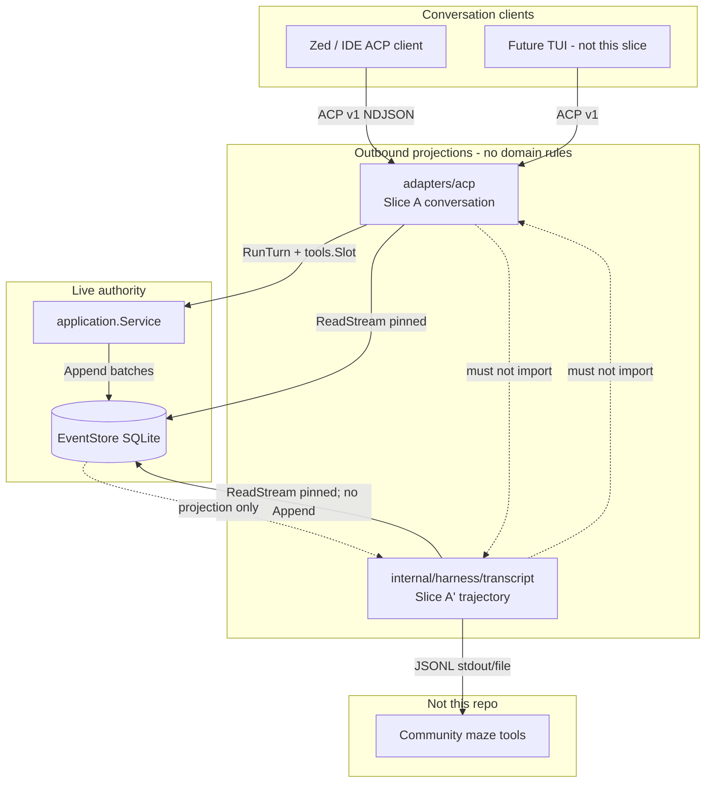
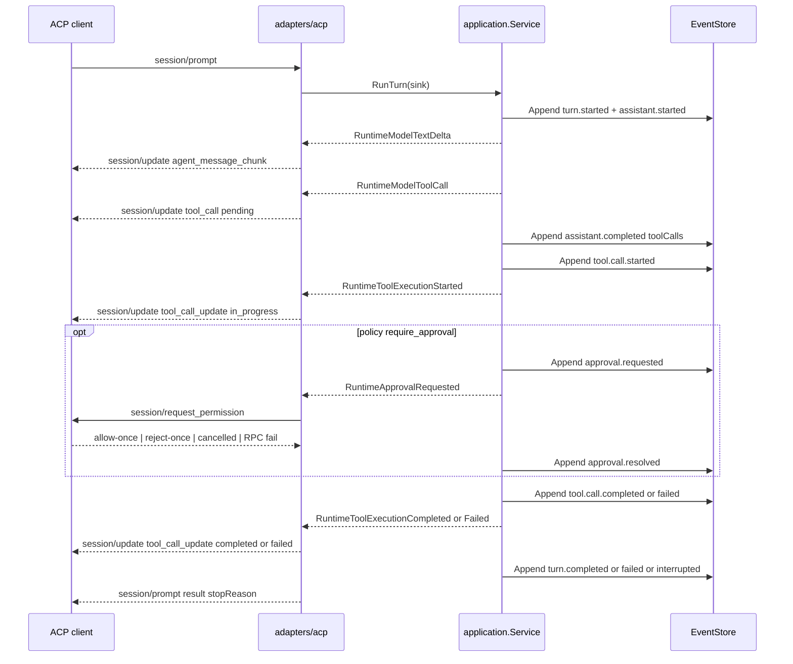
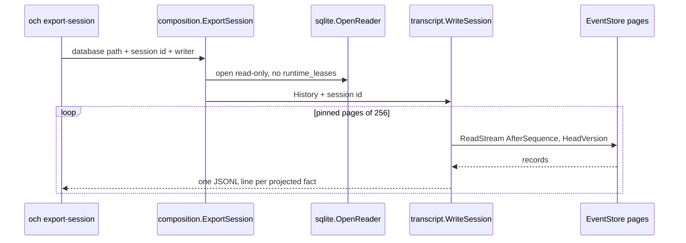

# Conversation Surface and Session Transcript (Slices A / A′)

- **Author:** TBD
- **Date:** 2026-08-23
- **Status:** Draft (pending human review)
- **Stability:** `experimental` public surfaces; adapter and projector remain `internal`
- **Maturity:** pre-v0; not a general availability release
- **Repository:** `open-code-harness` (`github.com/SongYii/open-code-harness`)
- **Normative language:** English
- **Reading copy:** [对话面与会话转录（切片 A / A′）](2026-08-23-conversation-and-session-transcript-design.zh-CN.md)
- **Intended landing path:** `docs/superpowers/specs/2026-08-23-conversation-and-session-transcript-design.md`
- **Parent / charter:** [Foundational architecture](2026-08-11-open-code-harness-architecture-design.md)
- **Prior ACP design:** [ACP v1 Adapter (Milestone 6)](2026-08-22-acp-v1-adapter-design.md)
- **Architecture gate (research, non-normative):** [ACP v1 adapter architecture gate](../../research/architecture-gates/2026-08-22-acp-v1-adapter.md)
- **This writing pass does not** add a row to [`docs/README.md`](../../README.md). Status is Draft until human review.

**Implemented contracts this slice must not change** (additive documentation after implementation is allowed; behavior of the named contracts is not):

- [Domain events](../../architecture/domain-events.md)
- [Engine vertical slice](../../architecture/engine-vertical-slice.md)
- [EventStore v2](../../architecture/eventstore-v2.md)
- [Tool runtime](../../architecture/tool-runtime.md)
- [JSONL audit replica](../../architecture/jsonl-audit-replica.md)
- [SQLite canonical EventStore](../../architecture/sqlite-eventstore.md) — except the additive read-only opener specified in §8.2
- [Composition root](../../architecture/composition-root.md) — except additive `ExportSession` wiring specified in §7.9 / §10.4
- [Runtime Host](../../architecture/runtime-host.md)
- [ACP v1 adapter](../../architecture/acp-v1.md) — Slice A *completes* the conversation projection; it does not reopen v1 targeting, `tools.Slot`, or the stop-reason algebra

English is the normative specification. The Chinese file is a synchronized reading copy.

---

## 1. Decision summary

Open Code Harness already persists a reconstructable Session/Turn/Item history in EventStore. The Milestone 6 ACP adapter projects almost only chat text (`user_message_chunk` / `agent_message_chunk`). That is not a DeepSeek-Harness-class **full agent trajectory**, and ACP is the wrong hang-point for community maze tools.

This slice splits the two needs into **two outbound projections of the same EventStore**. They never mix, never write back, and never share a codec with the Slice 3 audit replica.

```text
Zed / community ACP TUI          ← conversation: user / assistant / tool_call
        │ ACP v1
        ▼
   adapters/acp                  ← Slice A: chat projection
        │
EventStore (sole live authority)
        │
   session transcript JSONL      ← Slice A′: stepwise, wall-clock, usage, failure
        │
community maze tools             ← community draws the maze; harness does not
```

Load-bearing decisions:

1. **ACP is the conversation surface.** Complete ACP v1 `session/update` so a client can render chat including tool cards and permission. Stay on v1. Do not implement a maze UI, ACP v2, or `session/resume` here.
2. **Session transcript JSONL is the trajectory surface.** One projected fact per line, documented schema, exportable. This is the hang-point for `och-trace-compare` and similar community tools. The harness does not draw the maze and does not compute verdicts.
3. **EventStore remains the sole live authority.** Both surfaces are projections. Transcript is not a replica, not a commit point, and not writable back into the store. Audit JSONL (Slice 3) stays one line per atomic append with the digest chain; this slice does not touch that codec.
4. **Invent our own public transcript catalog.** Domain type strings that this repository already owns (`turn.started`, `tool.call.started`, …) may be reused as transcript `type` values because they are ours. DeepSeek Harness names (`turn/start`, `tool/call`, …), on-disk layouts, and visualizer schemas are not copied. Community projects are motivation, not architecture.
5. **v0 has no subagent.** Transcript and ACP must not invent `origin: subagent` (or any origin field).
6. **Compaction, when it arrives, must be domain events.** Implementation is out of this slice; the constraint is in scope so transcript and model context cannot later diverge.
7. **Parallel tools are not implemented.** Wall-clock fidelity is `domain.RecordedEvent.OccurredAt` of start and terminal events. Events in one atomic batch share one timestamp. Do not pretend per-call overlap.
8. **Slice A and Slice A′ are parallelizable.** Shared projector code is *not* shared across the two surfaces. ACP owns conversation mapping; `internal/harness/transcript` owns trajectory mapping. Duplication of the event `switch` is intentional.

---

## 2. Overview

Milestone 6 delivered an ACP v1 JSON-RPC adapter in `internal/harness/adapters/acp` that translates initialize / session/new / load / prompt / cancel / request_permission onto `application.Service` and pinned `EventStore.ReadStream`. `session/load` (`server.go` `project()`) currently emits only `turn.started` → `user_message_chunk` and `assistant.message.completed` → `agent_message_chunk`. `session/prompt` forwards only `engine.RuntimeModelTextDelta`. Tool, approval, usage, and failure facts are dropped on the wire even though the domain already records them (`tool.call.started|completed|failed|interrupted`, `approval.*`, `model.usage.recorded`, turn terminals).

Users asked whether completing ACP is enough for a full agent trajectory and for community visualizers. It is not. ACP v1 `tool_call` / `tool_call_update` exist so an IDE can render a conversation. They do not carry wall-clock step identity, usage, truncation flags, or a documented byte-stable log that a maze tool can diff. Putting trajectory onto ACP would overload a chat protocol and still starve visualizers that want JSONL.

The proposed solution is two slices:

- **Slice A** — total mapping of domain/runtime facts onto ACP v1 `session/update`, used both live (`session/prompt`) and on replay (`session/load`), including tool status and the relation to `session/request_permission`.
- **Slice A′** — a session-facing JSONL export (`och export-session`) plus a library projector, with a frozen experimental schema, golden fixtures, and an architecture owner for a new package `internal/harness/transcript`.

DeepSeek Harness's own ACP (`packages/acp/acp/README.md`, observed 2026-08-22 at `deepseek-ai/deepseek-harness@b150a55`) is cited only as proof of a split: it projects committed assistant text and omits raw deltas, tools, reasoning, and usage from ACP, leaving those on the session log. We do **not** copy that restriction for Slice A. The charter makes ACP the public client boundary for TUI/IDE, so tool cards belong on ACP. Trajectory still belongs on a log — ours, not theirs.

---

## 3. Background and current implemented state

Verified 2026-08-23 against this worktree.

### 3.1 ACP adapter today

| Path | Behavior | Gap |
| --- | --- | --- |
| Package | `internal/harness/adapters/acp`; composition `Assembly.ServeACP`; `cmd/och -acp` | Conversation projection incomplete |
| `server.go` `project()` | `TurnStarted` → `user_message_chunk`; `AssistantMessageCompleted` → `agent_message_chunk`; `default` returns nil | Tool, approval, failure, interrupt dropped on `session/load` |
| `updateSink.Emit` | Forwards only `RuntimeModelTextDelta` | `RuntimeModelToolCall`, `RuntimeToolExecution*`, `RuntimeApproval*` dropped on live prompt |
| Permission | `server.Decide` reverse-RPC; `toolCallId` = bare `ApprovalRequest.CallID`; `kind` = `"other"`; `status` = `"pending"` | Cannot correlate with a `tool_call` we never send; CallID is not session-unique |
| Frame codec | NDJSON JSON-RPC; `maxFrameBytes = 1 << 20` on decode (`codec.go`) | Outgoing updates are not clipped to that bound |
| Catalog-backed `RunTurn` | `docs/architecture/acp-v1.md`: prefixes the model prompt from the event log via `application.projectPriorTurns` | That is model memory, not ACP conversation projection. Milestone 6 design text still says “prompt remains amnesiac”; the implemented contract is authoritative. This slice does not reopen it. |
| Stop reason | Implemented `stopReason()` maps any `TurnStatusInterrupted` to `cancelled` | Milestone 6 spec said only `caller_canceled`. Out of this slice (see §16). |

ACP v1 wire shape we must map onto (fetched under `.reference/acp-spec`, not copied into this repository): `session/update` with `sessionUpdate: "tool_call"` / `"tool_call_update"`; statuses `pending` / `in_progress` / `completed` / `failed`; optional `kind`, `content[]`, `rawInput`, `rawOutput`; `session/request_permission` carrying a `toolCall` update. Stay on v1; v2 draft is out of scope.

### 3.2 Domain and runtime today

`domain.RecordedEvent` (`internal/harness/domain/record.go`) already has `Sequence`, `OccurredAt time.Time` (UTC, RFC3339Nano), `Event`, plus `ID` / `CommandID` / `SessionID`. The event catalog (`events.go`) already includes the facts a trajectory needs:

- Session: `session.created`, `session.closed`
- Turn: `turn.started` (`Input`), `turn.completed`, `turn.failed` (`Code`, `Message`), `turn.interrupted` (`Reason`)
- Assistant item: started / completed (`Text`, optional `ToolCalls []ToolCallOffer`) / failed / interrupted
- Tool item: `tool.call.started` (`CallID`, `Name`, `Arguments`, `StepIndex`) / completed (`Content`, `Truncated`) / failed / interrupted
- Version-only: `model.request.recorded`, `model.usage.recorded`, `policy.decision.recorded`, `approval.requested`, `approval.resolved`

Application Step loop (`internal/harness/application/loop.go`, `pipeline.go`) is sequential. `MaxSteps = 8`, `MaxToolCallsPerStep = 8`, tool result cap **64 KiB** with `truncated=true` and marker `\n[truncated]`. Compact `Session` still discards completed turns; the event log is the authority (`projectPriorTurns`).

Engine `RuntimeEvent` (`internal/harness/engine/runtime.go`) is a **thin transient signal**: `Type`, `Text`, `Code`, plus `Correlation` (`SessionID`, `TurnID`, `ItemID`, `CommandID`). Tool execution events put `name:id` in `Text` via `runtimeToolText`. They do **not** carry arguments or result content. `RuntimeModelToolCall` fires during the model stream, *before* `tool.call.started` is committed. `RuntimeToolExecutionStarted` fires immediately after that commit and **before** validation, policy, and approval (`pipeline.go`). The emitter's `ItemID` remains the assistant item for the whole turn, so live ACP cannot use `Correlation.ItemID` as a tool-call identity.

### 3.3 Persistence today

SQLite is the sole live commit authority. `sqlite.Open` always `AcquireLease`s `runtime_leases` (`open.go`). A second `Open` against a live database is refused. Reads use pinned `ReadStream` pages (`Limit` ≤ 256 in `application.ReadWholeStreamPinned`). Slice 3 audit JSONL is one line per **atomic append batch** (`formatVersion`, `commitPosition`, `events[]`, `batchDigest`) — a different grain and a different purpose.

The unused `transcript_entries` table is schema-only, reserved in the persistence design for TUI/Context pagination. This slice does **not** populate it. Session transcript JSONL is an export projection, not that table.

`cmd/och` is a thin flag parser over `composition.Open`. There is no export subcommand. `Open` requires workspace, provider URL, model, API key env, runtime id, and takes the fencing lease — unusable as an export path.

### 3.4 Pain points

1. A Zed (or future TUI) client cannot render tool cards, so the public conversation surface looks like a chatbot even when the engine executed tools.
2. Community trajectory tools have nothing documented to hang on. Audit JSONL is the wrong grain (batches, digests, canonical domain payloads including `model.request.recorded` envelopes up to 8 MiB).
3. Completing ACP without a transcript would tempt later work to overload `session/update` with usage, policy rule IDs, and maze semantics.
4. Export via `composition.Open` would steal or be refused by the live fencing lease.

---

## 4. Goals and non-goals

### 4.1 Goals

1. Publish a total mapping table from domain events and runtime events to ACP v1 `session/update` (live and load), including tool status and permission correlation.
2. Emit ACP `tool_call` / `tool_call_update` with a session-unique `toolCallId`, a kind derived from the four builtins, and bounded `content` / `rawInput`.
3. Keep ACP a transport adapter: no new Application port, no domain rules, no policy decisions. Shared mapping lives in `adapters/acp` as pure functions.
4. Define an experimental session transcript JSONL schema (envelope, catalog, identity, evolution rules) that is not the audit replica and not the domain codec.
5. Ship a library projector (`internal/harness/transcript`) and `och export-session` that read EventStore and write JSONL to an `io.Writer`.
6. Name resource bounds, failure semantics, and verification for both surfaces.
7. Record the compaction-as-domain-events constraint and the parallel-tools honesty gap.
8. Structure work as a real PR DAG so ACP and transcript proceed in parallel.

### 4.2 Non-goals (explicit exclusions)

| Exclusion | Notes |
| --- | --- |
| Maze / Trajectory UI / verdict heuristics | Failure signatures, empty search, blind retry, main-path vs detour. Community visualizers own these. |
| ACP v2 | Stay on `protocolVersion: 1`. |
| `session/list`, `session/resume`, `session/delete` | Slice B follow-on. Mentioned only for sequencing. |
| TypeScript TUI (milestone 7) | This document is not the TUI spec. |
| Context Engine / token-aware compaction implementation | Constraint only: must be domain events. |
| MCP client | Catalog `source=mcp` remains a type hole. |
| Parallel tool execution | Sequential Step loop unchanged. |
| Changing the audit JSONL codec | Slice 3 remains one line per append batch. |
| Writing `transcript_entries` / `snapshots` | Schema-only tables stay unused. |
| Copying DSH / Kimi / Codex on-disk layouts or event names | Motivation only. |
| New Application port for projection | Adapter-owned mapping. |
| Engine `RuntimeEvent` payload enrichment | Would change the engine contract; live ACP is honest about the thin signal. |
| Subagent origin, `origin` field | v0 has no subagent. |
| Redacted export | Later, same as audit. |
| Populating `docs/README.md` authority table | Draft, this writing pass. |

### 4.3 Follow-on sequence (not this spec's implementation)

1. **Slice A and A′** (this spec) — parallelizable.
2. **Slice B** — ACP `session/resume` / `session/list` / `session/delete` over EventStore.
3. **Compaction as domain events** — hard dependency before any context rewriting. Transcript and ACP then project those events. Until they exist, neither surface may claim compaction happened.
4. **Community visualizer** — outside this repository (`och-trace-compare` or similar). Consumes Slice A′ JSONL.

---

## 5. Two-surface architecture



Rules:

- EventStore is the only live commit authority. ACP and transcript are readers/projectors.
- `adapters/acp` must not import `transcript`. `transcript` must not import `acp` or any adapter.
- Composition is the only production importer of both (plus `cmd/och` via composition).
- Audit JSONL remains owned by `adapters/sqlite` and is a **batch integrity replica**, not a session transcript.



Transcript export is a separate, read-only path (no `RunTurn`, no lease):



---

## 6. Slice A — ACP conversation projection

### 6.1 Placement

Keep mapping inside `internal/harness/adapters/acp`. Extract pure functions so live prompt and load replay cannot drift:

| Symbol | File (proposed) | Role |
| --- | --- | --- |
| `ProjectRecordedEvent(sessionID string, record domain.RecordedEvent) []any` | `project.go` | Load replay; also the contract table in tests |
| `LiveTool` `{TurnID, CallID, Name}` | `project.go` | Adapter prompt-state identity for one outstanding tool (not Domain) |
| `ProjectRuntimeEvent(sessionID string, event engine.RuntimeEvent, live LiveTool) []any` | `project.go` | Live `updateSink`; `live` supplies CallID when `Text` is empty |
| `ToolCallID(turnID domain.TurnID, callID string) string` | `project.go` | Session-unique ACP id |
| `ToolKind(name string) string` | `project.go` | ACP `kind` |
| `clipUpdateText` / `clipToolContent` | `project.go` | Bounds in §6.7 |

`server.project` and `updateSink.Emit` become thin wrappers that write the returned updates as `session/update` notifications. No new Application port. Adapter still owns no domain rules (charter §6; Milestone 6 F9).

Two projectors, not one: `RuntimeEvent` and `RecordedEvent` have different fields. Forcing a single function would invent a fake common struct and hide the live fidelity gap (§6.6).

`ProjectRuntimeEvent` stays a pure function. It does **not** parse a CallID out of `tool.execution.failed`: Application emits that event as `RuntimePayload{Type: RuntimeToolExecutionFailed, Code: code}` with empty `Text` (`pipeline.go` `failToolAndContinue`), and `validToolRuntimePayload` forbids `Text` when `Code` is set. `Correlation.ItemID` is the assistant item for the whole turn (`owned.emitter` is never re-bound). Enriching `RuntimeEvent` remains a non-goal (§4.2).

**Adapter prompt-state (Slice A only):** `updateSink` remembers one outstanding `LiveTool` for the in-flight prompt.

1. On `model.tool_call` and `tool.execution.started`, parse `Text` as `name:callID` (last `:`), store `{TurnID: event.TurnID, CallID, Name}`, and pass that `live` into the projector.
2. On `tool.execution.completed`, parse `Text` if present; otherwise use remembered `live`. Clear `live` after projecting the terminal.
3. On `tool.execution.failed` with empty `Text`, pass remembered `live` and emit `tool_call_update` `{status: failed}` for that namespaced `toolCallId`. **Do not skip** a Code-only failed event. Clear `live` after.
4. Sequential `executeOneTool` (`loop.go`) makes one outstanding call honest. Overwriting `live` on the next started event is correct because the previous call has already terminalized.

This state lives only on the ACP prompt sink. It is not Domain, not EventStore, and not shared with transcript.

### 6.2 ACP `toolCallId` and kind

ACP v1 requires `toolCallId` unique within the session. Domain `CallID` is unique per model stream (duplicate id is `invalid_stream`) but **not** promised unique across turns. Domain `ItemID` is session-unique, but live `RuntimeEvent.Correlation.ItemID` is the **assistant** item.

**Decision:** `toolCallId = string(turnID) + "/" + callID`.

- Available on load from `ToolCallStarted.TurnID` + `CallID`.
- Available live from `RuntimeEvent.Correlation.TurnID` plus `CallID` parsed from `Text` (`name + ":" + id` in `runtimeToolText` / `RuntimeModelToolCall`) **or**, when `Text` is empty (Code-only `tool.execution.failed`), from the sink's remembered `LiveTool` (§6.1).
- `session/request_permission` must use the **same** id. Milestone 6 sent bare `CallID`. That wire is experimental and never correlated with a `tool_call` we did not send; this slice changes it. Permission still has `ApprovalRequest.CallID` and `TurnID` on the reverse RPC and does not use sink state.

Kind map (closed, builtin names only):

| Tool name | ACP `kind` |
| --- | --- |
| `read_file`, `list_dir` | `read` |
| `write_file` | `edit` |
| `exec` | `execute` |
| anything else (unknown tool, future names) | `other` |

Do not invent `search` / `fetch` / `delete` / `think`. Title is the tool name (stable, not a localized sentence).

### 6.3 Total mapping — live `session/prompt`

Source: `engine.RuntimeEvent` via `RunTurnRequest.Sink`. The client already has the user prompt; do **not** emit `user_message_chunk` for the in-flight turn.

| Runtime event | ACP `session/update` | Notes |
| --- | --- | --- |
| `model.text.delta` (non-empty) | `agent_message_chunk` `{type:text, text}` | Existing. Clip per §6.7. |
| `model.tool_call` | `tool_call` `{toolCallId, title, kind, status: pending}` | Parse `Text` as `name:callID` (split on the last `:`). No `rawInput` (not on the signal). |
| `tool.execution.started` | `tool_call_update` `{toolCallId, status: in_progress}` | Durable start is committed, but validation/approval/execute may still be ahead. Honest: ACP `in_progress` includes that wait. Do not invent a second clock. |
| `approval.requested` | none | Permission RPC is the UX. Tool card stays `in_progress` or was `pending` from `model.tool_call`. |
| `approval.resolved` | none | Outcome is the RPC result plus the later tool terminal. |
| `tool.execution.completed` | `tool_call_update` `{status: completed}` | No `content` / `rawOutput` live (not on the signal). Load replay fills them. Identity from `Text` or remembered `LiveTool`. |
| `tool.execution.failed` | `tool_call_update` `{status: failed}` | `Code` is not copied onto the wire (error hygiene). Identity from remembered `LiveTool` because Application emits Code-only (`Text` empty). Never skip. |
| `model.stream.started` / `completed` / `failed` / `interrupted` | none | Internal runner lifecycle. |
| `append.completed` | none | Not a conversation fact. |

`session/request_permission` (existing reverse RPC) is **not** a `session/update`. Relation to tool state:

1. Client has already received `tool_call` `pending` (from `model.tool_call`) and usually `tool_call_update` `in_progress` (from `tool.execution.started`, which Application emits before `Approver.Decide`).
2. Permission params reuse `ToolCallID(turnID, callID)`, `Title=name`, `Kind=ToolKind(name)`, `Status=pending` (ACP: pending includes awaiting approval).
3. Grant (`allow-once`) continues the pipeline; deny / timeout / cancel / RPC failure / teardown still fail-closed as today (`tools.Slot`). Application then emits `tool.execution.failed` → ACP `failed`.
4. Do not add `allow_always` / `reject_always` in this slice.

Notification send failure **must not** fail the in-flight prompt (Milestone 6 §6). Today `updateSink.Emit` returns `writeNotification` errors, and `engine.TurnRunner` maps sink failure to `CodeDelivery` → Application `runtime_delivery_failed`. Slice A **swallows** `session/update` write errors in the sink (`_ = writeNotification`; `Emit` returns nil). A dropped update must not become `CodeDelivery` and must not change `stopReason`. A failed write of the prompt JSON-RPC **result** is already best-effort (`runPrompt` uses `_ = s.out.writeResult` / `_ = s.out.writeError`) and stays that way: if the result frame cannot be written, the client sees a closed stream, not a mapped stop reason. `session/load` is the opposite: a failed update write fails the load RPC (`-32603`), because returning success after a partial replay would lie.

### 6.4 Total mapping — `session/load` replay

Source: pinned `History.ReadStream` (already in `server.replay`, page size 256, head pinned on the first page). Replace `project()` with `ProjectRecordedEvent`. Empty text still skipped.

| Domain event | ACP `session/update` | Not projected |
| --- | --- | --- |
| `turn.started` with non-empty `Input` | `user_message_chunk` | empty Input |
| `assistant.message.completed` with non-empty `Text` | `agent_message_chunk` | `ToolCalls` offers (cards come from `tool.call.*`) |
| `assistant.message.failed` / `interrupted` with non-empty `Message` | `agent_message_chunk` | codes |
| `tool.call.started` | `tool_call` `{toolCallId, title, kind, status: in_progress, rawInput?}` | — |
| `tool.call.completed` | `tool_call_update` `{status: completed, content: [text block]}` | domain `Truncated` flag (transcript keeps it) |
| `tool.call.failed` | `tool_call_update` `{status: failed, content: [text block of Message]}` | `Code` |
| `tool.call.interrupted` | `tool_call_update` `{status: failed}` | ACP has no `interrupted` status; do not invent one |
| `approval.requested` / `resolved` | none | Live-only RPC; load shows the tool terminal |
| `turn.completed` / `failed` / `interrupted` | none | Stop reason is the prompt RPC, not load |
| `session.created` / `session.closed` | none | — |
| `assistant.message.started` | none | no durable partial text |
| `model.request.recorded` | none | provider envelope |
| `model.usage.recorded` | none | trajectory surface |
| `policy.decision.recorded` | none | rule IDs |

`rawInput`: if `Arguments` is a JSON object or array, pass it as a JSON value; if it is not valid JSON, omit `rawInput` (transcript still has the string). `rawOutput` is an ACP object; tool `Content` is a string — **do not wrap it in a fake object**. Use `content: [{type:"content", content:{type:"text", text: ...}}]`.

Replay of a **running** session is allowed (`LoadSession` succeeds on `active`). The last tool card may remain `in_progress`. That is a correct snapshot, not a torn conversation: pinned head protocol.

Do not emit `session/request_permission` on load.

### 6.5 What is never projected on ACP

- Usage tokens, latency, `finishReason`, `providerRequestID`
- Policy `RuleID` / `Effect` / `Reason`
- `model.request.recorded` messages and tool schemas
- Audit `batchDigest` / `commitPosition` / `appendId`
- Raw provider SSE, engine ordinals, `RuntimeAppendCompleted`
- Domain error codes on the wire (fixed JSON-RPC messages remain)
- Subagent origin, plans, thoughts, terminals, diffs, ACP v2 fields
- Verdicts / maze annotations

### 6.6 Honest live fidelity gap

Slice A does **not** change `engine.RuntimeEvent`. Therefore live tool cards have id, name, kind, and status only. Arguments and result text appear on `session/load` and on the transcript. A client that never calls `session/load` will not see `rawInput` or output content for the in-flight turn. Live **identity** for Code-only `tool.execution.failed` is the exception that uses adapter `LiveTool` prompt-state, not an engine field.

This is a documented gap, not a silent lie. A follow-on (not this slice) may add additive optional fields to `RuntimeEvent` or a commit-observer; either is an engine/application contract change and needs its own spec.

Parallel tools: live events are sequential because the Step loop is sequential. Do not emit overlapping `in_progress` cards for one step's calls; Application runs `executeOneTool` in model order (`loop.go`).

### 6.7 Truncation and frame bounds

| Bound | Limit | On exceed |
| --- | --- | --- |
| Incoming RPC frame | `maxFrameBytes = 1 MiB` (existing) | `-32700` |
| Outgoing `agent_message_chunk` / `user_message_chunk` text | **768 KiB** valid UTF-8 prefix | clip at a code-point boundary; conversation continues |
| Outgoing tool `content` text | **16 KiB** valid UTF-8 prefix | clip at a code-point boundary; if clipped and the domain text does not already end with `\n[truncated]`, append that marker |
| Outgoing `rawInput` | **16 KiB** compact JSON encoding | clip the encoded bytes at a UTF-8 boundary; if the result is no longer valid JSON, **omit** `rawInput` rather than emit a truncated object. Do not append `\n[truncated]` to `rawInput` |
| Domain tool result (already applied) | 64 KiB + marker | transcript hang-point |
| Domain assistant text | 1 MiB (`output_limit`) | existing |

768 KiB leaves JSON envelope headroom under the 1 MiB frame. Clip in the projector, not in Domain. Never split a UTF-8 code point (a mid-rune clip would produce an invalid JSON string). `\n[truncated]` is only for text `content` blocks, never for `rawInput`.

Transcript is the untruncated hang-point relative to ACP: it carries the domain payload (already 64 KiB-capped for tools, with `truncated` bool). ACP may clip further for the IDE card.

### 6.8 Errors (Slice A)

| Condition | Wire | Prompt in-flight? |
| --- | --- | --- |
| Parse / non-object line | `-32700` | n/a |
| Unknown method | `-32601` | n/a |
| Bad params, unknown session on requests, cwd mismatch | `-32602` | n/a |
| Prompt already in flight | `-32600` `a prompt is already in flight for this session` | n/a |
| Turn completed | `stopReason: end_turn` | settles |
| Turn interrupted (implemented: any interrupted, or cancel category, or ctx done) | `stopReason: cancelled` | settles |
| Turn failed / other errors | `-32603` `session prompt failed` | settles |
| `session/update` write failure during prompt | swallowed; not `CodeDelivery`; `stopReason` unchanged | continues |
| Prompt JSON-RPC **result** write failure | already `_ = writeResult` / `_ = writeError`; best-effort; no mapped stop reason | settled internally |
| `session/update` write failure during load | `-32603` `session prompt failed` — **unchanged existing constant** `promptFailedMessage`; do not rename in this slice | n/a (load RPC) |
| Permission transport failure / cancel / non-allow-once | deny (existing) | tool fails, turn continues |

Raw engine and store messages never appear on the wire (unchanged).

### 6.9 Protocol types to add

`protocol.go` gains structs matching ACP v1 tool-call updates (`sessionUpdate`, `toolCallId`, optional `title`, `kind`, `status`, `content`, `rawInput`). No v2 fields. `permissionToolCall` stays but `ToolCallID` is the namespaced id and `Kind` uses `ToolKind`.

### 6.10 Tests (Slice A)

1. Table tests for `ProjectRecordedEvent` covering every domain event type (projected and explicitly empty).
2. Table tests for `ProjectRuntimeEvent` covering every `RuntimeEventType`, including a **Code-only** `tool.execution.failed` (`Text` empty) that still emits `tool_call_update` `{status: failed}` for the remembered namespaced `toolCallId` (must not skip).
3. `session/load` NDJSON test: history with `turn.started`, assistant complete, `tool.call.started` / completed / failed / interrupted emits the matching updates **before** the load result; `model.request.recorded` / `policy.decision.recorded` / usage produce no updates.
4. Live prompt: scripted `RunTurn` that emits text delta, `model.tool_call`, tool started/completed; client observes `tool_call` then `tool_call_update` then `end_turn`.
5. Permission: `toolCallId` equals `ToolCallID(turn, call)`; grant still executes; deny still fail-closed.
6. Notification write failure during prompt does not change stop reason (broken writer after initialize). A dropped `session/update` still settles `end_turn` when the turn completed.
7. Clip tests: a tool content string over 16 KiB is clipped at a UTF-8 boundary and may gain `\n[truncated]`; a 768 KiB+ assistant chunk is clipped at a code-point boundary; a `rawInput` object whose compact JSON exceeds 16 KiB is omitted rather than truncated to invalid JSON.
8. Existing initialize/new/busy/cancel tests remain green.
9. Composition e2e (`end_to_end_test.go` pattern): catalog-backed turn with `read_file` produces at least one live `tool_call` on the duplex during `session/prompt` (assigned to PR 2, not only load).

Default gate stays keyless, in-memory duplex, no subprocess.

---

## 7. Slice A′ — session transcript export

### 7.1 Placement and ownership

New package `internal/harness/transcript`.

| Importer | Allowed? |
| --- | --- |
| `internal/harness/transcript` tests | yes |
| `internal/harness/composition` | yes (wiring only) |
| `cmd/och` | **no** — cmd stays composition + flag parse (`cmd/och/main.go` comment) |
| `adapters/acp` | **no** |
| `domain`, `application` production | **no** — projection is outbound |
| `adapters/sqlite` | **no** — reader is passed in |

Exact architecture-guard matrix (PR 3 must add these `TestForbiddenImport` / `TestClassifyProductionDirectory` cases; omitting the reverse bans would leave C-05 unenforceable):

| Owner | May import | Must not import |
| --- | --- | --- |
| `ownerTranscript` (`internal/harness/transcript`) | `domain`; `application` (`ReadStream` types only); stdlib except `os` / `os/exec` / `net` / `net/http` | `engine`, `policy`, `tools`, `runtime`, `testkit`, any `adapters/*` |
| `ownerComposition` | `transcript` (and every adapter, as today) | `testkit` (unchanged) |
| `ownerDomain`, `ownerEngine`, `ownerApplication`, `ownerPolicy`, `ownerTools`, `ownerACP`, `ownerSQLite`, `ownerRuntime` | unchanged otherwise | **`internal/harness/transcript`** (reverse ban) |
| unowned packages under `internal/harness` | stdlib / `domain` as today | `transcript` (treat as a forbidden production dependency, same spirit as adapters/testkit) |

Add `ownerTranscript` to the `owners` slice of `TestOnlyCompositionAndRuntimeMayNameAnAdapter` (not to the adapters list) so “transcript cannot name an adapter” is pinned. `cmd/och` is outside that walk; PR 7 tests must assert production `cmd/och` files import only `composition`, existing `policy` (serve-mode `-policy`), and stdlib/`flag` — not `transcript` and not `adapters/sqlite`.

Without this owner, a new package that later imported sqlite would be caught by `unownedImport` for adapters; declaring the owner is still required so production files are inspected under a real rule set rather than the unowned default, and so the reverse bans exist.

### 7.2 Envelope

One UTF-8 JSON object per line. No embedded raw newlines (same NDJSON discipline as ACP and audit). Schema name `och.session.transcript`. `formatVersion` 1.

Two wire structs. One `Line` with `omitempty` cannot satisfy both key sets: empty `eventId`/`commandId` and `sequence: 0` would appear on snapshots, and `omitempty` on `Sequence` would also drop a legitimate fact sequence if it were ever zero (fact `sequence` is never omitted; EventStore sequences start at 1).

Frozen key order for **fact lines** (byte-stable `encoding/json` struct field order):

```text
formatVersion, schema, sessionId, eventId, commandId, sequence, occurredAt, type, payload
```

```go
type Line struct {
    FormatVersion int             `json:"formatVersion"`
    Schema        string          `json:"schema"`        // "och.session.transcript"
    SessionID     string          `json:"sessionId"`
    EventID       string          `json:"eventId"`
    CommandID     string          `json:"commandId"`
    Sequence      uint64          `json:"sequence"`      // EventStore per-session sequence; never omitempty
    OccurredAt    string          `json:"occurredAt"`    // RFC3339Nano UTC from RecordedEvent
    Type          string          `json:"type"`
    Payload       json.RawMessage `json:"payload"`
}

type SnapshotLine struct {
    FormatVersion int             `json:"formatVersion"`
    Schema        string          `json:"schema"`
    SessionID     string          `json:"sessionId"`
    OccurredAt    string          `json:"occurredAt"`    // RFC3339Nano UTC from the exporter clock
    Type          string          `json:"type"`          // "transcript.snapshot"
    Payload       json.RawMessage `json:"payload"`
}
```

`sequence` is the **EventStore sequence**, not a dense transcript counter. Omitted domain types (e.g. `model.request.recorded`) appear as **gaps**. Consumers must not assume density. `eventId` / `commandId` join to the audit replica without mixing codecs. Fact lines never omit `sequence`.

First line of every export is a snapshot, not a domain fact. Frozen keys: `formatVersion, schema, sessionId, occurredAt, type, payload`. Golden fixture (RFC3339Nano, nanoseconds present):

```json
{"formatVersion":1,"schema":"och.session.transcript","sessionId":"session-1","occurredAt":"2026-08-23T12:00:00.000000000Z","type":"transcript.snapshot","payload":{"headSequence":12,"running":true,"stability":"experimental"}}
```

`occurredAt` on the snapshot is the exporter's UTC time (RFC3339Nano) from a clock the composition injects — **not** a fabricated domain clock. Library tests pass a frozen clock. `headSequence` is the pinned `ReadStream` head. `running` is true when the pinned snapshot does not include `session.closed` and is not an empty session.

`UnmarshalLine` is two-arm: peek `type`; if `transcript.snapshot`, strict-decode `SnapshotLine`; otherwise strict-decode `Line`. Wrong keys for that arm fail. Trailing JSON rejected. Unknown `formatVersion` is a hard error for **our** decoder. Unknown fact `type` is skippable by **external** consumers (evolution rule in §7.5) via `DecodeSkipsUnknown`; the golden decoder for our encoder remains strict. Tests pin a snapshot golden and a fact golden.

### 7.3 Event type catalog (experimental)

Public `type` values. These coincide with **our** domain event type strings for the facts we expose. They are not DeepSeek `turn/start` / `tool/call` names.

| `type` | Payload fields | Source domain event |
| --- | --- | --- |
| `transcript.snapshot` | `headSequence`, `running`, `stability` | exporter (not domain) |
| `session.created` | `workspaceRoot` | `session.created` |
| `session.closed` | `{}` | `session.closed` |
| `turn.started` | `turnID`, `input` | `turn.started` |
| `turn.completed` | `turnID` | `turn.completed` |
| `turn.failed` | `turnID`, `code`, `message` | `turn.failed` |
| `turn.interrupted` | `turnID`, `reason` | `turn.interrupted` |
| `assistant.message.started` | `turnID`, `itemID`, `stepIndex`, `stepRef` | `assistant.message.started` + projector counter |
| `assistant.message.completed` | `turnID`, `itemID`, `stepIndex`, `stepRef`, `text`, `toolCalls` (optional) | `assistant.message.completed` |
| `assistant.message.failed` | `turnID`, `itemID`, `stepIndex`, `stepRef`, `code`, `message` | `assistant.message.failed` |
| `assistant.message.interrupted` | `turnID`, `itemID`, `stepIndex`, `stepRef`, `code`, `message` | `assistant.message.interrupted` |
| `model.usage.recorded` | `turnID`, `itemID`, `inputTokens`, `outputTokens`, `cachedInputTokens`, `latencyMs`, `finishReason`, `providerRequestID` | `model.usage.recorded` |
| `tool.call.started` | `turnID`, `itemID`, `callID`, `stepIndex`, `stepRef`, `name`, `arguments` | `tool.call.started` |
| `tool.call.completed` | `turnID`, `itemID`, `callID`, `stepIndex`, `stepRef`, `content`, `truncated` | `tool.call.completed` |
| `tool.call.failed` | `turnID`, `itemID`, `callID`, `stepIndex`, `stepRef`, `code`, `message` | `tool.call.failed` |
| `tool.call.interrupted` | `turnID`, `itemID`, `callID`, `stepIndex`, `stepRef`, `code`, `message` | `tool.call.interrupted` |
| `approval.requested` | `turnID`, `itemID`, `approvalID`, `callID`, `name`, `reason` | `approval.requested` |
| `approval.resolved` | `turnID`, `itemID`, `approvalID`, `decision` | `approval.resolved` |

**Omitted (do not emit a line):** `model.request.recorded` (provider envelope, up to 8 MiB), `policy.decision.recorded` (rule IDs; visualizers may infer deny from `tool.call.failed` codes such as `policy_denied`).

**Honest usage omission:** if `model.usage.recorded` was never appended (provider without usage, stream failure before usage, text-only path), the transcript has **no** usage line. Do not emit zero tokens.

**No `origin` field.** v0 has no subagent.

`toolCalls` on assistant complete, when present, is the domain `[]ToolCallOffer` (`id`, `name`, `arguments`) — our shape, not ACP's.

### 7.4 Identity and `stepRef`

Visualizers need a turn-qualified step label without inventing one.

- `turnID`, `itemID`, `callID` copied from the domain event.
- Domain `StepIndex` exists only on `ToolCallStarted` (`events.go`). Assistant events and tool terminals have no such field (implemented contract unchanged).
- Assistant events: the projector counts `assistant.message.started` per `turnID`, 1-based, stores it in `steps[turnID]`, and writes that count as `stepIndex`.
- `tool.call.started`: copy `ToolCallStarted.StepIndex` into the payload. Do not invent a second `callID → stepIndex` map.
- `tool.call.completed` / `failed` / `interrupted`: use the current `steps[turnID]` (the count of `assistant.message.started` in that turn so far). Under a healthy stream this equals the latest `ToolCallStarted.StepIndex` in the same turn, because tools run before the next `assistant.message.started` (`loop.go` `owned.stepIndex`).
- `stepRef` is the string `turnID + "/" + decimal(stepIndex)` (no spaces). Example: `turn-1/2`.

**Invariant (tested, not repaired):** for a `tool.call.started`, copied `StepIndex` equals `steps[turnID]` at that point (count of `assistant.message.started` in that turn up to the most recent one). For a tool terminal, payload `stepIndex` equals `steps[turnID]` and equals the latest started `StepIndex` in that turn. If a corrupt stream disagrees, emit both facts honestly; do not rewrite `StepIndex` or `steps`.

Wall-clock: `occurredAt` is `RecordedEvent.OccurredAt` of that line. Start/end of a tool call are the timestamps of `tool.call.started` and the terminal tool event. **Do not invent** a duration field. Events from one atomic batch share one `OccurredAt` (domain: clock called once per batch). A visualizer that draws overlapping bars from equal timestamps is wrong; sequential execution is the truth.

### 7.5 Stability and evolution

- Surface stability: **`experimental`** until v1.0 (same language as tool-runtime / EventStore contracts).
- Additive only: new `type` values may be added; existing names and payload keys are never reused for a different meaning.
- External consumers **must skip unknown `type` values** (and unknown payload keys inside a known type, once we document open content). This repository's golden decoder for *our* encoder remains strict so we cannot accidentally rename a field.
- `formatVersion` increments only for breaking envelope changes. Payload additive fields on an existing type do not bump `formatVersion`; they require a spec amendment and new fixtures.
- Domain schemaVersion stays 1 and is **not** the transcript `formatVersion`.

### 7.6 Projector behavior

```go
type StreamReader interface {
    ReadStream(context.Context, application.ReadStreamRequest) (application.StreamPage, error)
}

type Result struct {
    HeadSequence uint64
    Lines        uint64
    Running      bool
}

func WriteSession(ctx context.Context, src StreamReader, sessionID domain.SessionID, now time.Time, w io.Writer) (Result, error)
func ProjectRecord(record domain.RecordedEvent, steps map[domain.TurnID]uint32) (Line, bool, error)
func MarshalLine(Line) ([]byte, error)
func MarshalSnapshot(SnapshotLine) ([]byte, error)
func UnmarshalLine([]byte) (Decoded, error) // two-arm: SnapshotLine or Line
```

`ProjectRecord` returns a fact `Line`. It does not emit snapshots. Explicit `ok=false` omit for `model.request.recorded` and `policy.decision.recorded` only. Any other domain type not in the catalog table is `unsupported_event_type` (fail closed) — not a silent skip. `steps` is the per-turn `assistant.message.started` counter used for assistant rows and for tool terminals (§7.4).

`WriteSession`:

1. Parse session id; invalid → error `invalid_session_id`.
2. Pin head on the first page (`AfterSequence=0`, `Limit=256`, then pass `HeadVersion`) — same protocol as ACP `replay` and `ReadWholeStreamPinned`.
3. If the first page is empty and `HeadVersion==0`, fail `session_not_found` (do not write a snapshot of nothing).
4. Write `transcript.snapshot`.
5. For each record in order: `ProjectRecord`; if `ok`, `MarshalLine`, check size, write line + `\n`.
6. Do not buffer the whole session in memory beyond one page (256 records). Snapshot `running` can be computed on the fly (`session.closed` seen or not); if `session.closed` arrives on a later page, the snapshot already said `running: true` only if we did not yet know — **fix:** first walk is streaming, so snapshot cannot know `session.closed` at the end without a second pass or deferring the snapshot.

**Snapshot placement decision:** write the snapshot **last** would break “header first” consumers. Write it **first** with `running` derived without a second pass as: `running = !(last event of the pinned snapshot is session.closed)` requires knowing the last event.

Default (this spec): **two-phase without buffering payloads** — (a) pin head; (b) if `HeadVersion==0` fail; (c) optionally `Load`-less: we do not have compact state on a reader. Cheap check: page until end counting only whether any `session.closed` exists **or** peek by streaming twice. Double ReadStream of a pinned head is consistent and acceptable (sessions are small; 8 steps × a few dozen events). Implementation: `WriteSession` may scan once for closed/head then write snapshot then scan again for lines, **or** buffer only booleans. It must not buffer all payloads.

Chosen algorithm: single streaming pass that **buffers projected lines in a bounded spill** is rejected (unbounded). **Double pinned read** is the default: first pass computes `running` and validates contiguity; second pass writes snapshot then lines. Both passes use the same `HeadVersion`. Memory stays O(page).

Do not write back into EventStore. `StreamReader` has no `Append`. Tests using `adapters/memory` are in `_test.go` only.

### 7.7 Resource bounds

| Bound | Limit | On exceed |
| --- | --- | --- |
| Read page | 256 records | existing store validation |
| Encoded JSONL line | **2 MiB** | fail the export (`line_limit`); do not skip silently |
| Tool `content` in payload | domain 64 KiB + marker | already applied; `truncated` copied |
| Assistant `text` | domain 1 MiB | already applied |
| Arguments | domain 32 KiB (engine) | copied |
| Open files / process | one reader connection; no provider, no lease | — |

2 MiB is above 1 MiB assistant text plus JSON wrapping. If a future omitted-type leak tried to dump `model.request.recorded`, the line limit would fail closed — another reason that type stays omitted.

### 7.8 Failures (Slice A′)

| Condition | Behavior |
| --- | --- |
| Database missing / unreadable | CLI non-zero; no JSONL body guaranteed |
| Format newer than this binary | refuse (`FormatNewerError`); do not migrate (reader is not a writer) |
| Format older / needs migration | refuse; tell the operator to open once with a writer binary |
| Store corrupt / digest disagreement | fail closed; no partial success |
| Invalid session id | `invalid_session_id` |
| Session never created (`HeadVersion==0`) | `session_not_found` |
| Pinned head unservable | store `InvalidRead`; fail closed |
| Mid-export ctx cancel | stop; incomplete output; non-zero exit; no `.ok` sidecar (there is none) |
| Line over 2 MiB | `line_limit`; non-zero exit |
| Unknown / unreadable canonical domain payload (`UnmarshalRecordedEvent` fails, including unknown event type) | fail closed (`unsupported event type` / store corrupt). `sqlite.ReadStream` already maps this to `StoreCodeCorrupt` (`read.go`). Do **not** skip. Skip-unknown applies only to *external* transcript JSONL `type` values (§7.5), not to EventStore records. Export-time tolerance for future domain types is a domain/sqlite codec change with its own spec |
| Known domain type not in the transcript catalog (`model.request.recorded`, `policy.decision.recorded`) | omit the line (gap in `sequence`); not an error |
| Unknown domain schemaVersion on a record | fail closed (`unsupported_schema_version`) — same as domain codec |
| Session still running (no `session.closed`) | success; snapshot `running: true`; last facts may be a running turn |
| Live writer holds `runtime_leases` | does not fence the reader (no `AcquireLease`). The reader waits up to `BusyTimeout` (default 5s) on `SQLITE_BUSY` rather than failing immediately |
| Torn write of the output file | operator sees non-zero exit; no digest chain (this is not audit) |

CLI writes JSONL to stdout by default, or `-output PATH`. Diagnostics only on stderr (same stdout discipline as `-acp`, inverted: here stdout *is* the transcript).

Export is not crash-convergent like Slice 3. It is a one-shot projection. Retry is the operator's.

### 7.9 CLI and composition

`cmd/och` grows a **subcommand**, not a flag on the serve path, so export does not require provider URL, API key, workspace, or runtime id:

```text
och export-session -database PATH -session SESSION_ID [-output FILE]
```

If `args[0] == "export-session"`, parse a dedicated `FlagSet`. The existing no-subcommand serve flags (`-acp`, `-workspace`, …) stay unchanged. This is the first subcommand; document it as such.

`composition.ExportSession` opens `sqlite.OpenReader`, calls `transcript.WriteSession` with `time.Now().UTC()`, closes the reader, and **returns `transcript.Result`** so `cmd/och` can print the success diagnostic without importing `transcript`:

```go
func ExportSession(ctx context.Context, databasePath string, sessionID domain.SessionID, out io.Writer) (transcript.Result, error)
```

Composition is a library and must not print. cmd uses `:=` on the result (no `transcript` import) and formats stderr `och: exported session SESSION lines=N head=M running=bool` from `Result.Lines`, `HeadSequence`, and `Running`. An equivalent struct defined in composition is acceptable if returning `transcript.Result` is awkward at the cmd boundary; the numbers must not be dropped.

Do not call `composition.Open` / `runtime.Launch` on this path.

### 7.10 Tests (Slice A′)

1. Golden JSONL fixtures under `internal/harness/transcript/testdata/`, encoded and decoded byte-stable (copy the discipline of `internal/harness/domain/codec_test.go` and `testdata/*.jsonl`), including a **snapshot-line** golden with RFC3339Nano and no `eventId`/`commandId`/`sequence` keys.
2. `ProjectRecord` table: every domain type either produces a frozen payload, is explicitly omitted (`model.request.recorded`, `policy.decision.recorded`), or is not constructible; do not treat unknown types as skip.
3. `stepRef` / `stepIndex` alignment on a two-step `read_file` history (use domain events, not a live model): started copies `ToolCallStarted.StepIndex`; completed uses `steps[turnID]`; both match.
4. Usage line present when `model.usage.recorded` exists; absent when it does not (no zero fill).
5. Unknown future transcript JSONL `type` in a consumer helper `DecodeSkipsUnknown` (small exported skip-decoder for tests / docs). Our encoder's strict decoder still rejects it.
6. Double-pinned read: appending after the first page's pin is not visible (memory store: project a clone at a fixed head).
7. Empty store / unknown session → `session_not_found`, zero bytes written after error.
8. Line-limit test with an oversized assistant text fixture.
9. Architecture tests: production `transcript` files do not import adapters; composition may import transcript; domain/application/acp/sqlite/runtime/engine/policy/tools must not.

---

## 8. SQLite read-only opener (supporting A′)

### 8.1 Why

`sqlite.Open` acquires `runtime_leases`. Export through that constructor either steals the live writer's lease or is refused. `composition.Open` also demands a provider credential. Neither is acceptable for `och export-session` while an ACP process is serving.

### 8.2 Additive API

`internal/harness/adapters/sqlite`:

```go
// ReaderConfig is the read profile. It does not include RuntimeID or
// LeaseDuration (those exist only for the writer lease).
type ReaderConfig struct {
    Path               string
    BusyTimeout        time.Duration // default 5s; allowed range same as Config.BusyTimeout (100ms–60s)
    DeniedPathPrefixes []string      // same diagnosis as Open
    WALAutoCheckpoint  int           // default 1000; applied as a read-side pragma only
}

// OpenReader opens Path for pinned ReadStream only. It does not acquire
// runtime_leases, does not run migrations, and does not expose Append.
func OpenReader(ctx context.Context, config ReaderConfig) (*Reader, error)
```

`Reader` implements the same `ReadStream` shape as `application.EventStore` (or a narrow interface identical to ACP `History`). `Append` / `ResolveAppend` / `FindCommandRequest` are absent. `query_only=1` (or equivalent) is defense in depth on the connection; the Go type still has no `Append`. Tests assert a live `Open` writer and a concurrent `OpenReader` can `ReadStream` a committed session.

OpenReader reuses the verified open **read** profile from `Open` (`open.go` `dataSourceName` / `verifyProfile`):

- WAL; does **not** set `immutable=1` (must see the live writer's last commit).
- Bounded `busy_timeout` with the same default (5s) and allowed range as `Config.BusyTimeout`. A reader with no busy timeout against a writer's `BEGIN IMMEDIATE` returns `SQLITE_BUSY` immediately and would contradict export-while-ACP-serves.
- `foreign_keys=1`. `synchronous=FULL` may be set on the connection; the writer already maintains it.
- `DeniedPathPrefixes` — export must not open a network/synchronized location `Open` would refuse.
- Verifies `user_version` equals this binary's latest migration; newer → `FormatNewerError`; older → refuse with a stable “writer must migrate first” error.
- Does not run `migrate`.
- Does not touch `runtime_leases` or `export_leases`. Does not require `RuntimeID`.
- Fail-closed on corrupt metadata the same as `Open` reads.

`composition.ExportSession` passes `ReaderConfig{Path: databasePath}` and takes defaults. Optional deny-list flags are out of this slice.

This is an **additive** sqlite surface. Existing `Open` behavior is unchanged. Implemented-contract docs for sqlite gain a subsection in the docs PR; EventStore v2 four-method port is unchanged (Reader is not a second EventStore).

### 8.3 Exclusion

Do not implement export by copying the audit exporter, `ExportConsistent`, or `VACUUM INTO` backup. Those are integrity/replica paths. Transcript is a projection.

---

## 9. Compaction constraint (in scope) and parallel-tools honesty

### 9.1 Compaction

Milestone 8 Context Engine is not implemented here. **Hard constraint:** any future compaction, checkpoint rewrite, or token-aware trim **must** append new domain events (new types added to the stable catalog in `domain/events.go` and `docs/architecture/domain-events.md`). Those events become the only legal evidence that model-visible context changed.

Until such events exist:

- Transcript must not emit a synthetic `context.compacted` (or any alias).
- ACP must not emit a fake plan/message that implies history was rewritten.
- Application must not mutate prior `RecordedEvent` payloads in place.

When compaction lands, Slice A / A′ mapping tables are extended in that spec. This slice reserves no payload, only the rule.

### 9.2 Parallel tools

Tool runtime contract: sequential execution; compact Session allows one active Item. `OccurredAt` is assigned once per atomic decision batch. Transcript therefore cannot provide per-call start/end clocks beyond those timestamps. A waterfall UI that requires overlapping execution intervals cannot be honest on this engine. Document the gap in the transcript README-equivalent (implemented contract) and in payload commentary: equal timestamps mean same batch, not concurrency.

---

## 10. API / interface changes

### 10.1 ACP (additive)

- New `project.go` functions (§6.1), including `LiveTool` and `ProjectRuntimeEvent(..., live LiveTool)`.
- New `protocol.go` structs for `tool_call` / `tool_call_update`.
- `permissionToolCall.ToolCallID` format change (experimental).
- `updateSink` holds one outstanding `LiveTool`, maps more `RuntimeEventType`s, and swallows `session/update` write errors.
- `server.project` uses `ProjectRecordedEvent`.

No change to `Sessions` / `History` interfaces in `server.go`.

### 10.2 Transcript (new)

Package API in §7.6. No domain types added.

### 10.3 sqlite (additive)

`OpenReader` / `Reader` / `ReaderConfig` (§8.2).

### 10.4 composition (additive)

```go
func ExportSession(ctx context.Context, databasePath string, sessionID domain.SessionID, out io.Writer) (transcript.Result, error)
```

`Assembly` methods unchanged. `ServeACP` unchanged at the signature level. Composition must not print; cmd formats the §14 one-liner from `Result`.

### 10.5 cmd/och

Subcommand `export-session`. Serve-mode flags unchanged.

### 10.6 Architecture guard

`ownerTranscript` constant, ownership root, outbound and **reverse** forbidden-import cases (§7.1), and `ownerTranscript` on the `TestOnlyCompositionAndRuntimeMayNameAnAdapter` owners list (not the adapters list).

---

## 11. Data model changes

**None in Domain or EventStore v2.** No new tables. `transcript_entries` remains unused.

Transcript JSONL is an **export artifact**, operator-owned, not a store migration.

If a consumer wants to persist JSONL, they copy the file. Re-import into EventStore is forbidden (same spirit as audit: JSONL is not a peer authority; here it is not even a replica).

---

## 12. Alternatives considered

### 12.1 Put trajectory on ACP `session/update` only

**Rejected.** ACP v1 tool calls are conversation cards. They lack a documented append-only log, usage, truncation flags, step identity, and byte-stable fixtures. Community tools (`dsh-trace-compare` class) consume JSONL. Overloading ACP would still force a second export later and would mix IDE UX with eval traces.

### 12.2 Reuse Slice 3 audit JSONL as the hang-point

**Rejected.** Audit grain is **one line per atomic append** with `events[]`, digest chain, and canonical domain payloads including `model.request.recorded`. Visualizers want one fact per line, session-scoped, skippable types, no hash-chain requirement. Changing audit would break import/export integrity. Charter-level split: integrity replica ≠ conversation ≠ trajectory.

### 12.3 Copy DeepSeek session-log event names and ACP-omits-tools policy

**Rejected.** Charter forbids copying reference schemas. DSH ACP omitting tools is evidence that *they* put trajectory on a log, not a requirement that *our* ACP omit tool cards. Our charter: ACP is the public TUI/IDE boundary.

### 12.4 New Application `ProjectConversation` port

**Rejected** unless a later slice proves two adapters need the same conversation mapping. Today only `adapters/acp` speaks ACP. A port would pull protocol types inward or invent a second DTO layer. Pure functions in the adapter match Milestone 6.

### 12.5 Enrich `engine.RuntimeEvent` now so live ACP has arguments

**Deferred.** Correct for live fidelity, but it changes the engine vertical-slice contract (`RuntimePayload` validation, `modeltest` suite, every sink). This slice completes mapping onto the existing thin signal and documents the gap. A later spec may add optional fields.

### 12.6 Export via `composition.Open` / full Runtime Host

**Rejected.** Steals or conflicts with `runtime_leases`, requires API key, starts heartbeat. Read-only opener is the minimum honest path.

### 12.7 One shared projector package used by ACP and transcript

**Rejected.** Mixing surfaces in one package invites a single DTO that is neither valid ACP nor a stable JSONL schema. Duplicated `switch` statements are cheaper than a coupled abstraction.

---

## 13. Security and privacy

| Threat | Mitigation |
| --- | --- |
| Transcript contains user input, file bytes, exec output, workspace path | Local operator-initiated export only; no network publisher; same sensitivity as EventStore |
| Export while another process writes | Reader does not take the fencing lease; cannot append; cannot migrate |
| ACP leaks policy rule IDs, provider envelopes, tokens | Explicit omit list §6.5 |
| ACP leaks internal error strings | Unchanged `-32603` fixed message |
| Oversized ACP frame as a client DoS | Existing 1 MiB decode cap; outgoing clip |
| Pathological transcript line | 2 MiB fail-closed |
| Confused deputy: treating JSONL as re-importable history | No import API; docs state not writable to EventStore |
| `workspaceRoot` in `session.created` | Already a domain fact; not newly introduced |
| Redaction of secrets in tool output | Out of slice (same as audit redacted export) |

Auth: none. `authMethods` stays empty. Export is whoever can read the SQLite file.

---

## 14. Observability

No OpenTelemetry in this slice (milestone 10).

- ACP: existing stderr diagnostics from `cmd/och -acp` only; protocol writer remains ACP-only.
- Transcript CLI: progress is not printed per line (would drown stderr). On success, one-line stderr from `composition.ExportSession`'s `transcript.Result`: `och: exported session SESSION lines=N head=M running=bool`. On failure, `och: …` + non-zero exit. Composition does not print.
- Metrics: none required. Tests count lines and types.
- Alerting: none (single-process CLI / stdio agent).

---

## 15. Rollout, verification, completion evidence

### 15.1 Feature flags

None. Experimental surfaces, always compiled. `-acp` already exists; `export-session` is opt-in by invocation.

### 15.2 Staged rollout

1. Land spec (this document) under `docs/superpowers/specs/` after review.
2. Parallel implementation PRs per §PR Plan.
3. Implemented contracts + zh-CN reading copies after behavior is gated by tests.
4. Do not advertise GA. Stability remains `experimental`.

### 15.3 Rollback

Each PR is independently revertible. Projector functions are additive. `toolCallId` format change is the one experimental wire break; reverting that PR restores bare CallID. Transcript package can be deleted without touching Domain.

### 15.4 Verification commands (after implementation)

```bash
test -z "$(gofmt -l .)"
go vet ./...
go test ./internal/harness/adapters/acp/ ./internal/harness/transcript/ \
  ./internal/harness/adapters/sqlite/ ./internal/harness/composition/ \
  ./internal/harness/architecture/ ./internal/docsguard/ ./cmd/och/ -count=1
go test -race ./internal/harness/adapters/acp/ ./internal/harness/transcript/ -count=1
```

### 15.5 Completion evidence (required before claiming done)

An evidence ledger `docs/architecture/conversation-and-transcript-evidence.md` listing PRs, the mapping-table tests, golden JSONL hashes, OpenReader vs live-lease test, and the exclusions in §4.2. Implemented contracts:

- Update `docs/architecture/acp-v1.md` (and zh-CN) with the total mapping and clip bounds.
- Add `docs/architecture/session-transcript.md` (and zh-CN).
- Additive subsection on `sqlite-eventstore.md` for `OpenReader` / `ReaderConfig` (§8.2).

`docs/README.md` authority rows wait until Status is no longer Draft / until the implementation docs PR — not this writing pass.

---

## 16. Open questions

Only genuine remaining forks. Defaults are proposed; the two-surface split is **not** reopened.

1. **Live ACP `rawInput` / result content.** Default: omit until an engine-contract follow-on enriches `RuntimeEvent`. Alternative: ACP tails EventStore on `RuntimeAppendCompleted` (rejected as mixed-path complexity).
2. **`stopReason` spec/code drift.** Milestone 6 required `cancelled` only for `caller_canceled`; implemented `stopReason()` treats every `TurnStatusInterrupted` as `cancelled`. Default: **do not change in this slice** (not a conversation-projection bug). Slice B or a tiny follow-on may restore the spec.
3. **Snapshot line vs stderr-only metadata.** Default: first JSONL line is `transcript.snapshot` so a file is self-describing. Alternative: no snapshot type (pure domain facts only). Prefer the snapshot.
4. **`stepIndex` on assistant lines is projected, not stored.** Default: count `assistant.message.started` per turn. Alternative: add `StepIndex` to domain assistant events (rejected: would change the domain contract).
5. **CLI shape.** Default: subcommand `export-session`. Alternative: `-export-session` on the serve binary (rejected: pulls in `Open` requirements).

---

## 17. Risks

| Risk | Severity | Mitigation |
| --- | --- | --- |
| Sink write error aborts the turn via `CodeDelivery` once we emit many tool updates | High | Swallow `session/update` errors on the prompt path (§6.3); result writes stay best-effort |
| Code-only `tool.execution.failed` has no CallID on `RuntimeEvent` | High | Adapter `LiveTool` prompt-state (§6.1); sequential `executeOneTool` |
| Bare `CallID` collides across turns on ACP | Medium | Namespace `turnID/callID` |
| Export via `sqlite.Open` fences the live host | High | `OpenReader` never takes `runtime_leases` |
| Mixing audit JSONL with transcript | High | Distinct package, schema name, CLI, grain |
| Pretending parallel wall-clock or subagent origin | Medium | Explicit omissions; `OccurredAt` honesty |
| Filling `transcript_entries` “because the table exists” | Medium | Exclusion in §4.2 and §11 |
| Copying DSH names “for compatibility with dsh-trace-compare” | High | Own catalog; community tools adapt to us |
| Double ReadStream cost on large sessions | Low | Page size 256; v0 sessions are small; bound is honest |
| 768 KiB ACP clip surprises clients that expected full 1 MiB assistant text | Low | Transcript has the domain text; document the bound |

---

## 18. References

- [ACP v1 Adapter design](2026-08-22-acp-v1-adapter-design.md) and [implemented contract](../../architecture/acp-v1.md)
- [Domain events](../../architecture/domain-events.md), [Tool runtime](../../architecture/tool-runtime.md), [EventStore v2](../../architecture/eventstore-v2.md)
- [JSONL audit replica](../../architecture/jsonl-audit-replica.md) — different JSONL
- [ACP v1 adapter architecture gate](../../research/architecture-gates/2026-08-22-acp-v1-adapter.md) (2026-08-22): agentclientprotocol/agent-client-protocol `83dad56`; deepseek-ai/deepseek-harness `b150a55`; MoonshotAI/kimi-code `d4e0ad4`; zed-industries/codex-acp `296069e`
- ACP v1 tool-calls protocol (`.reference/acp-spec/docs/protocol/v1/tool-calls.mdx`) — wire shape only; not copied in-tree
- Code: `internal/harness/adapters/acp/server.go` (`project`, `updateSink`, `Decide`, `replay`); `internal/harness/domain/events.go`; `internal/harness/engine/runtime.go`; `internal/harness/application/pipeline.go` / `loop.go`; `internal/harness/architecture/dependencies_test.go`; `internal/harness/adapters/sqlite/open.go`; `cmd/och/main.go`
- Official comparison set (motivation, not copy): Pi, Kimi Code, Grok Build, Codex, Maka, DeepSeek Harness — cite repo+commit+date when used as evidence (gate above)

---

## Key Decisions

| ID | Decision | Rationale |
| --- | --- | --- |
| C-01 | Two surfaces, both from EventStore, never mixed | ACP cannot substitute for trajectory; audit JSONL cannot substitute for either |
| C-02 | Slice A completes ACP v1 tool cards; does not copy DSH “ACP is text-only” | Charter: ACP is the public TUI/IDE boundary |
| C-03 | Slice A′ is `och.session.transcript` JSONL, experimental, additive | Community hang-point without copying DSH schemas |
| C-04 | Mapping lives in `adapters/acp` as pure functions; no Application port | Milestone 6 F9; only one ACP consumer |
| C-05 | Transcript lives in `internal/harness/transcript` with `ownerTranscript` | Outbound projection. Guard matrix in §7.1: reverse bans on domain/engine/application/policy/tools/acp/sqlite/runtime; composition may import; cmd must not |
| C-06 | ACP `toolCallId` = `turnID + "/" + callID` | Session-unique; load from domain; live from `Text` or remembered `LiveTool` |
| C-07 | Live ACP omits `rawInput` / result content | `RuntimeEvent` is thin; engine contract not changed this slice |
| C-08 | Load replay uses `tool.call.*` for cards, not `AssistantMessageCompleted.ToolCalls` | Avoid duplicate cards; started is the durable intent |
| C-09 | Interrupted tools map to ACP `failed` | v1 has no interrupted status; do not invent v2 |
| C-10 | `session/update` write errors are swallowed; prompt **result** write stays `_ = writeResult` | Milestone 6: updates must not `CodeDelivery` the turn; result frames are already best-effort |
| C-11 | ACP clips 768 KiB / 16 KiB at a UTF-8 boundary; invalid truncated `rawInput` is omitted | `maxFrameBytes` 1 MiB; `\n[truncated]` only on text `content` |
| C-12 | Transcript `sequence` is EventStore sequence (gaps allowed) | Join key with the store; omitted types must not renumber history |
| C-13 | `stepRef` is projector-computed `turnID/stepIndex`: started copies `ToolCallStarted.StepIndex`; terminals use `steps[turnID]` | Visualizers must not invent it; domain terminals have no `StepIndex` |
| C-14 | Omit `model.request.recorded` and `policy.decision.recorded` from transcript | Envelopes and rule IDs are not trajectory UX; usage is included when present |
| C-15 | No `origin` field | v0 has no subagent; do not fabricate one |
| C-16 | Compaction must be future domain events | Prevents transcript vs model-context divergence |
| C-17 | Parallel tools: honest `OccurredAt` only | Sequential loop; one timestamp per batch |
| C-18 | `sqlite.OpenReader(ReaderConfig)` reuses WAL, `busy_timeout`, foreign keys, deny-list; no lease, no migrate, `query_only` | Must not fence a live `cmd/och -acp`; must not `SQLITE_BUSY` immediately |
| C-19 | `och export-session` via `composition.ExportSession(...) (transcript.Result, error)` | cmd stays thin and formats the diagnostic from `Result`; composition does not print |
| C-20 | Do not write `transcript_entries` or change audit codec | Different products; schema-only table is not this JSONL |
| C-21 | Double pinned ReadStream for snapshot `running` | Avoid buffering the session; head is immutable for the export |
| C-22 | External consumers skip unknown **transcript JSONL** `type`s; our encoder tests stay strict. Unknown **canonical domain** types fail closed (`StoreCorrupt`) | EventStore codec unchanged; skip-unknown is not a second decoder |
| C-23 | `updateSink` remembers one `LiveTool` so Code-only `tool.execution.failed` still gets `toolCallId` | Sequential `executeOneTool`; do not enrich `RuntimeEvent` |
| C-24 | Two wire structs: `Line` (facts) and `SnapshotLine` (no `eventId`/`commandId`/`sequence`) | One struct cannot satisfy both strict key sets |

---

## PR Plan

Level-0 PRs (no dependencies, can run in parallel): **PR 1, PR 2, PR 3, PR 4**.

ACP track: PR 2 → PR 5. Transcript track: PR 3 → PR 6, and PR 4 in parallel, then PR 7. Docs contract PR 8 waits for both tracks.

```text
PR1 (docs spec)
PR2 (ACP live) ──────► PR5 (ACP load)
PR3 (transcript codec) ► PR6 (projector) ─┐
PR4 (sqlite reader) ──────────────────────┴► PR7 (CLI/composition) ─► PR8 (contracts)
```

### PR 1: Land Slices A/A′ design spec and Chinese reading copy
- **Files/components affected:** `docs/superpowers/specs/2026-08-23-conversation-and-session-transcript-design.md`, `docs/superpowers/specs/2026-08-23-conversation-and-session-transcript-design.zh-CN.md`
- **Dependencies:** None
- **Description:** Docs-only landing of this Draft spec after human review. English is normative; the zh-CN copy names the English file as the source that wins on divergence. Do not edit `docs/README.md` in this PR. `internal/docsguard` relative-link and reading-copy gates must pass.

### PR 2: ACP live tool_call mapping, shared projector functions, permission id, notification swallow
- **Files/components affected:** `internal/harness/adapters/acp/project.go`, `internal/harness/adapters/acp/project_test.go`, `internal/harness/adapters/acp/protocol.go`, `internal/harness/adapters/acp/server.go`, `internal/harness/adapters/acp/server_test.go`, `internal/harness/composition/end_to_end_test.go`
- **Dependencies:** None
- **Description:** Add `LiveTool` / `ProjectRuntimeEvent` / `ProjectRecordedEvent` / `ToolCallID` / `ToolKind` and wire `updateSink` to remember one outstanding tool and emit `tool_call` / `tool_call_update` for live `session/prompt`. A Code-only `tool.execution.failed` must still update the namespaced `toolCallId` (table-test; do not skip). Change permission `toolCallId` to the namespaced form. Swallow `session/update` write errors so they cannot `CodeDelivery` the turn; prompt result writes stay `_ = writeResult`. Table-test every runtime event type. Add a composition duplex e2e that a catalog-backed `read_file` turn produces at least one live `tool_call` during `session/prompt`. Leave `session/load` behavior on the old `project()` switch until PR 5 so this PR stays reviewable as live mapping only (extracting `ProjectRecordedEvent` is allowed; `replay` may keep calling the old function).

### PR 3: Transcript schema, codec, golden fixtures, architecture owner
- **Files/components affected:** `internal/harness/transcript/` (`codec.go`, `codec_test.go`, `testdata/*.jsonl`), `internal/harness/architecture/dependencies_test.go`
- **Dependencies:** None
- **Description:** Introduce `ownerTranscript` with the §7.1 outbound **and reverse** import matrix, and add `ownerTranscript` to the `TestOnlyCompositionAndRuntimeMayNameAnAdapter` owners slice (not the adapters list). Package ships `Line`, `SnapshotLine`, `MarshalLine`, `MarshalSnapshot`, two-arm `UnmarshalLine`, `ProjectRecord` (single-record, in-memory), frozen fact **and snapshot** fixtures (RFC3339Nano), `DecodeSkipsUnknown` for external JSONL types, and line-limit tests. No CLI, no sqlite, no composition import yet. Production files import only domain/application/stdlib.

### PR 4: SQLite read-only opener
- **Files/components affected:** `internal/harness/adapters/sqlite/open.go` (or `reader.go`), `internal/harness/adapters/sqlite/reader_test.go`
- **Dependencies:** None
- **Description:** Add `ReaderConfig` / `OpenReader` that performs pinned `ReadStream` without `AcquireLease`, without migrations, and without `Append`. Apply the verified read profile: WAL, `busy_timeout` (default 5s, same range as `Config.BusyTimeout`), `foreign_keys=1`, `DeniedPathPrefixes`, `user_version` gate, `query_only=1`. Tests: refuse newer/older format; deny-list; concurrent reader while a leased writer commits; explicit busy-timeout assertion (reader waits, does not fail immediately on writer `BEGIN IMMEDIATE`); reader type has no append. Existing `Open` tests remain green.

### PR 5: ACP session/load replay through the same projector
- **Files/components affected:** `internal/harness/adapters/acp/server.go`, `internal/harness/adapters/acp/server_test.go`, `internal/harness/composition/end_to_end_test.go`
- **Dependencies:** PR 2
- **Description:** Point `replay`/`project` at `ProjectRecordedEvent` so `session/load` emits tool cards, failed/interrupted assistant text, and still omits usage/policy/model-request/audit. Add NDJSON tests for a tool-bearing history and a composition e2e that `session/load` after a catalog-backed `read_file` turn **in addition to** the live `tool_call` e2e landed in PR 2. Load write failure still fails the RPC with the existing `-32603` `session prompt failed` constant (do not rename).

### PR 6: EventStore → transcript session writer
- **Files/components affected:** `internal/harness/transcript/export.go`, `internal/harness/transcript/export_test.go`
- **Dependencies:** PR 3
- **Description:** Implement `WriteSession` over `StreamReader` with double pinned read, `MarshalSnapshot` first line, streaming pages of 256, `session_not_found`, ctx cancel, and `stepRef` alignment tests against a two-step recorded history (started copies `ToolCallStarted.StepIndex`; terminals use `steps[turnID]`). Fail closed if `ReadStream` returns store corrupt / unreadable canonical payload. Memory EventStore is used from `_test.go` only.

### PR 7: `composition.ExportSession` and `och export-session`
- **Files/components affected:** `internal/harness/composition/export.go`, `internal/harness/composition/export_test.go`, `cmd/och/main.go`, `cmd/och/main_test.go` (if present)
- **Dependencies:** PR 4, PR 6
- **Description:** Wire read-only sqlite + `transcript.WriteSession` as `composition.ExportSession(...) (transcript.Result, error)`. `cmd/och` parses subcommand `export-session -database -session [-output]`, does not call `composition.Open`, does not import `transcript`, and prints the §14 one-liner from `Result`. Tests cover missing DB, unknown session, stdout JSONL starting with `transcript.snapshot`, the stderr diagnostic, and cmd import restrictions. Serve-mode flags including `-acp` remain valid.

### PR 8: Implemented-contract docs and Chinese reading copies
- **Files/components affected:** `docs/architecture/acp-v1.md`, `docs/architecture/acp-v1.zh-CN.md`, `docs/architecture/session-transcript.md`, `docs/architecture/session-transcript.zh-CN.md`, `docs/architecture/sqlite-eventstore.md` (OpenReader subsection), `docs/architecture/sqlite-eventstore.zh-CN.md`, `docs/architecture/conversation-and-transcript-evidence.md`, `docs/README.md` (authority rows — only in this PR, after implementation)
- **Dependencies:** PR 5, PR 7
- **Description:** Record the implemented mapping tables, clip bounds, transcript schema, OpenReader, exclusions, and evidence ledger. zh-CN copies name their English sources. `docsguard` must pass. This is the first PR allowed to add `docs/README.md` authority rows for the new contract.

Do not file an implementation PR whose only job is “write this spec”; PR 1 is the docs landing of the spec itself.
