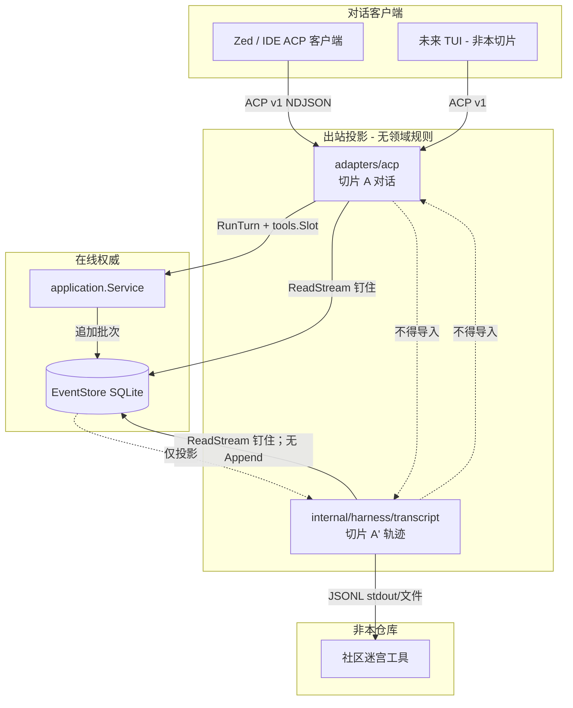

# 对话面与会话转录（切片 A / A′）

**状态：** 草稿（待人工评审）

**日期：** 2026-08-23

本文档是英文正本
[2026-08-23-conversation-and-session-transcript-design.md](2026-08-23-conversation-and-session-transcript-design.md)
的中文同步阅读版；两份副本如有分歧，以英文正本为准。

- **稳定性：** 公开面为 `experimental`；适配器与投影器仍为 `internal`
- **成熟度：** pre-v0，非 GA
- **父文档 / 章程：** [基础架构](2026-08-11-open-code-harness-architecture-design.md)
- **既有 ACP 设计：** [ACP v1 Adapter（里程碑 6）](2026-08-22-acp-v1-adapter-design.md)
- **本写作回合不**把本规格写入 [`docs/README.md`](../../README.md) 权威表。

**本切片不得改变的已实现合同**（实现后允许追加文档；下列合同的既有行为不变）：

- [领域事件](../../architecture/domain-events.md)
- [Engine 纵切](../../architecture/engine-vertical-slice.md)
- [EventStore v2](../../architecture/eventstore-v2.md)
- [Tool runtime](../../architecture/tool-runtime.md)
- [JSONL 审计副本](../../architecture/jsonl-audit-replica.md)
- [SQLite 规范 EventStore](../../architecture/sqlite-eventstore.md) — 第 8.2 节规定的只读打开器除外（加法）
- [组合根](../../architecture/composition-root.md) — §7.9 / §10.4 规定的 `ExportSession` 除外（加法）
- [Runtime Host](../../architecture/runtime-host.md)
- [ACP v1 adapter](../../architecture/acp-v1.md) — 切片 A *补完*对话投影，不重开 v1 目标、`tools.Slot` 或停止原因代数

---

## 1. 决策摘要

Open Code Harness 已在 EventStore 中持久化可重建的 Session/Turn/Item 历史。里程碑 6 的 ACP 适配器几乎只投影聊天文本（`user_message_chunk` / `agent_message_chunk`）。这不是 DeepSeek-Harness 级的**完整 agent 轨迹**，ACP 也不是社区迷宫工具的正确挂点。

本切片把两种需求拆成**同一 EventStore 的两条出站投影**。它们永不混用，永不回写，也永不与切片 3 审计副本共用编解码器。

```text
Zed / 社区 ACP TUI               ← 对话：user / assistant / tool_call
        │ ACP v1
        ▼
   adapters/acp                  ← 切片 A：聊天投影
        │
EventStore（唯一在线权威）
        │
   会话转录 JSONL                ← 切片 A′：逐步、墙钟、用量、失败
        │
社区迷宫工具                     ← 社区画迷宫；harness 不画
```

承重决策：

1. **ACP 是对话面。** 补完 ACP v1 `session/update`，让客户端能渲染含工具卡片与权限的聊天。留在 v1。此处不实现迷宫 UI、ACP v2 或 `session/resume`。
2. **会话转录 JSONL 是轨迹面。** 一行一条投影事实，有文档化 schema，可导出。这是 `och-trace-compare` 一类社区工具的挂点。Harness 不画迷宫，不算 verdict。
3. **EventStore 仍是唯一在线权威。** 两个面都是投影。转录不是副本、不是提交点、不可写回。切片 3 审计 JSONL 仍是一行一个原子追加（摘要链）；本切片不碰该编解码器。
4. **自创公开转录目录。** 本仓库已拥有的领域类型字符串（`turn.started`、`tool.call.started` 等）可作为转录 `type`，因为那是我们的名字。不复制 DeepSeek Harness 名称（`turn/start`、`tool/call` 等）、磁盘布局或可视化 schema。社区项目只作动机，不作架构。
5. **v0 无子代理。** 转录与 ACP 不得编造 `origin: subagent`（或任何 origin 字段）。
6. **压缩一旦到来，必须是领域事件。** 实现不在本切片；约束在范围内，以免转录与模型上下文日后分叉。
7. **并行工具未实现。** 墙钟保真度是起始与终态事件的 `domain.RecordedEvent.OccurredAt`。同一原子批次共享一个时间戳。不得假装逐调用重叠。
8. **切片 A 与 A′ 可并行。** 两套投影代码不跨面共享。ACP 拥有对话映射；`internal/harness/transcript` 拥有轨迹映射。事件 `switch` 的重复是故意的。

---

## 2. 概述

里程碑 6 在 `internal/harness/adapters/acp` 交付了 ACP v1 JSON-RPC 适配器，把 initialize / session/new / load / prompt / cancel / request_permission 翻译到 `application.Service` 与钉住的 `EventStore.ReadStream`。`session/load`（`server.go` `project()`）目前只发出 `turn.started` → `user_message_chunk` 与 `assistant.message.completed` → `agent_message_chunk`。`session/prompt` 只转发 `engine.RuntimeModelTextDelta`。工具、审批、用量、失败事实在电文上被丢弃，尽管领域已经记录它们。

用户问：补完 ACP 是否足以得到完整 agent 轨迹并供社区可视化使用。答案是否定的。ACP v1 的 `tool_call` / `tool_call_update` 是为了让 IDE 渲染对话，并不携带墙钟步骤身份、用量、截断标志，也不是迷宫工具可以 diff 的字节稳定日志。把轨迹塞进 ACP 会压垮聊天协议，同时仍让可视化工具挨饿。

方案分两片：

- **切片 A** — 领域/运行时事实到 ACP v1 `session/update` 的全映射（现场 `session/prompt` 与回放 `session/load`），含工具状态以及与 `session/request_permission` 的关系。
- **切片 A′** — 面向会话的 JSONL 导出（`och export-session`）加库投影器，冻结的 experimental schema、黄金夹具，以及新包 `internal/harness/transcript` 的架构所有者。

DeepSeek Harness 自己的 ACP（`packages/acp/acp/README.md`，2026-08-22 观察于 `deepseek-ai/deepseek-harness@b150a55`）只作为**拆分的证据**引用：它投影已提交的助手文本，并把原始 delta、工具、推理、用量留在会话日志。切片 A **不**复制该限制。章程规定 ACP 是面向 TUI/IDE 的公开客户端边界，因此工具卡片属于 ACP。轨迹仍属于日志——我们的日志，不是他们的。

---

## 3. 背景与当前已实现状态

于 2026-08-23 对照本工作树核实。

### 3.1 今日 ACP 适配器

| 路径 | 行为 | 缺口 |
| --- | --- | --- |
| 包 | `internal/harness/adapters/acp`；组合根 `Assembly.ServeACP`；`cmd/och -acp` | 对话投影不完整 |
| `server.go` `project()` | `TurnStarted` → `user_message_chunk`；`AssistantMessageCompleted` → `agent_message_chunk`；`default` 返回 nil | `session/load` 丢掉工具、审批、失败、中断 |
| `updateSink.Emit` | 只转发 `RuntimeModelTextDelta` | 现场 prompt 丢掉 `RuntimeModelToolCall`、`RuntimeToolExecution*`、`RuntimeApproval*` |
| 权限 | `server.Decide` 反向 RPC；`toolCallId` = 裸 `ApprovalRequest.CallID`；`kind` = `"other"`；`status` = `"pending"` | 无法与从未发送的 `tool_call` 关联；CallID 非会话唯一 |
| 帧编解码 | NDJSON JSON-RPC；解码 `maxFrameBytes = 1 << 20`（`codec.go`） | 出站更新未按该上限裁剪 |
| 目录启用的 `RunTurn` | `docs/architecture/acp-v1.md`：经 `application.projectPriorTurns` 从事件日志为模型 prompt 加前缀 | 那是模型记忆，不是 ACP 对话投影。里程碑 6 设计文仍写 “prompt 失忆”；已实现合同为准。本切片不重开。 |
| 停止原因 | 已实现 `stopReason()` 把任何 `TurnStatusInterrupted` 映射为 `cancelled` | 里程碑 6 规格只允许 `caller_canceled`。本切片不做（见 §16）。 |

必须映射到的 ACP v1 电文形状（取自 `.reference/acp-spec`，不复制进仓库）：`session/update` 的 `tool_call` / `tool_call_update`；状态 `pending` / `in_progress` / `completed` / `failed`；可选 `kind`、`content[]`、`rawInput`、`rawOutput`；`session/request_permission` 携带 `toolCall` 更新。留在 v1；v2 草稿不在范围。

### 3.2 今日领域与运行时

`domain.RecordedEvent`（`internal/harness/domain/record.go`）已有 `Sequence`、`OccurredAt time.Time`（UTC、RFC3339Nano）、`Event`，以及 `ID` / `CommandID` / `SessionID`。事件目录（`events.go`）已包含轨迹所需事实：会话生命周期、轮次起止（含原因）、助手消息、工具调用起止/失败/中断、`model.usage.recorded`、`approval.*`。`model.request.recorded` 与 `policy.decision.recorded` 为版本-only。

Application Step 循环（`loop.go`、`pipeline.go`）是顺序的。`MaxSteps = 8`，`MaxToolCallsPerStep = 8`，工具结果上限 **64 KiB**，`truncated=true`，标记 `\n[truncated]`。紧凑 `Session` 仍丢弃已完成轮次；事件日志是权威（`projectPriorTurns`）。

Engine `RuntimeEvent`（`runtime.go`）是**瘦瞬态信号**：`Type`、`Text`、`Code`，外加 `Correlation`。工具执行事件把 `name:id` 放在 `Text` 里（`runtimeToolText`）。**不**携带参数或结果内容。`RuntimeModelToolCall` 在模型流期间、`tool.call.started` 提交之前发出。`RuntimeToolExecutionStarted` 在该提交之后、校验/策略/审批之前立刻发出（`pipeline.go`）。发射器的 `ItemID` 整轮都是助手条目，因此现场 ACP 不能把 `Correlation.ItemID` 当作工具调用身份。

### 3.3 今日持久化

SQLite 是唯一在线提交权威。`sqlite.Open` 总会 `AcquireLease`（`open.go`）。对活跃数据库第二次 `Open` 会被拒绝。读取使用钉住的 `ReadStream` 页（`ReadWholeStreamPinned` 的 `Limit` ≤ 256）。切片 3 审计 JSONL 是**一行一个原子追加批次**——粒度与目的都不同。

未使用的 `transcript_entries` 表仅为 schema，在持久化设计中预留给 TUI/Context 分页。本切片**不**填充它。会话转录 JSONL 是导出投影，不是那张表。

`cmd/och` 是 `composition.Open` 上的瘦旗标解析器。没有导出子命令。`Open` 需要工作区、供应商 URL、模型、API 密钥环境变量、runtime id，并拿走围栏租约——不能当作导出路径。

### 3.4 痛点

1. Zed（或未来 TUI）客户端无法渲染工具卡片，公开对话面看起来像聊天机器人，即使引擎已执行工具。
2. 社区轨迹工具没有文档化挂点。审计 JSONL 粒度错误（批次、摘要、含最大 8 MiB 的 `model.request.recorded` 信封）。
3. 只补完 ACP 而不做转录，会诱使后续工作把用量、策略规则 ID 和迷宫语义塞进 `session/update`。
4. 经 `composition.Open` 导出将偷走或被活跃围栏租约拒绝。

---

## 4. 目标与非目标

### 4.1 目标

1. 公布领域事件与运行时事件到 ACP v1 `session/update` 的全映射表（现场与 load），含工具状态与权限关联。
2. 发出带会话唯一 `toolCallId`、由四个内置工具导出的 kind、以及有界 `content` / `rawInput` 的 ACP `tool_call` / `tool_call_update`。
3. ACP 保持传输适配器：无新 Application 端口，无领域规则。共享映射作为纯函数住在 `adapters/acp`。
4. 定义 experimental 会话转录 JSONL schema（信封、目录、身份、演进规则），它既不是审计副本也不是领域编解码器。
5. 交付库投影器（`internal/harness/transcript`）与 `och export-session`，从 EventStore 读并向 `io.Writer` 写 JSONL，并以 `transcript.complete` 尾行使截断文件可被拒收。
6. 为两个面命名资源上限、失败语义与验证方法。
7. 记录“压缩必须是领域事件”约束以及并行工具的诚实缺口。
8. 把工作结构化为真实 PR DAG，使 ACP 与转录可并行。
9. 在切片 A 把工具参数与结果送上 ACP 线之前，先关上既有的 `session/load` / `session/prompt` 工作区漏洞。

### 4.2 非目标（显式排除）

| 排除 | 说明 |
| --- | --- |
| 迷宫 / 轨迹 UI / verdict 启发式 | 失败签名、空搜索、盲目重试、主路径 vs 绕路。社区可视化器拥有这些。 |
| ACP v2 | 留在 `protocolVersion: 1`。 |
| `session/list`、`session/resume`、`session/delete` | 切片 B 后续。此处只为排序提及。 |
| TypeScript TUI（里程碑 7） | 本文不是 TUI 规格。 |
| Context Engine / 感知 token 的压缩实现 | 仅约束：必须是领域事件。 |
| MCP 客户端 | 目录 `source=mcp` 仍是类型空洞。 |
| 并行工具执行 | 顺序 Step 循环不变。 |
| 改变审计 JSONL 编解码器 | 切片 3 仍是一行一个追加批次。 |
| 写入 `transcript_entries` / `snapshots` | 仅 schema 的表继续不用。 |
| 复制 DSH / Kimi / Codex 磁盘布局或事件名 | 仅动机。 |
| 新的 Application 投影端口 | 适配器自有映射。 |
| 丰富 Engine `RuntimeEvent` 载荷 | 会改变 engine 合同；现场 ACP 对瘦信号保持诚实。 |
| 子代理 origin / `origin` 字段 | v0 无子代理。 |
| 脱敏导出 | 更后，与审计相同。 |
| 填入 `docs/README.md` 权威表 | 本写作回合为草稿。 |
| ACP `initialize` 的 `protocolVersion` 协商 | 今日 `handleRequest` 把 `initialized=true` 并一律回报 `1`，不读客户端版本（`server.go`）。本切片范围外。后续 ACP 正确性 PR；不要把切片 A 当成已覆盖。 |
| 权限反向 RPC waiter 清理 | `Decide` 在 `ctx.Done()` 时返回而不删除 `s.pending[id]`（`server.go`）。取消的审批会泄漏 waiter。本切片范围外。后续 ACP 正确性 PR。 |

### 4.3 后续顺序（非本规格的实现）

1. **切片 A 与 A′**（本规格）— 可并行。
2. **切片 B** — 在 EventStore 上的 ACP `session/resume` / `session/list` / `session/delete`。
3. **作为领域事件的压缩** — 任何上下文改写之前的硬依赖。然后转录与 ACP 投影那些事件。在它们存在之前，任一表面都不得声称发生过压缩。
4. **社区可视化器** — 本仓库之外（`och-trace-compare` 或类似）。消费切片 A′ JSONL。
5. **ACP `initialize` protocolVersion 协商** — 非本切片（§4.2）。
6. **取消时的权限 waiter 清理** — 非本切片（§4.2）。

---

## 5. 双表面架构



规则：

- EventStore 是唯一在线提交权威。ACP 与转录是读取器/投影器。
- `adapters/acp` 不得导入 `transcript`。`transcript` 不得导入 `acp` 或任何 adapter。
- 组合根是两者唯一的生产导入者（`cmd/och` 只经组合根）。
- 审计 JSONL 仍由 `adapters/sqlite` 拥有，是**批次完整性副本**，不是会话转录。

现场工具 + 权限的时序见英文本 §5 的 sequenceDiagram：`model.tool_call` → `tool_call pending` → 提交 `tool.call.started` → `in_progress` → 可选 `session/request_permission` → 终态 `completed`/`failed` → prompt 的 `stopReason`。

转录导出是独立只读路径（无 `RunTurn`、无租约）：`och export-session` → `composition.ExportSession` → `sqlite.OpenReader` → `transcript.WriteSession` 按钉住页写出。

---

## 6. 切片 A — ACP 对话投影

`session/new` 已拒绝不等于组合根工作区的非空 `cwd`。`session/load` 与 `session/prompt` 没有：load 丢弃 `LoadSession` 的 `WorkspaceRoot`（`server.go` `sessionLoad`），prompt 在 `RunTurn` 之前从不加载。该洞今天就在（load 上的用户/助手文本；目录启用的 prompt 会把外来历史前缀进模型）。切片 A 会把工具参数、结果和失败文本送上 ACP，从而放大它。工作区准入见 §6.11，归入 PR 2，使它在 PR 5 回放工具载荷**之前**落地。

### 6.1 放置

映射留在 `internal/harness/adapters/acp`。抽出纯函数，避免现场 prompt 与 load 回放漂移：

| 符号 | 拟定文件 | 职责 |
| --- | --- | --- |
| `ProjectRecordedEvent(sessionID string, record domain.RecordedEvent) []any` | `project.go` | Load 回放；也是测试中的合同表 |
| `LiveTool` `{TurnID, CallID, Name}` | `project.go` | 适配器 prompt 状态：一个未完成工具的身份（不是 Domain） |
| `ProjectRuntimeEvent(sessionID string, event engine.RuntimeEvent, live LiveTool) []any` | `project.go` | 现场 `updateSink`；`Text` 为空时由 `live` 提供 CallID |
| `ToolCallID(turnID domain.TurnID, callID string) string` | `project.go` | 会话唯一 ACP id |
| `ToolKind(name string) string` | `project.go` | ACP `kind` |
| `clipUpdateText` / `clipToolContent` | `project.go` | §6.7 的上限 |

`server.project` 与 `updateSink.Emit` 变成把返回的更新写成 `session/update` 通知的薄包装。无新 Application 端口。适配器仍不拥有领域规则。

两个投影器，不是一个：`RuntimeEvent` 与 `RecordedEvent` 字段不同。强行合成一个函数会发明虚假公共结构并掩盖现场保真缺口（§6.6）。

`ProjectRuntimeEvent` 保持纯函数。它**不能**从 `tool.execution.failed` 解析 CallID：Application 发出 `RuntimePayload{Type: RuntimeToolExecutionFailed, Code: code}` 且 `Text` 为空（`pipeline.go` `failToolAndContinue`），`validToolRuntimePayload` 在设了 `Code` 时禁止 `Text`。`Correlation.ItemID` 整轮都是助手条目（`owned.emitter` 从不改绑）。丰富 `RuntimeEvent` 仍是非目标（§4.2）。

**适配器 prompt 状态（仅切片 A）：** `updateSink` 为进行中的 prompt 记住一个未完成的 `LiveTool`。

1. 在 `model.tool_call` 与 `tool.execution.started` 上，按最后一个 `:` 把 `Text` 解析为 `name:callID`，存 `{TurnID: event.TurnID, CallID, Name}`，并把该 `live` 传入投影器。
2. 在 `tool.execution.completed` 上，若有 `Text` 则解析，否则用记住的 `live`。投影终态后清除 `live`。
3. 在 `Text` 为空的 `tool.execution.failed` 上，传入记住的 `live`，为该命名空间 `toolCallId` 发出 `tool_call_update` `{status: failed}`。**不要跳过**仅含 Code 的失败事件。之后清除 `live`。
4. 顺序的 `executeOneTool`（`loop.go`）使“一个未完成调用”为诚实。下一次 started 覆盖 `live` 是正确的，因为前一次已经终态。

此状态只存在于 ACP prompt sink。它不是 Domain，不是 EventStore，也不与转录共享。

### 6.2 ACP `toolCallId` 与 kind

ACP v1 要求 `toolCallId` 在会话内唯一。领域 `CallID` 在一次模型流内唯一（重复 id 是 `invalid_stream`），但**不**承诺跨轮唯一。领域 `ItemID` 会话唯一，但现场 `RuntimeEvent.Correlation.ItemID` 是**助手**条目。

**决策：** `toolCallId = string(turnID) + "/" + callID`。

- Load 时来自 `ToolCallStarted.TurnID` + `CallID`。
- 现场来自 `RuntimeEvent.Correlation.TurnID` 加上从 `Text` 解析的 CallID（`runtimeToolText` / `RuntimeModelToolCall` 的 `name + ":" + id`），**或者**当 `Text` 为空（仅含 Code 的 `tool.execution.failed`）时来自 sink 记住的 `LiveTool`（§6.1）。
- `session/request_permission` 必须使用**同一** id。里程碑 6 发送裸 `CallID`。该电文是 experimental，且从未与我们没发过的 `tool_call` 关联；本切片改变它。权限反向 RPC 仍有 `ApprovalRequest.CallID` 与 `TurnID`，不使用 sink 状态。

Kind 映射（封闭，仅内置名）：

| 工具名 | ACP `kind` |
| --- | --- |
| `read_file`、`list_dir` | `read` |
| `write_file` | `edit` |
| `exec` | `execute` |
| 其他（未知工具、未来名字） | `other` |

不发明 `search` / `fetch` / `delete` / `think`。Title 是工具名（稳定，不是本地化句子）。

### 6.3 全映射 — 现场 `session/prompt`

来源：经 `RunTurnRequest.Sink` 的 `engine.RuntimeEvent`。客户端已有用户 prompt；**不要**为进行中的轮次发 `user_message_chunk`。

| 运行时事件 | ACP `session/update` | 说明 |
| --- | --- | --- |
| `model.text.delta`（非空） | `agent_message_chunk` `{type:text, text}` | 既有。按 §6.7 裁剪。 |
| `model.tool_call` | `tool_call` `{toolCallId, title, kind, status: pending}` | 按最后一个 `:` 把 `Text` 解析为 `name:callID`。无 `rawInput`（信号上没有）。 |
| `tool.execution.started` | `tool_call_update` `{toolCallId, status: in_progress}` | 持久意图已提交，但校验/审批/执行可能仍在后面。诚实：ACP `in_progress` 包含这段等待。不发明第二套时钟。 |
| `approval.requested` | 无 | 权限 RPC 即 UX。 |
| `approval.resolved` | 无 | 结果是 RPC 加上随后的工具终态。 |
| `tool.execution.completed` | `tool_call_update` `{status: completed}` | 现场无 `content` / `rawOutput`。Load 回放补上。身份来自 `Text` 或记住的 `LiveTool`。 |
| `tool.execution.failed` | `tool_call_update` `{status: failed}` | `Code` 不上电文（错误卫生）。身份来自记住的 `LiveTool`，因为 Application 发出仅含 Code（`Text` 空）。永不跳过。 |
| `model.stream.started` / `completed` / `failed` / `interrupted` | 无 | 内部 runner 生命周期。 |
| `append.completed` | 无 | 不是对话事实。 |

`session/request_permission`（既有反向 RPC）**不是** `session/update`。与工具状态的关系：

1. 客户端通常已收到 `tool_call` `pending`（来自 `model.tool_call`）以及 `tool_call_update` `in_progress`（来自 `tool.execution.started`，Application 在 `Approver.Decide` 之前发出）。
2. 权限参数复用 `ToolCallID(turnID, callID)`、`Title=name`、`Kind=ToolKind(name)`、`Status=pending`（ACP：pending 包含等待审批）。
3. 授予（`allow-once`）继续管线；拒绝 / 超时 / 取消 / RPC 失败 / 拆解仍 fail-closed（`tools.Slot`）。然后 Application 发出 `tool.execution.failed` → ACP `failed`。
4. 本切片不加 `allow_always` / `reject_always`。

通知发送失败**不得**让进行中的 prompt 失败（里程碑 6 §6）。今日 `updateSink.Emit` 返回 `writeNotification` 错误，`engine.TurnRunner` 把 sink 失败映射为 `CodeDelivery` → Application `runtime_delivery_failed`。切片 A 在 sink 中**吞掉** `session/update` 写错误（`_ = writeNotification`；`Emit` 返回 nil）。被丢掉的更新不得变成 `CodeDelivery`，也不得改变 `stopReason`。prompt JSON-RPC **结果**帧的写失败已经是 best-effort（`runPrompt` 使用 `_ = s.out.writeResult` / `_ = s.out.writeError`）并保持如此：若结果帧写不出，客户端看到的是关闭的流，而不是映射后的 stop reason。`session/load` 相反：一次更新写失败会使 load RPC 失败（`-32603`），因为在部分回放之后返回成功是撒谎。

### 6.4 全映射 — `session/load` 回放

来源：钉住的 `History.ReadStream`（已在 `server.replay`，页大小 256，第一页钉住 head）。用 `ProjectRecordedEvent` 替换 `project()`。空文本仍跳过。

| 领域事件 | ACP `session/update` | 不投影 |
| --- | --- | --- |
| `turn.started` 且 `Input` 非空 | `user_message_chunk` | 空 Input |
| `assistant.message.completed` 且 `Text` 非空 | `agent_message_chunk` | `ToolCalls` 提议（卡片来自 `tool.call.*`） |
| `assistant.message.failed` / `interrupted` 且 `Message` 非空 | `agent_message_chunk` | codes |
| `tool.call.started` | `tool_call` `{toolCallId, title, kind, status: in_progress, rawInput?}` | — |
| `tool.call.completed` | `tool_call_update` `{status: completed, content: [文本块]}` | 领域 `Truncated` 标志（转录保留） |
| `tool.call.failed` | `tool_call_update` `{status: failed, content: [Message 文本块]}` | `Code` |
| `tool.call.interrupted` | `tool_call_update` `{status: failed}` | ACP 无 `interrupted` 状态；不发明 |
| `approval.requested` / `resolved` | 无 | 仅现场 RPC；load 显示工具终态 |
| `turn.completed` / `failed` / `interrupted` | 无 | 停止原因是 prompt RPC，不是 load |
| `session.created` / `session.closed` | 无 | — |
| `assistant.message.started` | 无 | 无持久部分文本 |
| `model.request.recorded` | 无 | 供应商信封 |
| `model.usage.recorded` | 无 | 轨迹面 |
| `policy.decision.recorded` | 无 | 规则 ID |

`rawInput`：若 `Arguments` 是 JSON 对象或数组，作为 JSON 值传递；若不是合法 JSON，省略 `rawInput`（转录仍有该字符串）。`rawOutput` 是 ACP 对象；工具 `Content` 是字符串——**不要包一层假对象**。使用 `content: [{type:"content", content:{type:"text", text: ...}}]`。

**未关闭**会话的回放是允许的（`LoadSession` 在 `active` 上成功，包括 `ActiveTurn == nil` 的空闲会话）。`ActiveTurn != nil` 的会话也可回放；最后一张工具卡片可以保持 `in_progress`。那是正确的钉住 head 快照，不是撕裂的对话。`WorkspaceRoot` 与组合根工作区不匹配的会话**不**回放（§6.11）。

Load 上不发出 `session/request_permission`。

### 6.5 ACP 上永不投影的内容

- 用量 token、延迟、`finishReason`、`providerRequestID`
- 策略 `RuleID` / `Effect` / `Reason`
- `model.request.recorded` 的 messages 与工具 schema
- 审计 `batchDigest` / `commitPosition` / `appendId`
- 原始供应商 SSE、engine ordinal、`RuntimeAppendCompleted`
- 电文上的领域错误码（固定 JSON-RPC 文案保持）
- 子代理 origin、plan、thought、terminal、diff、ACP v2 字段
- Verdicts / 迷宫注解

### 6.6 诚实的现场保真缺口

切片 A **不**改变 `engine.RuntimeEvent`。因此现场工具卡片只有 id、名称、kind 与状态。参数与结果文本出现在 `session/load` 和转录上。从不调用 `session/load` 的客户端看不到进行中轮次的 `rawInput` 或输出内容。现场 **身份**对仅含 Code 的 `tool.execution.failed` 是例外：使用适配器 `LiveTool` prompt 状态，而不是 engine 字段。

这是文档化缺口，不是静默谎言。后续（非本切片）可为 `RuntimeEvent` 增加可选字段或提交观察者；二者都是 engine/application 合同变更，需要自己的规格。

并行工具：现场事件是顺序的，因为 Step 循环是顺序的。不要为同一步的多次调用发出重叠的 `in_progress` 卡片；Application 按模型顺序运行 `executeOneTool`（`loop.go`）。

### 6.7 截断与帧上限

| 上限 | 限制 | 超出时 |
| --- | --- | --- |
| 入站 RPC 帧 | `maxFrameBytes = 1 MiB`（既有） | `-32700` |
| 出站 `agent_message_chunk` / `user_message_chunk` 文本 | **768 KiB** 合法 UTF-8 前缀 | 在码点边界裁剪；对话继续 |
| 出站工具 `content` 文本 | **16 KiB** 合法 UTF-8 前缀 | 在码点边界裁剪；若裁剪且领域文本尚未以 `\n[truncated]` 结尾，则追加该标记 |
| 出站 `rawInput` | **16 KiB** compact JSON 编码 | 在 UTF-8 边界裁剪编码字节；若结果不再是合法 JSON，**省略** `rawInput` 而不是发出截断对象。不要给 `rawInput` 追加 `\n[truncated]` |
| 领域工具结果（已应用） | 64 KiB + 标记 | 转录挂点 |
| 领域助手文本 | 1 MiB（`output_limit`） | 既有 |

768 KiB 为 JSON 信封在 1 MiB 帧下留出余量。在投影器中裁剪，不在 Domain 中裁剪。永不从 UTF-8 码点中间切开（半个 rune 会产生非法 JSON 字符串）。`\n[truncated]` 只用于文本 `content` 块，从不用于 `rawInput`。

相对 ACP，转录是未再裁剪的挂点：它携带领域载荷（工具已 64 KiB 封顶，带 `truncated` 布尔）。ACP 可为 IDE 卡片进一步裁剪。

### 6.8 错误（切片 A）

| 条件 | 电文 | 进行中的 prompt？ |
| --- | --- | --- |
| 解析 / 非对象行 | `-32700` | n/a |
| 未知方法 | `-32601` | n/a |
| 坏参数、请求上未知 session、cwd 不匹配、**session `WorkspaceRoot` ≠ 组合根工作区** | `-32602` `invalid params` | n/a |
| prompt 已在飞行 | `-32600` `a prompt is already in flight for this session` | n/a |
| 轮次 completed | `stopReason: end_turn` | 结算 |
| 轮次 interrupted（已实现：任何 interrupted，或取消类别，或 ctx 结束） | `stopReason: cancelled` | 结算 |
| 轮次 failed / 其他错误 | `-32603` `session prompt failed` | 结算 |
| prompt 期间 `session/update` 写失败 | 吞掉；不是 `CodeDelivery`；`stopReason` 不变 | 继续 |
| Prompt JSON-RPC **结果**写失败 | 已是 `_ = writeResult` / `_ = writeError`；best-effort；无映射的 stop reason | 内部已结算 |
| load 期间 `session/update` 写失败 | `-32603` `session prompt failed` — **不变的既有常量** `promptFailedMessage`；本切片不改名 | n/a（load RPC） |
| 权限传输失败 / 取消 / 非 allow-once | 拒绝（既有） | 工具失败，轮次继续 |

原始 engine 与 store 消息从不上电文（不变）。

### 6.9 要增加的协议类型

`protocol.go` 增加匹配 ACP v1 工具调用更新的结构体（`sessionUpdate`、`toolCallId`、可选 `title`、`kind`、`status`、`content`、`rawInput`）。无 v2 字段。`permissionToolCall` 保留，但 `ToolCallID` 为命名空间 id，`Kind` 使用 `ToolKind`。

### 6.10 测试（切片 A）

1. `ProjectRecordedEvent` 表测试覆盖每个领域事件类型（投影的与显式为空的）。
2. `ProjectRuntimeEvent` 表测试覆盖每个 `RuntimeEventType`，包括 **仅含 Code** 的 `tool.execution.failed`（`Text` 空）仍为记住的命名空间 `toolCallId` 发出 `tool_call_update` `{status: failed}`（不得跳过）。
3. `session/load` NDJSON 测试：含 `turn.started`、助手完成、`tool.call.started` / completed / failed / interrupted 的历史在 load 结果之前发出匹配更新；`model.request.recorded` / `policy.decision.recorded` / usage 不产生更新。
4. 现场 prompt：脚本化 `RunTurn` 发出文本 delta、`model.tool_call`、工具 started/completed；客户端观察到 `tool_call` 然后 `tool_call_update` 然后 `end_turn`。
5. 权限：`toolCallId` 等于 `ToolCallID(turn, call)`；授予仍执行；拒绝仍 fail-closed。
6. prompt 期间通知写失败不改变 stop reason（initialize 之后的损坏 writer）。丢掉的 `session/update` 在轮次 completed 时仍结算 `end_turn`。
7. 裁剪测试：超过 16 KiB 的工具内容在 UTF-8 边界裁剪并可获得 `\n[truncated]`；768 KiB+ 助手块在码点边界裁剪；compact JSON 超过 16 KiB 的 `rawInput` 对象被省略而不是截成非法 JSON。
8. 既有 initialize/new/busy/cancel 测试保持绿色。
9. 组合根 e2e（`end_to_end_test.go` 模式）：目录启用的 `read_file` 轮次在 `session/prompt` 期间于双工上至少产生一次现场 `tool_call`（归入 PR 2，不只是 load）。
10. 工作区准入（PR 2）：`session/load` 与 `session/prompt` 对 cleaned `WorkspaceRoot` 不同于组合根工作区的会话返回 `-32602`，且**不**发出任何 `session/update`。同工作区会话仍可 load 与 prompt。未知 session 仍是 `-32602`。电文上不区分“缺失”与“外来”。

默认门仍无密钥、内存双工、无子进程。

### 6.11 会话工作区准入

`session/new` 在 `cwd` 非空时已要求 `filepath.Clean(cwd) == server.workspace`。`session/load` 与 `session/prompt` 必须把同一组合根工作区当作**会话所有权**检查。

**规则：** 仅当 `filepath.Clean(loaded.WorkspaceRoot) == server.workspace` 时准入该 RPC。否则响应 `-32602` `invalid params`，不回放，不 `RunTurn`，不泄漏外来路径，也不泄漏该 session id 存在于本 store。

- **`session/load`：** 使用 `LoadSession` 已经返回的 `domain.Session`（今日适配器忽略它）。比较，然后 `replay`。不匹配则跳过 `replay`。
- **`session/prompt`：** 在 `RunTurn` **之前** `LoadSession`（或 `RunTurn` 会做的同一紧凑加载）。比较，然后启动 prompt goroutine。外来会话的历史不得前缀进模型（`projectPriorTurns`），也不得在当前 jail 下按那套历史执行工具。

这是适配器对既有返回值的策略，不是新的 Application 端口。一个 EventStore 文件可以容纳多个工作区的会话（审计导入、换 `-workspace` 复用 `-database`、测试）。典型一工作区部署不是让该不变量不测的理由。

归入 **PR 2**，使该洞在 PR 5 把工具参数与结果送上 load 回放之前关上。PR 5 保留回归测试。

---

## 7. 切片 A′ — 会话转录导出

### 7.1 放置与所有权

新包 `internal/harness/transcript`。

| 导入者 | 允许？ |
| --- | --- |
| `internal/harness/transcript` 测试 | 是 |
| `internal/harness/composition` | 是（仅接线） |
| `cmd/och` | **否** — cmd 保持 composition + 旗标解析 |
| `adapters/acp` | **否** |
| `domain`、`application` 生产代码 | **否** — 投影是出站的 |
| `adapters/sqlite` | **否** — 读取器由外部传入 |

精确的架构守卫矩阵（PR 3 必须增加这些 `TestForbiddenImport` / `TestClassifyProductionDirectory` 用例；省略反向禁令会使 C-05 无法执行）：

| 所有者 | 可以导入 | 不得导入 |
| --- | --- | --- |
| `ownerTranscript`（`internal/harness/transcript`） | `domain`；`application`（仅 `ReadStream` 类型）；除 `os` / `os/exec` / `net` / `net/http` 外的标准库 | `engine`、`policy`、`tools`、`runtime`、`testkit`、任何 `adapters/*` |
| `ownerComposition` | `transcript`（以及每一个 adapter，与今日相同） | `testkit`（不变） |
| `ownerDomain`、`ownerEngine`、`ownerApplication`、`ownerPolicy`、`ownerTools`、`ownerACP`、`ownerSQLite`、`ownerRuntime` | 其余不变 | **`internal/harness/transcript`**（反向禁令） |
| `internal/harness` 下未拥有的包 | 与今日一样的 stdlib / `domain` | `transcript`（与 adapters/testkit 同精神的禁止生产依赖） |

把 `ownerTranscript` 加进 `TestOnlyCompositionAndRuntimeMayNameAnAdapter` 的 `owners` 切片（不要加进 adapters 列表），以钉住“transcript 不能点名 adapter”。`cmd/och` 不在该 walk 内；PR 7 测试必须断言生产 `cmd/och` 文件只导入 `composition`、既有 `policy`（serve 模式 `-policy`）以及 stdlib/`flag` —— 不导入 `transcript`，也不导入 `adapters/sqlite`。

不声明所有者的话，日后若导入 sqlite 会被 adapters 的 `unownedImport` 抓住；仍须声明所有者，使生产文件按真实规则集检查，并且反向禁令存在。

### 7.2 信封

每行一个 UTF-8 JSON 对象。无嵌入原始换行（与 ACP、审计相同的 NDJSON 纪律）。Schema 名 `och.session.transcript`。`formatVersion` 1。

三套电文结构体（`Line`、`SnapshotLine`、`CompleteLine`）。带 `omitempty` 的单一 `Line` 无法满足完整性行的键集：快照/完成行会冒出空的 `eventId`/`commandId` 和 `sequence: 0`，而对 `Sequence` 使用 `omitempty` 也会在合法事实序列若为 0 时丢掉它（事实行永不省略 `sequence`；EventStore 序列从 1 起）。

**事实行**冻结键序（字节稳定的 `encoding/json` 结构体字段序）：

```text
formatVersion, schema, sessionId, eventId, commandId, sequence, occurredAt, type, payload
```

```go
type Line struct { /* formatVersion, schema, sessionId, eventId, commandId, sequence, occurredAt, type, payload；sequence 无 omitempty */ }
type SnapshotLine struct { /* formatVersion, schema, sessionId, occurredAt, type, payload；type=transcript.snapshot */ }
type CompleteLine struct { /* 与 SnapshotLine 相同的信封键；type=transcript.complete */ }
```

`sequence` 是 **EventStore 序列**，不是稠密转录计数器。被省略的领域类型（如 `model.request.recorded`）表现为**缺口**。消费者不得假设稠密。`eventId` / `commandId` 可与审计副本连接而不混用编解码器。事实行永不省略 `sequence`。

每次导出的第一行是快照，不是领域事实。冻结键：`formatVersion, schema, sessionId, occurredAt, type, payload`。黄金夹具（RFC3339Nano，含纳秒）：

```json
{"formatVersion":1,"schema":"och.session.transcript","sessionId":"session-1","occurredAt":"2026-08-23T12:00:00.000000000Z","type":"transcript.snapshot","payload":{"headSequence":12,"open":true,"running":false,"stability":"experimental"}}
```

快照上的 `occurredAt` 是组合根注入的时钟给出的导出 UTC 时间（RFC3339Nano）——**不是**编造的领域时钟。库测试传入冻结时钟。`headSequence` 是钉住的 `ReadStream` head。

快照载荷位**不是**“会话没有 `session.closed`”。领域会话在轮次完成后仍是 `active`（`ActiveTurn == nil`）；ACP 从不暴露 `session/close`，因此该定义对几乎每次导出都为真。第一遍钉住扫描用 `domain.Apply` 重建紧凑 `domain.Session`（既有纯回放，内存 O(页)）：

| 字段 | 为 true | 为 false |
| --- | --- | --- |
| `open` | `Status == active`（钉住快照中无 `session.closed`） | `Status == closed` |
| `running` | `ActiveTurn != nil` | 空闲的 `active` 会话，或已关闭 |

一次已完成的 ACP 对话通常是 `open: true`、`running: false`。进行中的轮次是 `open: true`、`running: true`。两个 bit 都要；不要合成一个。

每次**成功**导出的最后一行是 `transcript.complete`，信封与快照相同（无 `eventId` / `commandId` / `sequence`）。黄金（RFC3339Nano）：

```json
{"formatVersion":1,"schema":"och.session.transcript","sessionId":"session-1","occurredAt":"2026-08-23T12:00:00.000000000Z","type":"transcript.complete","payload":{"headSequence":12,"factLines":9,"open":true,"running":false}}
```

`complete.headSequence` 必须等于 `snapshot.headSequence`。`factLines` 是快照与完成行之间的事实行数（不含这两条完整性行）。complete 上的 `open` / `running` 回显快照（同一钉住 head）。complete 的 `occurredAt` 与快照是同一次导出时钟瞬间。

`UnmarshalLine` 为三臂：先看 `type`；`transcript.snapshot` → 严格解码 `SnapshotLine`；`transcript.complete` → 严格解码 `CompleteLine`；否则严格解码 `Line`。该臂键集不对则失败。拒绝尾随 JSON。对我们的解码器而言未知 `formatVersion` 是硬错误。未知**事实** `type` 由**外部**消费者经 `DecodeSkipsUnknown` 跳过（§7.5）；`transcript.snapshot` 与 `transcript.complete` **不是**可跳过的完整性类型。我们编码器的黄金解码器保持严格。测试钉住快照、完成与事实黄金。

### 7.3 事件类型目录（experimental）

公开 `type` 值。对所暴露的事实，它们与**我们的**领域事件类型字符串重合。它们不是 DeepSeek 的 `turn/start` / `tool/call`。

| `type` | 载荷字段 | 来源领域事件 |
| --- | --- | --- |
| `transcript.snapshot` | `headSequence`、`open`、`running`、`stability` | 导出器（非领域） |
| `transcript.complete` | `headSequence`、`factLines`、`open`、`running` | 导出器（非领域）；成功导出的最后一行 |
| `session.created` | `workspaceRoot` | `session.created` |
| `session.closed` | `{}` | `session.closed` |
| `turn.started` | `turnID`、`input` | `turn.started` |
| `turn.completed` | `turnID` | `turn.completed` |
| `turn.failed` | `turnID`、`code`、`message` | `turn.failed` |
| `turn.interrupted` | `turnID`、`reason` | `turn.interrupted` |
| `assistant.message.started` | `turnID`、`itemID`、`stepIndex`、`stepRef` | `assistant.message.started` + 投影器计数器 |
| `assistant.message.completed` | `turnID`、`itemID`、`stepIndex`、`stepRef`、`text`、`toolCalls`（可选） | `assistant.message.completed` |
| `assistant.message.failed` | `turnID`、`itemID`、`stepIndex`、`stepRef`、`code`、`message` | `assistant.message.failed` |
| `assistant.message.interrupted` | `turnID`、`itemID`、`stepIndex`、`stepRef`、`code`、`message` | `assistant.message.interrupted` |
| `model.usage.recorded` | `turnID`、`itemID`、`inputTokens`、`outputTokens`、`cachedInputTokens`、`latencyMs`、`finishReason`、`providerRequestID` | `model.usage.recorded` |
| `tool.call.started` | `turnID`、`itemID`、`callID`、`stepIndex`、`stepRef`、`name`、`arguments` | `tool.call.started` |
| `tool.call.completed` | `turnID`、`itemID`、`callID`、`stepIndex`、`stepRef`、`content`、`truncated` | `tool.call.completed` |
| `tool.call.failed` | `turnID`、`itemID`、`callID`、`stepIndex`、`stepRef`、`code`、`message` | `tool.call.failed` |
| `tool.call.interrupted` | `turnID`、`itemID`、`callID`、`stepIndex`、`stepRef`、`code`、`message` | `tool.call.interrupted` |
| `approval.requested` | `turnID`、`itemID`、`approvalID`、`callID`、`name`、`reason` | `approval.requested` |
| `approval.resolved` | `turnID`、`itemID`、`approvalID`、`decision` | `approval.resolved` |

**省略（不发一行）：** `model.request.recorded`（供应商信封，最大 8 MiB）、`policy.decision.recorded`（规则 ID；可视化器可从 `tool.call.failed` 的 `policy_denied` 等 code 推断拒绝）。

**诚实的用量省略：** 若从未追加 `model.usage.recorded`（无用量的供应商、用量前流失败、纯文本路径），转录**没有**用量行。不发零 token。

**无 `origin` 字段。** v0 无子代理。

助手完成上的 `toolCalls`（若存在）是领域 `[]ToolCallOffer`（`id`、`name`、`arguments`）——我们的形状，不是 ACP 的。

### 7.4 身份与 `stepRef`

可视化器需要轮次限定的步骤标签，且不得自行发明。

- `turnID`、`itemID`、`callID` 从领域事件复制。
- 领域 `StepIndex` 只存在于 `ToolCallStarted`（`events.go`）。助手事件与工具终态没有该字段（已实现合同不变）。
- 助手事件：投影器按 `turnID` 对 `assistant.message.started` 从 1 计数，存入 `steps[turnID]`，并写入该计数为 `stepIndex`。
- `tool.call.started`：把 `ToolCallStarted.StepIndex` 复制进载荷。不要发明第二份 `callID → stepIndex` 映射。
- `tool.call.completed` / `failed` / `interrupted`：使用当前的 `steps[turnID]`（该轮次迄今的 `assistant.message.started` 计数）。健康流上这等于同轮最近一次 `ToolCallStarted.StepIndex`，因为工具在下一次 `assistant.message.started` 之前运行（`loop.go` `owned.stepIndex`）。
- `stepRef` 是字符串 `turnID + "/" + decimal(stepIndex)`（无空格）。例：`turn-1/2`。

**不变量（测试，不修复）：** 对 `tool.call.started`，复制的 `StepIndex` 等于当时的 `steps[turnID]`（该轮次直到最近一次（含）的 `assistant.message.started` 计数）。对工具终态，载荷 `stepIndex` 等于 `steps[turnID]` 且等于该轮最近一次 started 的 `StepIndex`。若损坏流不一致，诚实发出两个事实；不改写 `StepIndex` 或 `steps`。

墙钟：该行的 `occurredAt` 是 `RecordedEvent.OccurredAt`。一次工具调用的起止是 `tool.call.started` 与终态工具事件的时间戳。**不要发明** duration 字段。同一原子批次的事件共享一个 `OccurredAt`（领域：每个批次调用一次时钟）。用相等时间戳画重叠条的可视化器是错的；顺序执行才是真相。

### 7.5 稳定性与演进

- 表面稳定性：直到 v1.0 为 **`experimental`**（与 tool-runtime / EventStore 合同相同用语）。
- 只加法：可以增加新 `type`；既有名字与载荷键永不改义重用。
- 外部消费者**必须跳过未知事实 `type` 值**。跳过未知**不**适用于 `transcript.snapshot` 或 `transcript.complete`。实现本合同时，消费者**拒绝**第一行不是快照或最后一行不是 complete 的文件，即使中间跳过了未知事实。本仓库针对*我们*编码器的黄金解码器保持严格，以免意外改名。
- 仅破坏性信封变更才递增 `formatVersion`。既有类型上的加法字段不升 `formatVersion`；它们需要规格修订与新夹具。
- 领域 schemaVersion 仍为 1，**不是**转录 `formatVersion`。

### 7.6 投影器行为

```go
type StreamReader interface {
    ReadStream(context.Context, application.ReadStreamRequest) (application.StreamPage, error)
}

type Result struct {
    HeadSequence uint64
    FactLines    uint64
    Open         bool
    Running      bool
}

func WriteSession(ctx context.Context, src StreamReader, sessionID domain.SessionID, now time.Time, w io.Writer) (Result, error)
func ProjectRecord(record domain.RecordedEvent, steps map[domain.TurnID]uint32) (Line, bool, error)
func MarshalLine(Line) ([]byte, error)
func MarshalSnapshot(SnapshotLine) ([]byte, error)
func MarshalComplete(CompleteLine) ([]byte, error)
func UnmarshalLine([]byte) (Decoded, error) // 三臂：SnapshotLine、CompleteLine 或 Line
```

`ProjectRecord` 返回事实 `Line`。它不发出快照或完成尾行。仅对 `model.request.recorded` 与 `policy.decision.recorded` 显式 `ok=false` 省略。目录表中没有的任何其他领域类型是 `unsupported_event_type`（fail-closed）——不是静默跳过。`steps` 是按轮次的 `assistant.message.started` 计数器，用于助手行与工具终态（§7.4）。

`WriteSession`：

1. 解析 session id；非法 → `invalid_session_id`。什么也不写。
2. 在第一页钉住 head（`AfterSequence=0`，`Limit=256`，随后传 `HeadVersion`）——与 ACP `replay` 和 `ReadWholeStreamPinned` 相同协议。
3. 若第一页为空且 `HeadVersion==0`，失败 `session_not_found`（不为虚无写快照）。
4. **双次钉住读**，两遍同一 `HeadVersion`，内存 O(页)，不缓冲载荷：
   1. 第一遍：对每条记录 `domain.Apply` 到紧凑 `Session`；统计 `ProjectRecord` 会发出的事实行（`ok=true`）；规范载荷损坏则 fail-closed。然后 `open = (session.Status == active)`，`running = (session.ActiveTurn != nil)`。
   2. 第二遍：写 `transcript.snapshot`；写各事实行；写 `transcript.complete`。
5. 快照开始写之后任一步失败（ctx 取消、`line_limit`、store 损坏）：**不要**写 `transcript.complete`。返回错误。writer 里可能已有快照和一段事实前缀——那**不是**成功导出。
6. 仅在 complete 行写出之后返回 nil。`Result.FactLines` 等于 `complete.factLines`。

省略类型仍造成 `sequence` 缺口。完整性靠尾行，不是“最大事实 sequence == headSequence”。

不写回 EventStore。`StreamReader` 没有 `Append`。使用 `adapters/memory` 的测试仅在 `_test.go`。

**消费者合同：** 仅当 (a) 第一行是 `transcript.snapshot`，(b) 最后一行是 `transcript.complete`，(c) `complete.headSequence == snapshot.headSequence`，(d) 中间事实行数等于 `complete.factLines`，(e) complete 换行之后无字节，才把流或文件当作有效。否则拒绝整个产物，不要解释前缀。序列缺口不能为缺失尾行开脱。

### 7.7 资源上限

| 上限 | 限制 | 超出时 |
| --- | --- | --- |
| 读页 | 256 条记录 | 既有 store 校验 |
| 编码后 JSONL 行 | **2 MiB** | 导出失败（`line_limit`）；不静默跳过 |
| 载荷中的工具 `content` | 领域 64 KiB + 标记 | 已应用；复制 `truncated` |
| 助手 `text` | 领域 1 MiB | 已应用 |
| 参数 | 领域 32 KiB（engine） | 复制 |
| 打开文件 / 进程 | 一个读取连接；无供应商、无租约 | — |

2 MiB 高于 1 MiB 助手文本加 JSON 包装。若未来省略类型泄漏试图倾倒 `model.request.recorded`，行上限会 fail-closed——这也是该类型保持省略的原因。

### 7.8 失败（切片 A′）

| 条件 | 行为 |
| --- | --- |
| 数据库缺失 / 不可读 | CLI 非零；不保证 JSONL 正文 |
| 格式新于本二进制 | 拒绝（`FormatNewerError`）；不迁移（读取器不是写入器） |
| 格式更旧 / 需要迁移 | 拒绝；告知操作员先用写入器二进制打开一次 |
| Store 损坏 / 摘要不一致 | fail-closed；无部分成功 |
| 非法 session id | `invalid_session_id` |
| 会话从未创建（`HeadVersion==0`） | `session_not_found` |
| 钉住 head 无法服务 | store `InvalidRead`；fail-closed |
| 导出中途 ctx 取消 | 停止；**不要**写 `transcript.complete`；非零退出。stdout 可能含以快照开头的前缀——消费者拒绝它。`-output` 不得把临时文件 rename 到目标（§7.9） |
| 行超过 2 MiB | `line_limit`；不写 complete；非零退出 |
| 未知 / 不可读的规范领域载荷（`UnmarshalRecordedEvent` 失败，包括未知事件类型） | fail-closed（`unsupported event type` / store corrupt）。`sqlite.ReadStream` 已把它映射为 `StoreCodeCorrupt`（`read.go`）。**不要跳过**。跳过未知只适用于*外部*转录 JSONL 的 `type`（§7.5），不适用于 EventStore 记录。导出时容忍未来领域类型是带自己规格的 domain/sqlite 编解码变更 |
| 目录中未收录的已知领域类型（`model.request.recorded`、`policy.decision.recorded`） | 省略该行（`sequence` 缺口）；不是错误 |
| 记录上未知领域 schemaVersion | fail-closed（`unsupported_schema_version`）——与领域编解码器相同 |
| 会话 `open` 且 `ActiveTurn == nil` | 成功；快照 `open: true`、`running: false` |
| 会话 `ActiveTurn != nil` | 成功；快照 `open: true`、`running: true`；最后事实可能是运行中的轮次 |
| 会话已关闭 | 成功；快照 `open: false`、`running: false` |
| 现场写入器持有 `runtime_leases` | 不围栏读取器（无 `AcquireLease`）。读取器在 `SQLITE_BUSY` 上等待最多 `BusyTimeout`（默认 5s），而不是立即失败 |
| 撕裂 / 部分输出文件 | 无 `transcript.complete` 尾行 → 消费者拒绝。`-output` 保持目标未改动（删除临时文件）。不是审计摘要链 |

CLI 默认把 JSONL 写到 stdout，或 `-output PATH`。诊断只在 stderr（与 `-acp` 的 stdout 纪律相同，方向相反：此处 stdout *就是* 转录）。

导出不像切片 3 那样崩溃收敛。完整性是 `transcript.complete` 行，加上 `-output` 的原子发布。重试是操作员的事。

### 7.9 CLI 与组合根

`cmd/och` 增加一个**子命令**，而不是 serve 路径上的旗标，因此导出不需要供应商 URL、API 密钥、工作区或 runtime id：

```text
och export-session -database PATH -session SESSION_ID [-output FILE]
```

若 `args[0] == "export-session"`，解析专用 `FlagSet`。既有无子命令的 serve 旗标（`-acp`、`-workspace` 等）保持不变。这是第一个子命令；按此记录。

`composition.ExportSession` 打开 `sqlite.OpenReader`，以 `time.Now().UTC()` 调用 `transcript.WriteSession`，关闭读取器，并**返回 `transcript.Result`**，使 `cmd/och` 能打印成功诊断而不导入 `transcript`：

```go
func ExportSession(ctx context.Context, databasePath string, sessionID domain.SessionID, out io.Writer) (transcript.Result, error)
```

组合根是库，不得打印。cmd 对结果使用 `:=`（不导入 `transcript`），并从 `Result.FactLines`、`HeadSequence`、`Open`、`Running` 格式化 stderr `och: exported session SESSION facts=N head=M open=bool running=bool`。若在 cmd 边界返回 `transcript.Result` 别扭，组合根内的等价结构体也可；数字不得丢掉。

**原子 `-output`：** `ExportSession` 写到 `io.Writer`，不做 rename。当设置了 `-output PATH` 时，`cmd/och` 必须：

1. 在 `PATH` 同一目录创建临时文件（使 `rename` 在同一文件系统上原子）。
2. 把该文件交给 `ExportSession`。
3. 成功：`Sync` 文件、关闭、`Rename` 到 `PATH`。
4. 错误或取消：关闭、删除临时文件，`PATH` 保持未改动（不存在或仍是上一份完整文件）。

stdout 模式直接写 stdout。被取消的 stdout 导出没有 complete 行；消费者拒绝它。此路径不调用 `composition.Open` / `runtime.Launch`。

### 7.10 测试（切片 A′）

1. `internal/harness/transcript/testdata/` 下的黄金 JSONL 夹具，编码与解码字节稳定（复制 `internal/harness/domain/codec_test.go` 与 `testdata/*.jsonl` 的纪律），包括带 RFC3339Nano、不含 `eventId`/`commandId`/`sequence` 键的**快照**与**完成**黄金。
2. `ProjectRecord` 表：每个领域类型要么产生冻结载荷，要么被显式省略（`model.request.recorded`、`policy.decision.recorded`），要么不可构造；不要把未知类型当作跳过。
3. 两步 `read_file` 历史上的 `stepRef` / `stepIndex` 对齐（用领域事件，不用现场模型）：started 复制 `ToolCallStarted.StepIndex`；completed 使用 `steps[turnID]`；二者匹配。
4. 存在 `model.usage.recorded` 时有用量行；不存在时缺席（不填零）。
5. 消费者辅助 `DecodeSkipsUnknown` 跳过未知未来**事实** `type`。快照/完成永不跳过。我们编码器的严格解码器仍拒绝未知类型。
6. 双次钉住读：第一页钉住之后的追加不可见。
7. 空 store / 未知会话 → `session_not_found`，出错后零字节写出。
8. 超大助手文本夹具的行上限测试：出错，无 `transcript.complete` 行。
9. 架构测试：生产 `transcript` 文件不导入 adapter；composition 可以导入 transcript；domain/application/acp/sqlite/runtime/engine/policy/tools 不得导入。
10. 空闲已完成会话（轮次结束、无 `session.closed`）：快照 `open: true`、`running: false`。进行中轮次：`running: true`。已关闭会话：`open: false`、`running: false`。
11. 快照写出后取消：`WriteSession` 返回错误，writer **没有** complete 行。实现消费者合同的辅助函数拒绝该缓冲。
12. 成功导出的最后一行是 complete；`factLines` 与中间计数匹配。

---

## 8. SQLite 只读打开器（支撑 A′）

### 8.1 为什么

`sqlite.Open` 获取 `runtime_leases`。经该构造器导出要么偷走现场写入器的租约，要么被拒绝。`composition.Open` 还要求供应商凭据。二者对正在 serve ACP 时的 `och export-session` 都不可接受。

### 8.2 加法 API

`internal/harness/adapters/sqlite`：

```go
type ReaderConfig struct {
    Path               string
    BusyTimeout        time.Duration // 默认 5s；允许范围与 Config.BusyTimeout 相同（100ms–60s）
    DeniedPathPrefixes []string
    WALAutoCheckpoint  int
}

func OpenReader(ctx context.Context, config ReaderConfig) (*Reader, error)
```

`Reader` 实现与 `application.EventStore` 相同的 `ReadStream` 形状（或与 ACP `History` 相同的窄接口）。没有 `Append` / `ResolveAppend` / `FindCommandRequest`。连接上的 `query_only=1`（或等价物）是纵深防御；Go 类型仍无 `Append`。测试断言现场 `Open` 写入器与并发 `OpenReader` 可以对已提交会话 `ReadStream`。

OpenReader 复用 `Open` 已验证的**读**配置文件（`open.go` `dataSourceName` / `verifyProfile`）：

- WAL；**不**设 `immutable=1`（必须看见现场写入器的最后一次提交）。
- 有界 `busy_timeout`，默认（5s）与允许范围与 `Config.BusyTimeout` 相同。无 busy timeout 的读取器在写入器 `BEGIN IMMEDIATE` 上会立即 `SQLITE_BUSY`，与“ACP serve 时导出”矛盾。
- `foreign_keys=1`。连接上可设 `synchronous=FULL`；写入器已经维护它。
- `DeniedPathPrefixes` —— 导出不得打开 `Open` 会拒绝的网络/同步位置。
- 校验 `user_version` 等于本二进制最新迁移；更新 → `FormatNewerError`；更旧 → 以稳定的 “写入器必须先迁移” 错误拒绝。
- 不跑 `migrate`。
- 不碰 `runtime_leases` 或 `export_leases`。不要求 `RuntimeID`。
- 损坏元数据与 `Open` 读取同样 fail-closed。

`composition.ExportSession` 传入 `ReaderConfig{Path: databasePath}` 并取默认。可选 deny-list 旗标不在本切片。

这是 **加法** sqlite 表面。既有 `Open` 行为不变。sqlite 已实现合同在文档 PR 中增加一小节；EventStore v2 四方法端口不变（Reader 不是第二个 EventStore）。

### 8.3 排除

不要靠复制审计导出器、`ExportConsistent` 或 `VACUUM INTO` 备份来实现导出。那些是完整性/副本路径。转录是投影。

---

## 9. 压缩约束（在范围内）与并行工具诚实性

### 9.1 压缩

里程碑 8 Context Engine 不在此处实现。**硬约束：** 任何未来的压缩、检查点改写或感知 token 的裁剪**必须**追加新的领域事件（在 `domain/events.go` 与 `docs/architecture/domain-events.md` 的稳定目录中增加新类型）。那些事件成为模型可见上下文已改变的唯一合法证据。

在此类事件存在之前：

- 转录不得发出合成的 `context.compacted`（或任何别名）。
- ACP 不得发出暗示历史被改写的假 plan/消息。
- Application 不得就地改动既有 `RecordedEvent` 载荷。

压缩落地时，在该规格中扩展切片 A / A′ 映射表。本切片不预留载荷，只预留规则。

### 9.2 并行工具

Tool runtime 合同：顺序执行；紧凑 Session 允许最多一个活跃 Item。`OccurredAt` 按原子决策批次赋值一次。因此转录不能提供超出那些时间戳的逐调用起止时钟。需要重叠执行区间的瀑布 UI 在此引擎上不可能诚实。在转录已实现合同与载荷说明中记录该缺口：相等时间戳意味着同一批次，不是并发。

---

## 10. API / 接口变更

### 10.1 ACP（加法）

- 新的 `project.go` 函数（§6.1），包括 `LiveTool` 与 `ProjectRuntimeEvent(..., live LiveTool)`。
- `protocol.go` 中新的 `tool_call` / `tool_call_update` 结构体。
- `permissionToolCall.ToolCallID` 格式变更（experimental）。
- `updateSink` 记住一个未完成的 `LiveTool`，映射更多 `RuntimeEventType`，并吞掉 `session/update` 写错误。
- `server.project` 使用 `ProjectRecordedEvent`。
- `session/load` 与 `session/prompt` 把 `LoadSession` 的 `WorkspaceRoot` 与组合根工作区比较（§6.11）。

`server.go` 中的 `Sessions` / `History` 接口不变。适配器开始使用 `LoadSession` 已经返回的 `Session` 值。

### 10.2 转录（新建）

§7.6 的包 API。不增加领域类型。

### 10.3 sqlite（加法）

`OpenReader` / `Reader` / `ReaderConfig`（§8.2）。

### 10.4 组合根（加法）

```go
func ExportSession(ctx context.Context, databasePath string, sessionID domain.SessionID, out io.Writer) (transcript.Result, error)
```

`Assembly` 方法不变。`ServeACP` 签名级不变。组合根不得打印；cmd 从 `Result` 格式化 §14 的一行诊断。

### 10.5 cmd/och

子命令 `export-session`。Serve 模式旗标不变。

### 10.6 架构守卫

`ownerTranscript` 常量、所有权根、出站与**反向**禁止导入用例（§7.1），以及把 `ownerTranscript` 放进 `TestOnlyCompositionAndRuntimeMayNameAnAdapter` 的 owners 列表（不是 adapters 列表）。

---

## 11. 数据模型变更

**Domain 与 EventStore v2 无变更。** 无新表。`transcript_entries` 仍未使用。

转录 JSONL 是**导出制品**，由操作员拥有，不是 store 迁移。

若消费者想持久化 JSONL，他们复制文件。禁止再导入 EventStore（与审计精神相同：JSONL 不是对等权威；此处它甚至不是副本）。

---

## 12. 考虑过的替代方案

### 12.1 只把轨迹放在 ACP `session/update` 上

**拒绝。** ACP v1 工具调用是对话卡片。它们缺少文档化的只追加日志、用量、截断标志、步骤身份与字节稳定夹具。社区工具（`dsh-trace-compare` 一类）消费 JSONL。压垮 ACP 仍会迫使日后第二次导出，并把 IDE UX 与评测轨迹混在一起。

### 12.2 把切片 3 审计 JSONL 当作挂点

**拒绝。** 审计粒度是**一行一个原子追加**，带 `events[]`、摘要链以及含 `model.request.recorded` 的规范领域载荷。可视化器要一行一个事实、会话范围、可跳过类型、无哈希链要求。改审计会破坏导入/导出完整性。章程级拆分：完整性副本 ≠ 对话 ≠ 轨迹。

### 12.3 复制 DeepSeek 会话日志事件名以及 “ACP 省略工具” 策略

**拒绝。** 章程禁止复制参考 schema。DSH ACP 省略工具只证明*他们*把轨迹放在日志上，并不要求*我们的* ACP 省略工具卡片。我们的章程：ACP 是公开 TUI/IDE 边界。

### 12.4 新的 Application `ProjectConversation` 端口

**拒绝**，除非后续切片证明两个适配器需要同一对话映射。今日只有 `adapters/acp` 讲 ACP。端口会把协议类型向内拉，或发明第二层 DTO。适配器内的纯函数符合里程碑 6。

### 12.5 现在丰富 `engine.RuntimeEvent` 使现场 ACP 有参数

**推迟。** 对现场保真是正确的，但会改变 engine 纵切合同（`RuntimePayload` 校验、`modeltest` 套件、每个 sink）。本切片在既有瘦信号上完成映射并记录缺口。后续规格可以增加可选字段。

### 12.6 经 `composition.Open` / 完整 Runtime Host 导出

**拒绝。** 偷走或与 `runtime_leases` 冲突，需要 API 密钥，启动心跳。只读打开器是最小诚实路径。

### 12.7 ACP 与转录共用一个投影器包

**拒绝。** 在一个包里混合两个面会诱使一个既不是合法 ACP 也不是稳定 JSONL schema 的 DTO。重复的 `switch` 比耦合抽象更便宜。

---

## 13. 安全与隐私

| 威胁 | 缓解 |
| --- | --- |
| 转录含用户输入、文件字节、exec 输出、工作区路径 | 仅本地、由操作员发起的导出；无网络发布器；敏感度与 EventStore 相同 |
| 另一进程写入时导出 | 读取器不拿围栏租约；不能追加；不能迁移 |
| ACP 泄漏策略规则 ID、供应商信封、token | §6.5 显式省略表 |
| ACP 泄漏内部错误字符串 | 不变的 `-32603` 固定文案 |
| 超大 ACP 帧作为客户端 DoS | 既有 1 MiB 解码上限；出站裁剪 |
| 病态转录行 | 2 MiB fail-closed |
| 迷糊代理：把 JSONL 当作可再导入历史 | 无导入 API；文档声明不可写入 EventStore |
| `session.created` 中的 `workspaceRoot` | 已是领域事实；不是新引入 |
| ACP `session/load` / `session/prompt` 外来工作区会话 | 适配器在回放或 `RunTurn` 之前比较 `LoadSession.WorkspaceRoot` 与组合根工作区（§6.11）。`-32602`，无更新，不泄漏路径 |
| 部分转录文件看起来完整 | 要求 `transcript.complete` 尾行；`-output` 临时文件 + fsync + rename；消费者拒绝缺失尾行 |
| 工具输出中的密钥脱敏 | 本切片不做（与审计脱敏导出相同） |

鉴权：无。`authMethods` 保持为空。导出权限等于谁能读 SQLite 文件。

---

## 14. 可观测性

本切片无 OpenTelemetry（里程碑 10）。

- ACP：仅既有 `cmd/och -acp` 的 stderr 诊断；协议 writer 仍只写 ACP。
- 转录 CLI：不按行打印进度（会淹没 stderr）。成功时由 `composition.ExportSession` 的 `transcript.Result` 打一行 stderr：`och: exported session SESSION facts=N head=M open=bool running=bool`。失败时 `och: …` + 非零退出。组合根不打印。
- 指标：不要求。测试计行与类型。
- 告警：无（单进程 CLI / stdio agent）。

---

## 15. 发布、验证、完成证据

### 15.1 功能旗标

无。Experimental 表面，始终编译。`-acp` 已存在；`export-session` 按调用选择加入。

### 15.2 分阶段发布

1. 评审后把规格落在 `docs/superpowers/specs/`。
2. 按 §PR Plan 并行实现 PR。
3. 行为被测试门住之后，落地已实现合同 + zh-CN 阅读版。
4. 不宣传 GA。稳定性保持 `experimental`。

### 15.3 回滚

每个 PR 可独立回退。投影器函数是加法。`toolCallId` 格式变更是一处 experimental 电文破坏；回退该 PR 即恢复裸 CallID。转录包可删除而不碰 Domain。

### 15.4 验证命令（实现之后）

```bash
test -z "$(gofmt -l .)"
go vet ./...
go test ./internal/harness/adapters/acp/ ./internal/harness/transcript/ \
  ./internal/harness/adapters/sqlite/ ./internal/harness/composition/ \
  ./internal/harness/architecture/ ./internal/docsguard/ ./cmd/och/ -count=1
go test -race ./internal/harness/adapters/acp/ ./internal/harness/transcript/ -count=1
```

### 15.5 完成证据（声称完成之前必需）

证据台账 `docs/architecture/conversation-and-transcript-evidence.md` 列出各 PR、映射表测试、黄金 JSONL 哈希、OpenReader vs 现场租约测试，以及 §4.2 的排除。已实现合同：

- 更新 `docs/architecture/acp-v1.md`（及 zh-CN）写入全映射与裁剪上限。
- 新增 `docs/architecture/session-transcript.md`（及 zh-CN）。
- 在 `sqlite-eventstore.md` 为 `OpenReader` / `ReaderConfig`（§8.2）增加加法小节。

`docs/README.md` 权威行等到状态不再是 Draft / 等到实现文档 PR——不是本写作回合。

---

## 16. 未决问题

仅真正剩余的分叉。已提出默认；**不**重开双表面拆分。

1. **现场 ACP 的 `rawInput` / 结果内容。** 默认：省略，直到后续 engine 合同丰富 `RuntimeEvent`。替代：ACP 在 `RuntimeAppendCompleted` 上尾随 EventStore（因混路径复杂度而拒绝）。
2. **`stopReason` 规格与代码漂移。** 里程碑 6 要求仅 `caller_canceled` 为 `cancelled`；已实现 `stopReason()` 把每个 `TurnStatusInterrupted` 当作 `cancelled`。默认：**本切片不改**（不是对话投影缺陷）。切片 B 或极小后续可恢复规格。
3. **助手行上的 `stepIndex` 是投影的，不是存储的。** 默认：按轮次计数 `assistant.message.started`。替代：给领域助手事件加 `StepIndex`（拒绝：会改变领域合同）。
4. **CLI 形状。** 默认：子命令 `export-session`。替代：serve 二进制上的 `-export-session`（拒绝：会拉入 `Open` 的要求）。

评审中已决议（不再开放）：快照是第一行，**并且**成功导出的最后一行是 `transcript.complete`；`running` 是 `ActiveTurn != nil`，不是“未关闭”。

---

## 17. 风险

| 风险 | 严重度 | 缓解 |
| --- | --- | --- |
| 一旦发出许多工具更新，sink 写错误经 `CodeDelivery` 中止轮次 | 高 | 在 prompt 路径吞掉 `session/update` 错误（§6.3）；结果写保持 best-effort |
| 仅含 Code 的 `tool.execution.failed` 在 `RuntimeEvent` 上没有 CallID | 高 | 适配器 `LiveTool` prompt 状态（§6.1）；顺序 `executeOneTool` |
| 裸 `CallID` 在 ACP 上跨轮碰撞 | 中 | 命名空间 `turnID/callID` |
| 经 `sqlite.Open` 导出围栏现场 host | 高 | `OpenReader` 永不拿 `runtime_leases` |
| 把审计 JSONL 与转录混用 | 高 | 不同包、schema 名、CLI、粒度 |
| 假装并行墙钟或子代理 origin | 中 | 显式省略；`OccurredAt` 诚实 |
| 因为表存在就填充 `transcript_entries` | 中 | §4.2 与 §11 排除 |
| 为了与 `dsh-trace-compare` “兼容”而复制 DSH 名称 | 高 | 自有目录；社区工具适配我们 |
| 大会话上双次 ReadStream 成本 | 低 | 页大小 256；v0 会话很小；上限诚实 |
| 768 KiB ACP 裁剪让期望完整 1 MiB 助手文本的客户端惊讶 | 低 | 转录有领域文本；记录该上限 |
| 每个空闲 ACP 会话都是 `running: true` | 高 | 由紧凑 `domain.Apply` 得到 `open` vs `running`（§7.2） |
| 截断 JSONL 被当成完整轨迹 | 高 | `transcript.complete` 尾行；`-output` 原子发布；消费者拒绝缺失尾行 |
| 切片 A 放大 ACP 上的外来工作区历史 | 高 | load 与 prompt 的工作区准入先于工具回放（§6.11） |

---

## 18. 参考

- [ACP v1 Adapter 设计](2026-08-22-acp-v1-adapter-design.md) 与 [已实现合同](../../architecture/acp-v1.md)
- [领域事件](../../architecture/domain-events.md)、[Tool runtime](../../architecture/tool-runtime.md)、[EventStore v2](../../architecture/eventstore-v2.md)
- [JSONL 审计副本](../../architecture/jsonl-audit-replica.md) — 另一种 JSONL
- [ACP v1 adapter 架构门](../../research/architecture-gates/2026-08-22-acp-v1-adapter.md)（2026-08-22）：agentclientprotocol/agent-client-protocol `83dad56`；deepseek-ai/deepseek-harness `b150a55`；MoonshotAI/kimi-code `d4e0ad4`；zed-industries/codex-acp `296069e`
- ACP v1 tool-calls 协议（`.reference/acp-spec/docs/protocol/v1/tool-calls.mdx`）— 仅电文形状；不复制进树
- 代码：`internal/harness/adapters/acp/server.go`（`project`、`updateSink`、`Decide`、`replay`）；`internal/harness/domain/events.go`；`internal/harness/engine/runtime.go`；`internal/harness/application/pipeline.go` / `loop.go`；`internal/harness/architecture/dependencies_test.go`；`internal/harness/adapters/sqlite/open.go`；`cmd/och/main.go`
- 官方对照集（动机，不复制）：Pi、Kimi Code、Grok Build、Codex、Maka、DeepSeek Harness — 用作证据时按仓库+提交+日期引用（见上述架构门）

---

## Key Decisions

| ID | 决策 | 理由 |
| --- | --- | --- |
| C-01 | 两个表面，都来自 EventStore，永不混用 | ACP 不能替代轨迹；审计 JSONL 也不能替代二者之一 |
| C-02 | 切片 A 补完 ACP v1 工具卡片；不复制 DSH “ACP 仅文本” | 章程：ACP 是公开 TUI/IDE 边界 |
| C-03 | 切片 A′ 是 `och.session.transcript` JSONL，experimental，加法 | 社区挂点且不复制 DSH schema |
| C-04 | 映射作为纯函数住在 `adapters/acp`；无 Application 端口 | 里程碑 6 F9；只有一个 ACP 消费者 |
| C-05 | 转录住在 `internal/harness/transcript`，带 `ownerTranscript` | 出站投影。守卫矩阵见 §7.1：domain/engine/application/policy/tools/acp/sqlite/runtime 反向禁止；composition 可导入；cmd 不得 |
| C-06 | ACP `toolCallId` = `turnID + "/" + callID` | 会话唯一；load 来自领域；现场来自 `Text` 或记住的 `LiveTool` |
| C-07 | 现场 ACP 省略 `rawInput` / 结果内容 | `RuntimeEvent` 是瘦的；本切片不改 engine 合同 |
| C-08 | Load 回放用 `tool.call.*` 做卡片，不用 `AssistantMessageCompleted.ToolCalls` | 避免重复卡片；started 是持久意图 |
| C-09 | 被中断的工具映射为 ACP `failed` | v1 无 interrupted 状态；不发明 v2 |
| C-10 | `session/update` 写错误被吞掉；prompt **结果**写保持 `_ = writeResult` | 里程碑 6：更新不得 `CodeDelivery` 轮次；结果帧已经是 best-effort |
| C-11 | ACP 在 UTF-8 边界裁剪 768 KiB / 16 KiB；非法截断的 `rawInput` 省略 | `maxFrameBytes` 1 MiB；`\n[truncated]` 只用于文本 `content` |
| C-12 | 转录 `sequence` 是 EventStore 序列（允许缺口） | 与 store 的连接键；省略类型不得重编号历史 |
| C-13 | `stepRef` 由投影器计算为 `turnID/stepIndex`：started 复制 `ToolCallStarted.StepIndex`；终态使用 `steps[turnID]` | 可视化器不得发明它；领域终态没有 `StepIndex` |
| C-14 | 转录省略 `model.request.recorded` 与 `policy.decision.recorded` | 信封与规则 ID 不是轨迹 UX；用量在存在时包含 |
| C-15 | 无 `origin` 字段 | v0 无子代理；不编造 |
| C-16 | 压缩必须是未来的领域事件 | 防止转录与模型上下文分叉 |
| C-17 | 并行工具：仅诚实的 `OccurredAt` | 顺序循环；每批次一个时间戳 |
| C-18 | `sqlite.OpenReader(ReaderConfig)` 复用 WAL、`busy_timeout`、外键、deny-list；无租约、无迁移、`query_only` | 不得围栏现场 `cmd/och -acp`；不得立即 `SQLITE_BUSY` |
| C-19 | `och export-session` 经 `composition.ExportSession(...) (transcript.Result, error)` | cmd 保持瘦并从 `Result` 格式化诊断；组合根不打印 |
| C-20 | 不写 `transcript_entries` 或改审计编解码器 | 不同产品；仅 schema 的表不是这份 JSONL |
| C-21 | 双次钉住 ReadStream；第一遍 `domain.Apply` 得到 `open`/`running` | 避免缓冲载荷；head 不可变；`running` 是 `ActiveTurn != nil`，不是“未关闭” |
| C-22 | 外部消费者跳过未知**事实** JSONL `type`；快照/完成是必需的。未知**规范领域**类型 fail-closed（`StoreCorrupt`） | EventStore 编解码器不变；跳过未知不是第二套解码器，也不能免除尾行 |
| C-23 | `updateSink` 记住一个 `LiveTool`，使仅含 Code 的 `tool.execution.failed` 仍有 `toolCallId` | 顺序 `executeOneTool`；不丰富 `RuntimeEvent` |
| C-24 | 三套电文结构体：`Line`（事实）、`SnapshotLine`、`CompleteLine` | 完整性行不得长出空的 `eventId`/`sequence` 键 |
| C-25 | `session/load` 与 `session/prompt` 要求 `WorkspaceRoot` = 组合根工作区 | 既有漏洞；切片 A 会把工具参数/结果送上 ACP。PR 2，先于 PR 5 回放 |
| C-26 | 成功导出以 `transcript.complete` 结束；消费者拒绝没有它的文件 | 序列缺口使 `headSequence` 不够；CLI 退出码不随文件走 |
| C-27 | `-output` 为临时文件 + fsync + rename；stdout 完整性只靠尾行 | 同目录 rename 是原子的；失败导出不得覆盖上一份好文件 |
| C-28 | ACP `protocolVersion` 协商与权限 waiter 清理留在本切片之外 | 里程碑 6 遗留；写进 §4.2，以免被当成 PR 2 已覆盖 |

---

## PR Plan

无依赖、可并行的 0 级 PR：**PR 1、PR 2、PR 3、PR 4**。

ACP 轨道：PR 2 → PR 5。转录轨道：PR 3 → PR 6，PR 4 并行，然后 PR 7。合同文档 PR 8 等待两条轨道。

```text
PR1（规格文档）
PR2（ACP 现场）──────► PR5（ACP load）
PR3（转录编解码）► PR6（投影器）─┐
PR4（sqlite 读取器）─────────────┴► PR7（CLI/组合根）─► PR8（合同）
```

### PR 1: 落地切片 A/A′ 设计规格与中文阅读版
- **Files/components affected:** `docs/superpowers/specs/2026-08-23-conversation-and-session-transcript-design.md`, `docs/superpowers/specs/2026-08-23-conversation-and-session-transcript-design.zh-CN.md`
- **Dependencies:** None
- **Description:** 人工评审后仅文档落地本 Draft 规格。英文为规范；zh-CN 副本点名英文文件为分歧时胜出的来源。本 PR 不编辑 `docs/README.md`。`internal/docsguard` 相对链接与阅读版门必须通过。

### PR 2: ACP 现场 tool_call 映射、共享投影函数、权限 id、通知吞咽
- **Files/components affected:** `internal/harness/adapters/acp/project.go`, `internal/harness/adapters/acp/project_test.go`, `internal/harness/adapters/acp/protocol.go`, `internal/harness/adapters/acp/server.go`, `internal/harness/adapters/acp/server_test.go`, `internal/harness/composition/end_to_end_test.go`
- **Dependencies:** None
- **Description:** 增加 `LiveTool` / `ProjectRuntimeEvent` / `ProjectRecordedEvent` / `ToolCallID` / `ToolKind`，让 `updateSink` 记住一个未完成工具，并为现场 `session/prompt` 发出 `tool_call` / `tool_call_update`。仅含 Code 的 `tool.execution.failed` 必须仍更新命名空间 `toolCallId`（表测试；不得跳过）。把权限 `toolCallId` 改为命名空间形式。吞掉 `session/update` 写错误，使它们不能 `CodeDelivery` 轮次；prompt 结果写保持 `_ = writeResult`。表测试每个运行时事件类型。增加组合根双工 e2e：目录启用的 `read_file` 轮次在 `session/prompt` 期间至少产生一次现场 `tool_call`。**工作区准入（§6.11）：** `session/load` 与 `session/prompt` 对 cleaned `WorkspaceRoot` ≠ 组合根工作区的会话以 `-32602` 拒绝，且无 `session/update` / 无 `RunTurn`。同工作区会话仍可用。在 PR 5 之前让 `session/load` 的*投影*留在旧的 `project()` switch 上，使本 PR 可作为现场映射加所有权门独立评审（允许抽出 `ProjectRecordedEvent`；`replay` 可在工作区检查之后暂仍调用旧函数）。

### PR 3: 转录 schema、编解码器、黄金夹具、架构所有者
- **Files/components affected:** `internal/harness/transcript/`（`codec.go`、`codec_test.go`、`testdata/*.jsonl`）, `internal/harness/architecture/dependencies_test.go`
- **Dependencies:** None
- **Description:** 引入带 §7.1 出站**与反向**导入矩阵的 `ownerTranscript`，并把 `ownerTranscript` 加进 `TestOnlyCompositionAndRuntimeMayNameAnAdapter` 的 owners 切片（不是 adapters 列表）。包装运 `Line`、`SnapshotLine`、`CompleteLine`、`MarshalLine`、`MarshalSnapshot`、`MarshalComplete`、三臂 `UnmarshalLine`、`ProjectRecord`（单记录、内存）、冻结事实**以及快照与完成**夹具（RFC3339Nano）、仅对未知*事实*类型的 `DecodeSkipsUnknown`（快照/完成永不跳过），以及行上限测试。尚无 CLI、无 sqlite、无 composition 导入。生产文件只导入 domain/application/stdlib。

### PR 4: SQLite 只读打开器
- **Files/components affected:** `internal/harness/adapters/sqlite/open.go`（或 `reader.go`）, `internal/harness/adapters/sqlite/reader_test.go`
- **Dependencies:** None
- **Description:** 增加 `ReaderConfig` / `OpenReader`，做钉住的 `ReadStream`，不 `AcquireLease`、不迁移、无 `Append`。应用已验证读配置：WAL、`busy_timeout`（默认 5s，范围与 `Config.BusyTimeout` 相同）、`foreign_keys=1`、`DeniedPathPrefixes`、`user_version` 门、`query_only=1`。测试：拒绝更新/更旧格式；deny-list；租约写入器提交时并发读取；显式 busy-timeout 断言（读取器等待，不在写入器 `BEGIN IMMEDIATE` 上立即失败）；读取器类型无 append。既有 `Open` 测试保持绿色。

### PR 5: 经同一投影器的 ACP session/load 回放
- **Files/components affected:** `internal/harness/adapters/acp/server.go`, `internal/harness/adapters/acp/server_test.go`, `internal/harness/composition/end_to_end_test.go`
- **Dependencies:** PR 2
- **Description:** 把 `replay`/`project` 指向 `ProjectRecordedEvent`，使 `session/load` 发出工具卡片、失败/中断助手文本，并仍省略用量/策略/模型请求/审计。为带工具的历史增加 NDJSON 测试，以及目录启用的 `read_file` 轮次之后 `session/load` 的组合根 e2e（**附加于** PR 2 已落地的现场 `tool_call` e2e）。保留回归测试：外来工作区会话在本回放落地后仍得 `-32602` 且无工具卡片更新。Load 写失败仍使 RPC 失败，使用既有 `-32603` `session prompt failed` 常量（不改名）。

### PR 6: EventStore → 转录会话写出器
- **Files/components affected:** `internal/harness/transcript/export.go`, `internal/harness/transcript/export_test.go`
- **Dependencies:** PR 3
- **Description:** 在 `StreamReader` 上实现 `WriteSession`：双次钉住读、第一遍 `domain.Apply` 得到 `open`/`running`、先写 `MarshalSnapshot`、再写事实行、最后 `MarshalComplete`、256 条一页的流式分页、`session_not_found`、ctx 取消（无 complete 行）、空闲 vs 进行中的快照 bit，以及对照两步已记录历史的 `stepRef` 对齐测试（started 复制 `ToolCallStarted.StepIndex`；终态使用 `steps[turnID]`）。若 `ReadStream` 返回 store corrupt / 不可读规范载荷则 fail-closed。Memory EventStore 仅从 `_test.go` 使用。

### PR 7: `composition.ExportSession` 与 `och export-session`
- **Files/components affected:** `internal/harness/composition/export.go`, `internal/harness/composition/export_test.go`, `cmd/och/main.go`, `cmd/och/main_test.go`（若存在）
- **Dependencies:** PR 4, PR 6
- **Description:** 把只读 sqlite + `transcript.WriteSession` 接成 `composition.ExportSession(...) (transcript.Result, error)`。`cmd/och` 解析子命令 `export-session -database -session [-output]`，不调用 `composition.Open`，不导入 `transcript`，并从 `Result` 打印 §14 的一行诊断。`-output PATH` 使用同目录临时文件、`Sync` 与 `Rename`；失败导出必须保持 `PATH` 未改动，且不得产生没有 `transcript.complete` 的目标文件。测试覆盖缺失 DB、未知会话、以 snapshot 开头并以 complete 结尾的 stdout JSONL、取消的 `-output` 不留下目标、stderr 诊断，以及 cmd 导入限制。含 `-acp` 的 serve 模式旗标保持有效。

### PR 8: 已实现合同文档与中文阅读版
- **Files/components affected:** `docs/architecture/acp-v1.md`, `docs/architecture/acp-v1.zh-CN.md`, `docs/architecture/session-transcript.md`, `docs/architecture/session-transcript.zh-CN.md`, `docs/architecture/sqlite-eventstore.md`（OpenReader 小节）, `docs/architecture/sqlite-eventstore.zh-CN.md`, `docs/architecture/conversation-and-transcript-evidence.md`, `docs/README.md`（权威行——仅本 PR，实现之后）
- **Dependencies:** PR 5, PR 7
- **Description:** 记录已实现的映射表、裁剪上限、转录 schema、OpenReader、排除项与证据台账。zh-CN 副本点名其英文来源。`docsguard` 必须通过。这是第一个被允许为新合同向 `docs/README.md` 增加权威行的 PR。

不要提交唯一工作是“写本规格”的实现 PR；PR 1 就是规格本身的文档落地。
